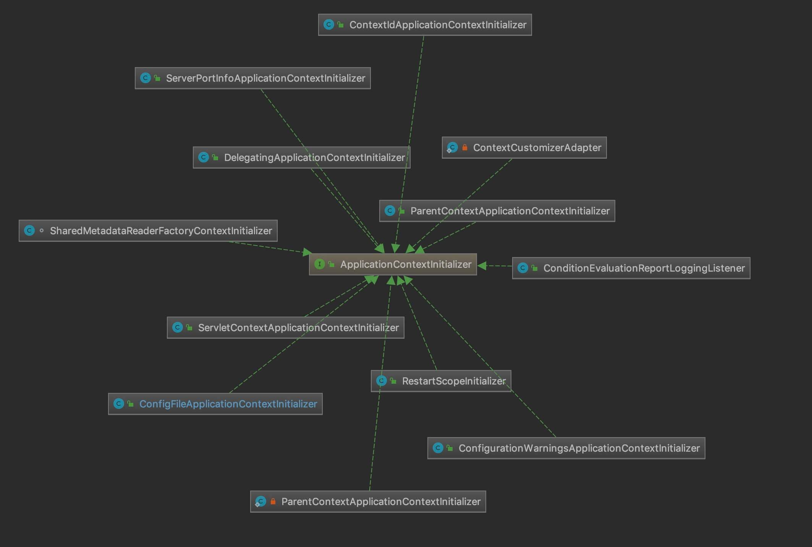

# ApplicationContextInitializer


## 1. 概述

本文，我们来补充[精 Spring Boot 分析 SpringApplication》](http://svip.iocoder.cn/Spring-Boot/SpringApplication)文章，在《源源不断》详细解析的 ApplicationContext 。


## 2.ApplicationContextInitializer

`org.springframework.context.ApplicationContextInitializer`，ApplicationContext初始化接口。代码如下：

```java
	/** 
* 用于初始化 Spring { @link ConfigurableApplicationContext} 
* 之前的回调接口 { @linkplain ConfigurableApplicationContext#refresh() refreshed}。
* 
* <p>通常在需要
对应用程序上下文进行一些编程初始化的 Web 应用程序中使用。例如，
针对 { @linkplain ConfigurableApplicationContext#getEnvironment() 
* context's environment} 注册属性源或激活 * 配置文件。请参阅 { @code ContextLoader} 和 { @code FrameworkServlet} 支持
* 分别声明“contextInitializerClasses”上下文参数和初始化参数。
* 
* <p>{ @code ApplicationContextInitializer} 处理器被鼓励检测
* Spring 的 { @link org.springframework.core.Ordered Ordered} 接口是否已
实现 * 或者 @{ @link org.springframework.core.annotation。 Order Order} 
* 注释存在并在调用之前对实例进行相应的排序。
* 
* @author Chris Beams 
* @since 3.1 
* @param <C> 应用程序上下文类型
* @see org.springframework.web.context.ContextLoader#customizeContext 
* @seeorg.springframework.web.context.ContextLoader#CONTEXT_INITIALIZER_CLASSES_PARAM 
* @see org.springframework.web.servlet.FrameworkServlet#setContextInitializerClasses 
* @see org.springframework.web.servlet.FrameworkServlet#applyInitializers 
*/ 
public  interface  ApplicationContextInitializer < C  extends  ConfigurableApplicationContext > {

	/** 
	 * 初始化给定的应用程序上下文。
	 * @param applicationContext 要配置的应用程序
	 */ void initialize (C applicationContext) ;
	 

```

- 1、ApplicationContextInitializer 是 Spring Framework 3.1 版本开始提供的接口。而在这里，我们是来分享 Spring Boot 中，几个 ApplicationContextInitializer 实现类。

- 2、【作用】ApplicationContextInitializer 是一个回调接口，用于 Spring ConfigurableApplicationContext 容器执行 `#refresh()` 方法进行初始化之前，提前走一些自定义的初始化逻辑。
- 3、【场景】它的使用场景，例如说 Web 应用中需要注册属性，或者激活 Profiles 。
- 4、【排序】它支持 Spring 的 Ordered 接口、`@Order` 注解，来对多个 ApplicationContextInitializer 实例进行排序，从而实现，ApplicationContextInitializer 按照顺序调用 `#initialize(C applicationContext)` 方法，进行初始化。


## 3. SpringApplication 中的使用

### 3.1 初始化 ApplicationContextInitializer 集合

在 SpringApplication 构造方法中，会调用 `#getSpringFactoriesInstances(Class<T> type)` 方法，获得 ApplicationContextInitializer 集合。代码如下：

```java
// SpringApplication.java

private <T> Collection<T> getSpringFactoriesInstances(Class<T> type) {
    return getSpringFactoriesInstances(type, new Class<?>[] {});
}

private <T> Collection<T> getSpringFactoriesInstances(Class<T> type,
        Class<?>[] parameterTypes, Object... args) {
    ClassLoader classLoader = getClassLoader();
    // Use names and ensure unique to protect against duplicates
    // <1> 加载指定类型对应的，在 `META-INF/spring.factories` 里的类名的数组
    Set<String> names = new LinkedHashSet<>(SpringFactoriesLoader.loadFactoryNames(type, classLoader));
    // <2> 创建对象们
    List<T> instances = createSpringFactoriesInstances(type, parameterTypes, classLoader, args, names);
    // <3> 排序对象们
    AnnotationAwareOrderComparator.sort(instances);
    return instances;
}
```

- `<1>` 处，加载指定 ApplicationContextInitializer 类型对应的，在 `META-INF/spring.factories` 里的类名的数组。

- 假设只在 Spring MVC 的环境下，`initializers` 属性的结果如下图:

  

  ​                                                                                     *` initializers` 属性*

- 艿艿整理了 Spring Boot 中，ApplicationContextInitializer 的实现类们，如下图所示：

  

- `<2>` 处，创建对象们。
- `<3>` 处，排序对象们。这个就是在 [「2. ApplicationContextInitializer」](http://svip.iocoder.cn/Spring-Boot/ApplicationContextInitializer/#) 提到的【排序】。


### 3.2 prepareContext

在 `#prepareContext(...)` 方法中，即在 Spring IoC 容器初始化之前，会调用 `#applyInitializers()` 方法，逐个调用 ApplicationContextInitializer 的初始化方法。代码如下：

```java
// SpringApplication.java

protected void applyInitializers(ConfigurableApplicationContext context) {
    // 遍历 ApplicationContextInitializer 数组
    for (ApplicationContextInitializer initializer : getInitializers()) {
        // 校验 ApplicationContextInitializer 的泛型非空
        Class<?> requiredType = GenericTypeResolver.resolveTypeArgument(initializer.getClass(), ApplicationContextInitializer.class);
        Assert.isInstanceOf(requiredType, context, "Unable to call initializer.");
        // 初始化 ApplicationContextInitializer
        initializer.initialize(context);
    }
}
```

- 比较简单，就是调用 `ApplicationContextInitializer#initialize(context)` 方法，进行初始化。

下面，我们来逐个看看 Spring Boot 对 ApplicationContextInitializer 的实现类们。


## 4. DelegatingApplicationContextInitializer

`org.springframework.boot.context.config.DelegatingApplicationContextInitializer` ，实现 ApplicationContextInitializer、Ordered 接口，根据环境变量配置的 `context.initializer.classes` 配置的 ApplicationContextInitializer 类们，交给它们进行初始化。

### 4.1 构造方法

```java
// DelegatingApplicationContextInitializer.java

/**
 * 环境变量配置的属性
 */
private static final String PROPERTY_NAME = "context.initializer.classes";

/**
 * 默认优先级
 */
private int order = 0;

// ... 构造方法为空

@Override
public int getOrder() {
	return this.order;
}
```

- 优先级为 0 ，在 Spring Boot 默认的 ApplicationContextInitializer 实现类中，是排在最前面的。


### 4.2 initialize

实现 `#initialize(ConfigurableApplicationContext context)` 方法，代码如下：

```java
// DelegatingApplicationContextInitializer.java

@Override
public void initialize(ConfigurableApplicationContext context) {
    // <1> 获得环境变量配置的 ApplicationContextInitializer 集合们
    ConfigurableEnvironment environment = context.getEnvironment();
    List<Class<?>> initializerClasses = getInitializerClasses(environment);
    // <2>如果非空，则进行初始化
    if (!initializerClasses.isEmpty()) {
        applyInitializerClasses(context, initializerClasses);
    }
}
```

- `<1>` 处，调用 `#getInitializerClasses(ConfigurableEnvironment env)` 方法，获得环境变量配置的 ApplicationContextInitializer 集合们。代码如下：

  ```java
  // DelegatingApplicationContextInitializer.java
  
  private List<Class<?>> getInitializerClasses(ConfigurableEnvironment env) {
      // 获得环境变量配置的属性
      String classNames = env.getProperty(PROPERTY_NAME);
      // 拼装成数组，按照 ，分隔
      List<Class<?>> classes = new ArrayList<>();
      if (StringUtils.hasLength(classNames)) {
          for (String className : StringUtils.tokenizeToStringArray(classNames, ",")) {
              classes.add(getInitializerClass(className));
          }
      }
      return classes;
  }
  
  private Class<?> getInitializerClass(String className) throws LinkageError {
  	try {
  		// 获得全类名，对应的类
  		Class<?> initializerClass = ClassUtils.forName(className, ClassUtils.getDefaultClassLoader());
  		Assert.isAssignable(ApplicationContextInitializer.class, initializerClass);
  		return initializerClass;
  	} catch (ClassNotFoundException ex) {
  		throw new ApplicationContextException("Failed to load context initializer class [" + className + "]", ex);
  	}
  }
  ```

- `<2>` 处，调用 `#applyInitializerClasses(ConfigurableApplicationContext context, List<Class<?>> initializerClasses)` 方法，执行初始化。代码如下：

  ```java
  // DelegatingApplicationContextInitializer.java
  
  private void applyInitializerClasses(ConfigurableApplicationContext context, List<Class<?>> initializerClasses) {
      Class<?> contextClass = context.getClass();
      // 遍历 initializerClasses 数组，创建对应的 ApplicationContextInitializer 对象们 ①
      List<ApplicationContextInitializer<?>> initializers = new ArrayList<>();
      for (Class<?> initializerClass : initializerClasses) {
          initializers.add(instantiateInitializer(contextClass, initializerClass));
      }
      // 执行 ApplicationContextInitializer 们的初始化逻辑 ②
      applyInitializers(context, initializers);
  }
  
  // 被 ① 处调用
  private ApplicationContextInitializer<?> instantiateInitializer(Class<?> contextClass, Class<?> initializerClass) {
      // 断言校验
      Class<?> requireContextClass = GenericTypeResolver.resolveTypeArgument(initializerClass, ApplicationContextInitializer.class);
      Assert.isAssignable(requireContextClass, contextClass, String.format(
                      "Could not add context initializer [%s]"
                              + " as its generic parameter [%s] is not assignable "
                              + "from the type of application context used by this "
                              + "context loader [%s]: ",
                      initializerClass.getName(), requireContextClass.getName(), contextClass.getName()));
      // 创建 ApplicationContextInitializer 对象
      return (ApplicationContextInitializer<?>) BeanUtils.instantiateClass(initializerClass);
  }
  
  // 被 ② 处调用
  @SuppressWarnings({ "unchecked", "rawtypes" })
  private void applyInitializers(ConfigurableApplicationContext context, List<ApplicationContextInitializer<?>> initializers) {
      // 排序，无处不在的排序！
      initializers.sort(new AnnotationAwareOrderComparator());
      // 执行初始化逻辑
      for (ApplicationContextInitializer initializer : initializers) {
          initializer.initialize(context);
      }
  }
  ```

  

## 5.SharedMetadataReaderFactoryContextInitializer

`org.springframework.boot.autoconfigure.SharedMetadataReaderFactoryContextInitializer` ，实现 ApplicationContextInitializer、Ordered 接口，它会创建一个用于在 ConfigurationClassPostProcessor 和 Spring Boot 间共享的 CachingMetadataReaderFactory Bean 对象。

简化代码如下：

```java
/**
 * {@link ApplicationContextInitializer} to create a shared
 * {@link CachingMetadataReaderFactory} between the
 * {@link ConfigurationClassPostProcessor} and Spring Boot.
 *
 * @author Phillip Webb
 * @since 1.4.0
 */
 
/**
 * 创建的 CachingMetadataReaderFactory 的 Bean 名字
 */
public static final String BEAN_NAME = "org.springframework.boot.autoconfigure."
        + "internalCachingMetadataReaderFactory";

@Override
public void initialize(ConfigurableApplicationContext applicationContext) {
    applicationContext.addBeanFactoryPostProcessor(new CachingMetadataReaderFactoryPostProcessor());
}

@Override
public int getOrder() {
    return 0;
}

// ... 省略 CachingMetadataReaderFactoryPostProcessor 内部类

```


## 6. ContextIdApplicationContextInitializer

`org.springframework.boot.context.ContextIdApplicationContextInitializer` ，实现 ApplicationContextInitializer、Ordered 接口，负责生成 Spring 容器的编号。

### 6.1 构造方法

```java
// ContextIdApplicationContextInitializer.java

/**
 * 优先级
 */
private int order = Ordered.LOWEST_PRECEDENCE - 10;

@Override
public int getOrder() {
	return this.order;
}
```


### 6.2 initialize

实现 `#initialize(ConfigurableApplicationContext context)` 方法，代码如下：

```java
// ContextIdApplicationContextInitializer.java

@Override
public void initialize(ConfigurableApplicationContext applicationContext) {
    // <1> 获得（创建） ContextId 对象
    ContextId contextId = getContextId(applicationContext);
    // <2> 设置到 applicationContext 中
    applicationContext.setId(contextId.getId());
    // <3> 注册到 contextId 到 Spring 容器中
    applicationContext.getBeanFactory().registerSingleton(ContextId.class.getName(), contextId);
}
```

ContextId ，是 ContextIdApplicationContextInitializer 的内部类，Spring 容器编号的封装。代码如下：

```java
// ContextIdApplicationContextInitializer#ContextId.java

class ContextId {

    /**
     * 递增序列
     */
	private final AtomicLong children = new AtomicLong(0);

    /**
     * 编号
     */
	private final String id;

	ContextId(String id) {
		this.id = id;
	}

    /**
     * @return 创建子 Context 的编号
     */
	ContextId createChildId() {
		return new ContextId(this.id + "-" + this.children.incrementAndGet());
	}

	String getId() {
		return this.id;
	}

}
```

- `<1>` 处，调用 `#getContextId(ConfigurableApplicationContext applicationContext)` 方法，获得（创建） ContextId 对象。代码如下：

  ```java
  // ContextIdApplicationContextInitializer.java
  
  private ContextId getContextId(ConfigurableApplicationContext applicationContext) {
      // 获得父 ApplicationContext 对象
      ApplicationContext parent = applicationContext.getParent();
      // 情况一，如果父 ApplicationContext 存在，且有对应的 ContextId 对象，则使用它生成当前容器的 ContextId 对象
      if (parent != null && parent.containsBean(ContextId.class.getName())) {
          return parent.getBean(ContextId.class).createChildId();
      }
      // 情况二，创建 ContextId 对象
      return new ContextId(getApplicationId(applicationContext.getEnvironment()));
  }
  
  private String getApplicationId(ConfigurableEnvironment environment) {
      String name = environment.getProperty("spring.application.name");
      return StringUtils.hasText(name) ? name : "application";
  }
  ```

- 一般情况下，使用 `"spring.application.name"` 环境变量，作为 ContextId 对象的 `id` 属性。
- `<2>` 处，设置到 `applicationContext.id` 中。
- `<3>` 处，注册到 `contextId` 到 Spring 容器中。这样，后续就可以拿到了。


## 7. ConfigurationWarningsApplicationContextInitializer

`org.springframework.boot.context.ConfigurationWarningsApplicationContextInitializer` ，实现 ApplicationContextInitializer 接口，用于检查配置，报告错误的配置。如下是其类上的注释：

```java
/**
 * {@link ApplicationContextInitializer} to report warnings for common misconfiguration mistakes.
 */
```


### 7.1 initialize

实现 `#initialize(ConfigurableApplicationContext applicationContext)` 方法，代码如下：

```java
// ConfigurationWarningsApplicationContextInitializer.java

@Override
public void initialize(ConfigurableApplicationContext context) {
	// 注册 ConfigurationWarningsPostProcessor 到 Spring 容器中
	context.addBeanFactoryPostProcessor(new ConfigurationWarningsPostProcessor(getChecks()));
}
```

- 注册 ConfigurationWarningsPostProcessor 到 Spring 容器中。关于 ConfigurationWarningsPostProcessor 类，在 [「7.2 ConfigurationWarningsPostProcessor」](http://svip.iocoder.cn/Spring-Boot/ApplicationContextInitializer/#) 中，详细解析。

- 其中，`#getChecks()` 方法，返回 Check 数组。代码如下：

  ```java
  // ConfigurationWarningsApplicationContextInitializer.java
  
  protected Check[] getChecks() {
  	return new Check[] { new ComponentScanPackageCheck() };
  }
  
  ```

- 返回的数组，只有一个 ComponentScanPackageCheck 对象。

- Check ，是 ConfigurationWarningsApplicationContextInitializer 的内部接口，校验器。代码如下：

```java
// ConfigurationWarningsApplicationContextInitializer.java

@FunctionalInterface
protected interface Check {

	/**
	 * Returns a warning if the check fails or {@code null} if there are no problems.
	 * @param registry the {@link BeanDefinitionRegistry}
	 * @return a warning message or {@code null}
	 */
	String getWarning(BeanDefinitionRegistry registry);

}

```


### 7.2 ConfigurationWarningsPostProcessor

ConfigurationWarningsPostProcessor ，是 ConfigurationWarningsApplicationContextInitializer 的内部静态类，实现 PriorityOrdered、BeanDefinitionRegistryPostProcessor 接口，代码如下：

```java
// ConfigurationWarningsPostProcessor#ConfigurationWarningsPostProcessor.java

protected static final class ConfigurationWarningsPostProcessor
        implements PriorityOrdered, BeanDefinitionRegistryPostProcessor {

    /**
     * Check 数组
     */
    private Check[] checks;

    public ConfigurationWarningsPostProcessor(Check[] checks) {
        this.checks = checks;
    }

    @Override
    public int getOrder() {
        return Ordered.LOWEST_PRECEDENCE - 1;
    }

    @Override
    public void postProcessBeanFactory(ConfigurableListableBeanFactory beanFactory) throws BeansException {}

    @Override
    public void postProcessBeanDefinitionRegistry(BeanDefinitionRegistry registry) throws BeansException {
        // 遍历 Check 数组，执行校验。若有错，则打印 warn 日志
        for (Check check : this.checks) {
            String message = check.getWarning(registry);
            if (StringUtils.hasLength(message)) {
                warn(message);
            }
        }

    }

    private void warn(String message) {
        if (logger.isWarnEnabled()) {
            logger.warn(String.format("%n%n** WARNING ** : %s%n%n", message));
        }
    }

}
```

- 核心就是 `#postProcessBeanDefinitionRegistry(BeanDefinitionRegistry registry)` 方法。在其内部，遍历 Check 数组，执行校验。若有错，则打印 warn 日志。在上文中，我们看到目前 `checks` 只有一个 ComponentScanPackageCheck 元素。关于它，我们在 [「7.3 ComponentScanPackageCheck」](http://svip.iocoder.cn/Spring-Boot/ApplicationContextInitializer/#) 详细解析。


### 7.3 ComponentScanPackageCheck

ComponentScanPackageCheck ，实现 Check 接口，检查是否使用了 `@ComponentScan` 注解，扫描了指定扫描的包。

#### 7.3.1 构造方法

```java
// ConfigurationWarningsPostProcessor#ComponentScanPackageCheck.java

/**
 * 有问题的包的集合。
 *
 * 即禁止使用 @ComponentScan 注解扫描这个集合中的包
 */
private static final Set<String> PROBLEM_PACKAGES;

static {
    Set<String> packages = new HashSet<>();
    packages.add("org.springframework");
    packages.add("org");
    PROBLEM_PACKAGES = Collections.unmodifiableSet(packages);
}
```

- 即禁止扫描 `"org.springframework"` 和 `"org"` 包。因为 `"org.springframework"` 包下，有非常多的 Bean ，这样扫描，会错误的注入很多 Bean 。

#### 7.3.2 getWarning

实现 `#getWarning(BeanDefinitionRegistry registry)` 方法，代码如下：

```java
// ConfigurationWarningsPostProcessor#ComponentScanPackageCheck.java

@Override
public String getWarning(BeanDefinitionRegistry registry) {
    // <1> 获得要扫描的包
    Set<String> scannedPackages = getComponentScanningPackages(registry);
    // <2> 获得要扫描的包中，有问题的包
    List<String> problematicPackages = getProblematicPackages(scannedPackages);
    // <3.1> 如果 problematicPackages 为空，说明不存在问题
    if (problematicPackages.isEmpty()) {
        return null;
    }
    // <3.2> 如果 problematicPackages 非空，说明有问题，返回错误提示
    return "Your ApplicationContext is unlikely to "
            + "start due to a @ComponentScan of "
            + StringUtils.collectionToDelimitedString(problematicPackages, ", ")
            + ".";
}
```

- `<1>` 处，调用 `#getComponentScanningPackages(BeanDefinitionRegistry registry)` 方法，获得要扫描的包。代码如下：

  ```java
  // ConfigurationWarningsPostProcessor#ComponentScanPackageCheck.java
  
  protected Set<String> getComponentScanningPackages(BeanDefinitionRegistry registry) {
      // 扫描的包的集合
      Set<String> packages = new LinkedHashSet<>();
      // 获得所有 BeanDefinition 的名字们
      String[] names = registry.getBeanDefinitionNames();
      for (String name : names) {
          // 如果是 AnnotatedBeanDefinition
          BeanDefinition definition = registry.getBeanDefinition(name);
          if (definition instanceof AnnotatedBeanDefinition) {
              AnnotatedBeanDefinition annotatedDefinition = (AnnotatedBeanDefinition) definition;
              // 如果有 @ComponentScan 注解，则添加到 packages 中
              addComponentScanningPackages(packages, annotatedDefinition.getMetadata());
          }
      }
      return packages;
  }
  
  private void addComponentScanningPackages(Set<String> packages, AnnotationMetadata metadata) {
      // 获得 @ComponentScan 注解
      AnnotationAttributes attributes = AnnotationAttributes.fromMap(metadata.getAnnotationAttributes(ComponentScan.class.getName(), true));
      // 如果存在，则添加到 packages 中
      if (attributes != null) {
          addPackages(packages, attributes.getStringArray("value"));
          addPackages(packages, attributes.getStringArray("basePackages"));
          addClasses(packages, attributes.getStringArray("basePackageClasses"));
          if (packages.isEmpty()) {
              packages.add(ClassUtils.getPackageName(metadata.getClassName()));
          }
      }
  }
  
  private void addPackages(Set<String> packages, String[] values) {
      if (values != null) {
          Collections.addAll(packages, values);
      }
  }
  
  private void addClasses(Set<String> packages, String[] values) {
      if (values != null) {
          for (String value : values) {
              packages.add(ClassUtils.getPackageName(value));
          }
      }
  }
  ```

- 虽然很长，但是比较简单。就是找 `@ComponentScan` 注解所扫描的包。

- `<2>` 处，调用 `#getProblematicPackages(Set<String> scannedPackages)` 方法，获得要扫描的包中，有问题的包。代码如下：

  ```java
  // ConfigurationWarningsPostProcessor#ComponentScanPackageCheck.java
  
  private List<String> getProblematicPackages(Set<String> scannedPackages) {
      // 有问题的包的集合
      List<String> problematicPackages = new ArrayList<>();
      for (String scannedPackage : scannedPackages) {
          // 判断是否在 PROBLEM_PACKAGES 中。如果是，则添加到 problematicPackages 中
          if (isProblematicPackage(scannedPackage)) {
              problematicPackages.add(getDisplayName(scannedPackage));
          }
      }
      return problematicPackages;
  }
  
  private boolean isProblematicPackage(String scannedPackage) {
      if (scannedPackage == null || scannedPackage.isEmpty()) {
          return true;
      }
      return PROBLEM_PACKAGES.contains(scannedPackage);
  }
  
  private String getDisplayName(String scannedPackage) {
      if (scannedPackage == null || scannedPackage.isEmpty()) {
          return "the default package";
      }
      return "'" + scannedPackage + "'";
  }
  ```

  -  就是判断 `scannedPackages` 哪些在 `PROBLEM_PACKAGES` 中。
  - `<3.1>` 处，如果 `problematicPackages` 为空，说明不存在问题。
  - `<3.2>` 处，如果 `problematicPackages` 非空，说明有问题，返回错误提示。


## 8. ServerPortInfoApplicationContextInitializer

`org.springframework.boot.web.context.ServerPortInfoApplicationContextInitializer` ，实现 ApplicationContextInitializer、ApplicationListener 接口，监听 EmbeddedServletContainerInitializedEvent 类型的事件，然后将内嵌的 Web 服务器使用的端口给设置到 ApplicationContext 中。


### 8.1 initialize

实现 `#initialize(ConfigurableApplicationContext applicationContext)` 方法，代码如下：

```java
// ServerPortInfoApplicationContextInitializer.java

@Override
public void initialize(ConfigurableApplicationContext applicationContext) {
	applicationContext.addApplicationListener(this);
}
```

- 将自身作为一个 ApplicationListener 监听器，添加到 Spring 容器中。

### 8.2 onApplicationEvent

实现 `#onApplicationEvent(WebServerInitializedEvent event)` 方法，当监听到 WebServerInitializedEvent 事件，进行触发。代码如下：

```java
// ServerPortInfoApplicationContextInitializer.java

@Override
public void onApplicationEvent(WebServerInitializedEvent event) {
    // <1> 获得属性名
    String propertyName = "local." + getName(event.getApplicationContext()) + ".port";
    // <2> 设置端口到 environment 的 propertyName 中
    setPortProperty(event.getApplicationContext(), propertyName, event.getWebServer().getPort());
}
```

- `<1>` 处，获得属性名。其中，`#getName(WebServerApplicationContext context)` 方法，获得 WebServer 的名字。代码如下：

  ```java
  // ServerPortInfoApplicationContextInitializer.java
  
  private String getName(WebServerApplicationContext context) {
  	String name = context.getServerNamespace();
  	return StringUtils.hasText(name) ? name : "server";
  }
  ```

- `<2>` 处，调用 `#setPortProperty(ApplicationContext context, String propertyName, int port)` 方法，设置端口到 `environment` 的 `propertyName` 中。代码如下：

  ```java
  // ServerPortInfoApplicationContextInitializer.java
  
  private void setPortProperty(ApplicationContext context, String propertyName, int port) {
      // 设置端口到 environment 的 propertyName 中
      if (context instanceof ConfigurableApplicationContext) {
          setPortProperty(((ConfigurableApplicationContext) context).getEnvironment(), propertyName, port);
      }
      // 如果有父容器，则继续设置
      if (context.getParent() != null) {
          setPortProperty(context.getParent(), propertyName, port);
      }
  }
  
  @SuppressWarnings("unchecked")
  private void setPortProperty(ConfigurableEnvironment environment, String propertyName, int port) {
      MutablePropertySources sources = environment.getPropertySources();
      // 获得 "server.ports" 属性对应的值
      PropertySource<?> source = sources.get("server.ports");
      if (source == null) {
          source = new MapPropertySource("server.ports", new HashMap<>());
          sources.addFirst(source);
      }
      // 添加到 source 中
      ((Map<String, Object>) source.getSource()).put(propertyName, port);
  }
  ```

- 注意噢，设置的属性结果是，`"server.ports"` 中，的 KEY 为 `propertyName` ，VALUE 为 `port` 。


## 9. 其他 ApplicationContextInitializer 实现类

ApplicationContextInitializer 还有一些其它实现类，不是很重要，可以选择不看。

- `spring-boot-test` 模块
  - `org.springframework.boot.test.context.ConfigFileApplicationContextInitializer` 类
  - `org.springframework.boot.test.context.SpringBootContextLoader` 中的ParentContextApplicationContextInitializer 类

- `spring-boot-devtools` 模块
  - `org.springframework.boot.devtools.restart.RestartScopeInitializer` 类

- `spring-boot-autoconfigure` 模块

  - `org.springframework.boot.autoconfigure.logging.ConditionEvaluationReportLoggingListener` 类

- `spring-boot` 模块

  - `org.springframework.boot.web.servlet.support.ServletContextApplicationContextInitializer` 类
  - `org.springframework.boot.builder.ParentContextApplicationContextInitializer` 类

  

