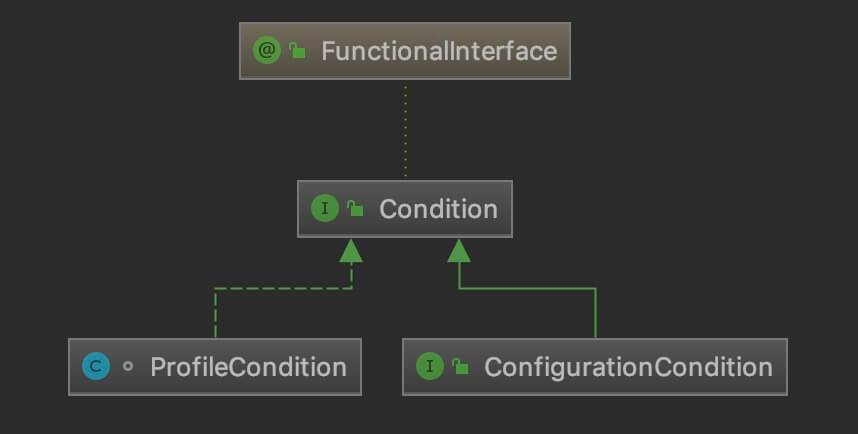
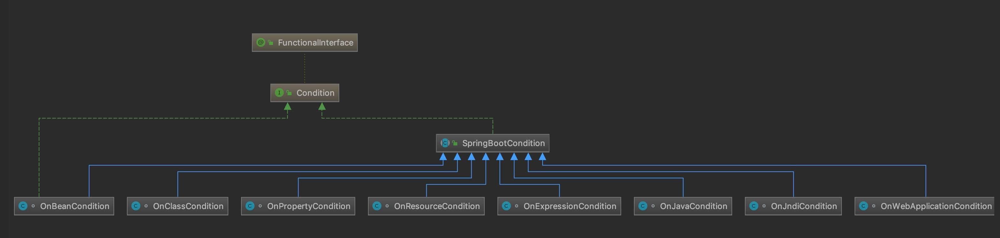
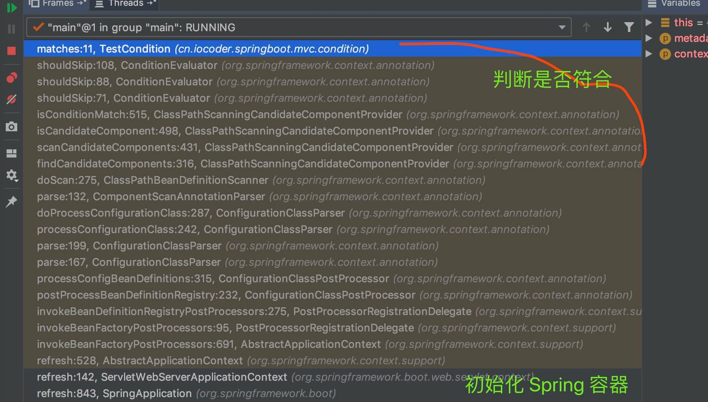
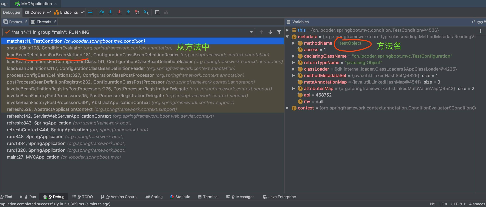
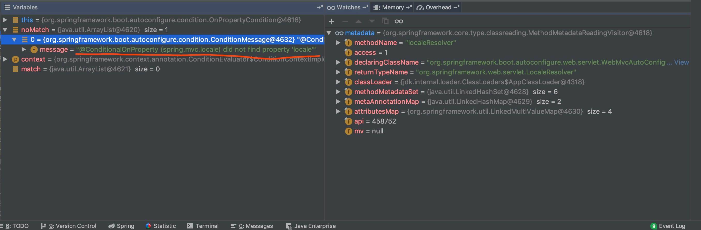
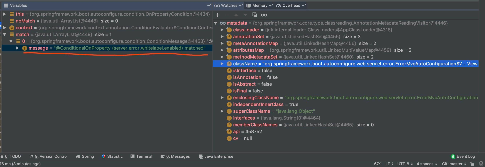

## 1. 概述

在前面的文章，我们已经看过 Spring Boot 如何实现**自动配置**的功能，但是，实际场景下，这显然不够。为什么呢？因为每个框架的**配置**，需要满足一定的**条件**，才应该进行**自动配置**。这时候，我们很自然就可以想到 Spring Boot 的 **Condition** 功能。不过呢，Condition 功能并不是 Spring Boot 所独有，而是在 Spring Framework 中就已经提供了。那么，究竟是什么样的关系呢，我们在 [「2. Condition 演进史」](http://svip.iocoder.cn/Spring-Boot/Condition/#) 来瞅瞅。

## 2. Condition 演进史

### 2.1 Profile 的出场

在 Spring3.1 的版本，为了满足不同环境注册不同的 Bean ，引入了 `@Profile` 注解。例如：

```java
@Configuration
public class DataSourceConfiguration {

    @Bean
    @Profile("DEV")
    public DataSource devDataSource() {
        // ... 单机 MySQL
    }

    @Bean
    @Profile("PROD")
    public DataSource prodDataSource() {
        // ... 集群 MySQL
    }
    
}
```

- 在测试环境下，我们注册单机 MySQL 的 DataSource Bean 。
- 在生产环境下，我们注册集群 MySQL 的 DataSource Bean 。

`org.springframework.context.annotation.@Profile` ，代码如下：

```java
// Profile.java

@Target({ElementType.TYPE, ElementType.METHOD})
@Retention(RetentionPolicy.RUNTIME)
@Documented
@Conditional(ProfileCondition.class)
public @interface Profile {

	/**
	 * The set of profiles for which the annotated component should be registered.
	 */
	String[] value();

}
```

- 这是 Spring5 版本的 `@Profile` 注解的代码。它已经是经过 Condition 改造的实现。详细的，我们放在 [「2.2 Condition」](http://svip.iocoder.cn/Spring-Boot/Condition/#) 。
- 让我们在来看一眼 Spring3 版本的 `@Profile` 注解的代码。如下：

- 可以大体猜出，此时并没有将 Profile 作为 Condition 的一种情况。

### 2.2 Condition 的出现

```java
在 Spring4 的版本，正式出现 Condition 功能，体现在 org.springframework.context.annotation.Condition 接口，代码如下：
```

```java
// Condition.java

@FunctionalInterface
public interface Condition {

	boolean matches(ConditionContext context, AnnotatedTypeMetadata metadata);

}
```

- 很简洁的一个接口，只有一个 `#matches(...)` 方法，用于判断是佛匹配。从参数中就可以看出，它是和注解配合，而这个注解便是 `@Conditional` 。

```java
// Conditional.java

@Target({ElementType.TYPE, ElementType.METHOD})
@Retention(RetentionPolicy.RUNTIME)
@Documented
public @interface Conditional {

	Class<? extends Condition>[] value();

}
```

- 可以注解在**方法**、或者在**类**上，表示需要满足的条件（Condition）。

- 在 [「2.1 Profile 的出现」](http://svip.iocoder.cn/Spring-Boot/Condition/#) 小节中，我们已经看到 `@Profile` 上，有 `@Conditional(ProfileCondition.class)` 的注解，表示使用 `org.springframework.context.annotation.ProfileCondition` 作为条件。

- 当然，我们也可以直接在 Configuration 类上使用。例如：

  ```java
  @Configuration
  public class TestConfiguration {
  
      @Bean
      @Conditional(XXXCondition.class)
      public Object xxxObject() {
          return new Object();
      }
      
  }
  ```

- 即，创建 `#xxxObject()` 方法对应的 Bean 对象，需要满足 XXXCondition 条件。

- 在 Spring5 中，艿艿整理了下目前提供的 Condition 实现类，如下图：

  

  ​																										Condition 实现类

- 显然，默认提供的 Condition 实现类非常少。

### 2.3 SpringBootCondition 的进击

为了满足更加丰富的 Condition（条件）的需要，Spring Boot 进一步拓展了更多的实现类，如下图所示：



- `org.springframework.boot.autoconfigure.condition.SpringBootCondition` ，是 Spring Boot 实现 Condition 的抽象类，且是 Spring Boot 所有 Condition 实现类的基类。
- 分别对应如下注解：
  - `@ConditionalOnBean`：当容器里有指定 Bean 的条件下。
  - `@ConditionalOnMissingBean`：当容器里没有指定 Bean 的情况下。
  - `@ConditionalOnSingleCandidate`：当指定 Bean 在容器中只有一个，或者虽然有多个但是指定首选 Bean 。
  - `@ConditionalOnClass`：当类路径下有指定类的条件下。
  - `@ConditionalOnMissingClass`：当类路径下没有指定类的条件下。
  - `@ConditionalOnProperty`：指定的属性是否有指定的值
  - `@ConditionalOnResource`：类路径是否有指定的值
  - `@ConditionalOnExpression`：基于 SpEL 表达式作为判断条件。
  - `@ConditionalOnJava`：基于 Java 版本作为判断条件
  - `@ConditionalOnJndi`：在 JNDI 存在的条件下差在指定的位置
  - `@ConditionalOnNotWebApplication`：当前项目不是 Web 项目的条件下
  - `@ConditionalOnWebApplication`：当前项目是 Web项 目的条件下。

### 2.4 小结

到了此处，我们基本算是理清了 Condition 的整个演进构成：

- `@Profile` 注解，在 Spring3.1 提出，可以作为是 Condition 的雏形。
- Condition 接口，在 Spring4 提出，是 Condition 的正式出现。
- SpringCondition 抽象类，在 Spring Boot 实现，是对 Condition 进一步拓展。


## 3. Condition 如何生效？

在上面的文章中，我们已经看到，`@Conditional` 注解，可以添加：

- 类级别上
- 方法级别上

```properties
添加到注解上，相当于添加到类级别或者方法级别上。
```

并且，一般情况下我们和配置类（Configuration）一起使用，但是实际上，我们也可以添加到普通的 Bean 类上。例如：

```java
// DemoController.java

@Controller
@RequestMapping("/demo")
@Conditional(TestCondition.class)
public class DemoController {

    @ResponseBody
    @RequestMapping("/hello")
    public String hello() {
        return "world";
    }

}
```

那么，究竟 Condition 是如何生效的呢？分成两种情况：

- 方式一，**配置类**。添加到配置类（Configuration）上面。
- 方式二，**创建 Bean 对象**。添加到配置类（Configuration）、或者 Bean Class 的上面。

```properties
本质上，方式二上的两种，都是创建 Bean 对象，所以统一处理方式即可。
```

```java
假设，我们在 TestConfiguration 这个示例下进行测试，看看具体的调用链。代码如下：
```

```java
// TestConfiguration.java

@Configuration
@Conditional(TestCondition.class) // 艿艿自己编写的 Condition 实现类，方式测试调试
public class TestConfiguration {

    @Bean
    @Conditional(TestCondition.class)
    public Object testObject() {
        return new Object();
    }

}

// TestCondition.java
public class TestCondition implements Condition {

    @Override
    public boolean matches(ConditionContext context, AnnotatedTypeMetadata metadata) {
        return true;
    }

}
```

### 3.1 方式一：配置类

在 TestCondition 的 `#matches(...)` 方法中，打个断点。看看**方式一**情况下的具体的表现。如下图所示：



- 通过调用 `Condition#matches(...)` 方法，判断该是否匹配。如果不匹配，内部所有方法，都无法创建 Bean 对象。

### 3.2 方式二：创建 Bean 对象

在 TestCondition 的 `#matches(...)` 方法中，打个断点。看看**方式二**情况下的具体的表现。如下图所示：



- 通过调用 `Condition#matches(...)` 方法，判断是否匹配。如果吧匹配，则不从该方法加载 BeanDefinition 。这样，就不会创建对应的 Bean 对象了。

### 3.3 小结

至此，我们已经看到 Condition 如何生效。还是相对比较简单的。

下面，我们一起来看看 SpringBootCondition 如何实现它的进击。

## 4. ProfileCondition

`org.springframework.context.annotation.ProfileCondition` ，实现 Condition 接口，给 `@Profile` 使用的 Condition 实现类。代码如下：

```java
// ProfileCondition.java

class ProfileCondition implements Condition {

    @Override
    public boolean matches(ConditionContext context, AnnotatedTypeMetadata metadata) {
        // 获得 @Profile 注解的属性
        MultiValueMap<String, Object> attrs = metadata.getAllAnnotationAttributes(Profile.class.getName());
        // 如果非空，进行判断
        if (attrs != null) {
            // 遍历所有 @Profile 的 value 属性
            for (Object value : attrs.get("value")) {
                // 判断 environment 有符合的 Profile ，则返回 true ，表示匹配
                if (context.getEnvironment().acceptsProfiles(Profiles.of((String[]) value))) {
                    return true;
                }
            }
            // 如果没有，则返回 false
            return false;
        }
        // 如果为空，就表示满足条件
        return true;
    }

}
```

- 核心逻辑，获得 `@Profile` 的 `value` 属性，和 `environment` 是否有匹配的。如果有，则表示匹配。

## 5. SpringBootCondition

`org.springframework.boot.autoconfigure.condition.SpringBootCondition` ，实现 Condition 接口，Spring Boot Condition 的**抽象基类**，主要用于提供相应的日志，帮助开发者判断哪些被进行加载。如下是其上的类注释：

### 5.1 matches

```java
// SpringBootCondition.java

@Override
public final boolean matches(ConditionContext context, AnnotatedTypeMetadata metadata) {
    // <1> 获得注解的是方法名还是类名
    String classOrMethodName = getClassOrMethodName(metadata);
    try {
        // <2> 条件匹配结果
        ConditionOutcome outcome = getMatchOutcome(context, metadata);
        // <3> 打印结果
        logOutcome(classOrMethodName, outcome);
        // <4> 记录
        recordEvaluation(context, classOrMethodName, outcome);
        // <5> 返回是否匹配
        return outcome.isMatch();
    } catch (NoClassDefFoundError ex) {
        throw new IllegalStateException(
                "Could not evaluate condition on " + classOrMethodName + " due to "
                        + ex.getMessage() + " not "
                        + "found. Make sure your own configuration does not rely on "
                        + "that class. This can also happen if you are "
                        + "@ComponentScanning a springframework package (e.g. if you "
                        + "put a @ComponentScan in the default package by mistake)",
                ex);
    } catch (RuntimeException ex) {
        throw new IllegalStateException("Error processing condition on " + getName(metadata), ex);
    }
}

```

- `<1>` 处，调用 `#getClassOrMethodName(AnnotatedTypeMetadata metadata)` 方法，获得注解的是方法名还是类名。代码如下：

```java
// SpringBootCondition.java

private static String getClassOrMethodName(AnnotatedTypeMetadata metadata) {
	// 类
	if (metadata instanceof ClassMetadata) {
		ClassMetadata classMetadata = (ClassMetadata) metadata;
		return classMetadata.getClassName();
	}
	// 方法
	MethodMetadata methodMetadata = (MethodMetadata) metadata;
	return methodMetadata.getDeclaringClassName() + "#" + methodMetadata.getMethodName();
}
```

- `<2>` 处，调用 `#getMatchOutcome(ConditionContext context, AnnotatedTypeMetadata metadata)` **抽象**方法，执行匹配，返回匹配结果。这是一个**抽象**方法，由子类进行实现。
  - [`org.springframework.boot.autoconfigure.condition.ConditionOutcome`](https://github.com/YunaiV/spring-boot/blob/master/spring-boot-project/spring-boot-autoconfigure/src/main/java/org/springframework/boot/autoconfigure/condition/ConditionOutcome.java) ，匹配结果。
  - [`org.springframework.boot.autoconfigure.condition.ConditionMessage`](https://github.com/YunaiV/spring-boot/blob/master/spring-boot-project/spring-boot-autoconfigure/src/main/java/org/springframework/boot/autoconfigure/condition/ConditionMessage.java) ，匹配消息。
  - 以上的类，自己瞅瞅。简单~
- `<3>` 处，调用 `#logOutcome(String classOrMethodName, ConditionOutcome outcome)` 方法，打印结果日志。代码如下：

```java
// SpringBootCondition.java
    
protected final void logOutcome(String classOrMethodName, ConditionOutcome outcome) {
	if (this.logger.isTraceEnabled()) {
		this.logger.trace(getLogMessage(classOrMethodName, outcome));
	}
}

private StringBuilder getLogMessage(String classOrMethodName, ConditionOutcome outcome) {
	StringBuilder message = new StringBuilder();
	message.append("Condition ");
	message.append(ClassUtils.getShortName(getClass()));
	message.append(" on ");
	message.append(classOrMethodName);
	message.append(outcome.isMatch() ? " matched" : " did not match");
	if (StringUtils.hasLength(outcome.getMessage())) {
		message.append(" due to ");
		message.append(outcome.getMessage());
	}
	return message;
}
```

- `4>` 处，调用 `#recordEvaluation(ConditionContext context, String classOrMethodName, ConditionOutcome outcome)` 方法，记录到 ConditionEvaluationReport 。代码如下：

```java
// SpringBootCondition.java

private void recordEvaluation(ConditionContext context, String classOrMethodName, ConditionOutcome outcome) {
	if (context.getBeanFactory() != null) {
		ConditionEvaluationReport.get(context.getBeanFactory()).recordConditionEvaluation(classOrMethodName, this, outcome);
	}
}
```

- `<5>` 处，返回是否匹配。

### 5.2 anyMatches

`#anyMatches(ConditionContext context, AnnotatedTypeMetadata metadata, Condition... conditions)` 方法，判断是否匹配指定的 Condition 们中的任一一个。代码如下：

```java
// SpringBootCondition.java
    
protected final boolean anyMatches(ConditionContext context, AnnotatedTypeMetadata metadata, Condition... conditions) {
    // 遍历 Condition
    for (Condition condition : conditions) {
        // 执行匹配
        if (matches(context, metadata, condition)) {
            return true;
        }
    }
    return false;
}
```

遍历 `conditions` 数组，调用 `#matches(ConditionContext context, AnnotatedTypeMetadata metadata, Condition condition)` 方法，执行匹配。代码如下：

```java
// SpringBootCondition.java

protected final boolean matches(ConditionContext context, AnnotatedTypeMetadata metadata, Condition condition) {
	// 如果是 SpringBootCondition 类型，执行 SpringBootCondition 的直接匹配方法（无需日志）
	if (condition instanceof SpringBootCondition) {
		return ((SpringBootCondition) condition).getMatchOutcome(context, metadata).isMatch();
	}
	return condition.matches(context, metadata);
```

总的来说，SpringBootCondition 这个类，没啥好说，重点还是在子类。

## 6. SpringBootCondition 的实现类

我们在回忆下，SpringBootCondition 的实现类，主要如下图：


### 6.1 OnPropertyCondition

`org.springframework.boot.autoconfigure.condition.OnPropertyCondition` ，继承 SpringBootCondition 抽象类，给 `@ConditionalOnProperty` 使用的Condition 配置类


#### 6.1.1 getMatchOutcome

`#getMatchOutcome(ConditionContext context, AnnotatedTypeMetadata metadata)` 方法，获得匹配结果。代码如下：

```java
// OnPropertyCondition.java

@Override
public ConditionOutcome getMatchOutcome(ConditionContext context, AnnotatedTypeMetadata metadata) {
	// <1> 获得 @ConditionalOnProperty 注解的属性
	List<AnnotationAttributes> allAnnotationAttributes = annotationAttributesFromMultiValueMap(
			metadata.getAllAnnotationAttributes(ConditionalOnProperty.class.getName()));
	// <2> 存储匹配和不匹配的结果消息结果
	List<ConditionMessage> noMatch = new ArrayList<>();
	List<ConditionMessage> match = new ArrayList<>();
	// <3> 遍历 annotationAttributes 属性数组，逐个判断是否匹配，并添加到结果
	for (AnnotationAttributes annotationAttributes : allAnnotationAttributes) {
		ConditionOutcome outcome = determineOutcome(annotationAttributes, context.getEnvironment());
		(outcome.isMatch() ? match : noMatch).add(outcome.getConditionMessage());
	}
	// <4.1> 如果有不匹配的，则返回不匹配
	if (!noMatch.isEmpty()) {
		return ConditionOutcome.noMatch(ConditionMessage.of(noMatch));
	}
	// <4.2> 如果都匹配，则返回匹配
	return ConditionOutcome.match(ConditionMessage.of(match));
}
```

- `<1>` 处，调用 `#annotationAttributesFromMultiValueMap(MultiValueMap<String, Object> multiValueMap)` 方法，获得 `@ConditionalOnProperty` 注解的属性。代码如下：

```java
// OnPropertyCondition.java

private List<AnnotationAttributes> annotationAttributesFromMultiValueMap(MultiValueMap<String, Object> multiValueMap) {
	List<Map<String, Object>> maps = new ArrayList<>();
	multiValueMap.forEach((key, value) -> {
		for (int i = 0; i < value.size(); i++) {
			Map<String, Object> map;
			if (i < maps.size()) {
				map = maps.get(i);
			} else {
				map = new HashMap<>();
				maps.add(map);
			}
			map.put(key, value.get(i));
		}
	});
	List<AnnotationAttributes> annotationAttributes = new ArrayList<>(maps.size());
	for (Map<String, Object> map : maps) {
		annotationAttributes.add(AnnotationAttributes.fromMap(map));
	}
	return annotationAttributes;
}
```

懒的看整个代码实现的过程，可以直接看最终执行的结果图：


- `<2>` 处，存储匹配和不匹配的结果消息结果。

- `<3>` 处，遍历 `annotationAttributes` 属性数组，逐个调用 `#determineOutcome(AnnotationAttributes annotationAttributes, PropertyResolver resolver)` 方法，判断是否匹配，并添加到结果。详细解析，见 [「6.1.2 determineOutcome」](http://svip.iocoder.cn/Spring-Boot/Condition/#) 。

- `<4.1>` 处，如果有不匹配的，则返回不匹配。返回结果示例如下：

  

  ​																						不匹配				

- `<4.2>` 处，如果都匹配，则返回匹配。返回结果示例如下：

  

  ​																							匹配

#### 6.1.2 determineOutcome

`#determineOutcome(AnnotationAttributes annotationAttributes, PropertyResolver resolver)` 方法，判断是否匹配。代码如下：

```java
// OnPropertyCondition.java

private ConditionOutcome determineOutcome(AnnotationAttributes annotationAttributes, PropertyResolver resolver) {
    // <1> 解析成 Spec 对象
    Spec spec = new Spec(annotationAttributes);
    // <2> 创建结果数组
    List<String> missingProperties = new ArrayList<>();
    List<String> nonMatchingProperties = new ArrayList<>();
    // <3> 收集是否不匹配的信息，到 missingProperties、nonMatchingProperties 中
    spec.collectProperties(resolver, missingProperties, nonMatchingProperties);
    // <4.1> 如果有属性缺失，则返回不匹配
    if (!missingProperties.isEmpty()) {
        return ConditionOutcome.noMatch(ConditionMessage.forCondition(ConditionalOnProperty.class, spec)
                        .didNotFind("property", "properties").items(Style.QUOTE, missingProperties));
    }
    // <4.2> 如果有属性不匹配，则返回不匹配
    if (!nonMatchingProperties.isEmpty()) {
        return ConditionOutcome.noMatch(ConditionMessage.forCondition(ConditionalOnProperty.class, spec)
                        .found("different value in property", "different value in properties").items(Style.QUOTE, nonMatchingProperties));
    }
    // <4.3> 返回匹配
    return ConditionOutcome.match(ConditionMessage.forCondition(ConditionalOnProperty.class, spec).because("matched"));
}
```

`<1>` 处，解析成 Spec 对象。Spec 是 OnPropertyCondition 的内部静态类。代码如下：

```java
// OnPropertyCondition#Spec.java

private static class Spec {

	/**
	 * 属性前缀
	*/
	private final String prefix;
	/**
	 * 是否有指定值
	*/
	private final String havingValue;
	/**
	 * 属性名
	*/
	private final String[] names;
	/**
	 * 如果属性不存在，是否认为是匹配的。
	 *
	 * 如果为 false 时，就认为属性丢失，即不匹配。
	*/
	private final boolean matchIfMissing;

	Spec(AnnotationAttributes annotationAttributes) {
		String prefix = annotationAttributes.getString("prefix").trim();
		if (StringUtils.hasText(prefix) && !prefix.endsWith(".")) {
			prefix = prefix + ".";
		}
		this.prefix = prefix;
		this.havingValue = annotationAttributes.getString("havingValue");
		this.names = getNames(annotationAttributes);
		this.matchIfMissing = annotationAttributes.getBoolean("matchIfMissing");
	}

	// 从 value 或者 name 属性种，获得值
	private String[] getNames(Map<String, Object> annotationAttributes) {
		String[] value = (String[]) annotationAttributes.get("value");
		String[] name = (String[]) annotationAttributes.get("name");
		Assert.state(value.length > 0 || name.length > 0, "The name or value attribute of @ConditionalOnProperty must be specified");
		Assert.state(value.length == 0 || name.length == 0, "The name and value attributes of @ConditionalOnProperty are exclusive");
		return (value.length > 0) ? value : name;
	}
	
	// ... 省略其它方法先~
}

```

- `<2>` 处，创建结果数组。
- `<3>` 处，调用 `Spec#collectProperties(PropertyResolver resolver, List<String> missing, List<String> nonMatching)` 方法，收集是否不匹配的信息，到 `missingProperties`、`nonMatchingProperties` 中。代码如下：

```java
// OnPropertyCondition#Spec.java
private void collectProperties(PropertyResolver resolver, List<String> missing, List<String> nonMatching) {
	// 遍历 names 数组
	for (String name : this.names) {
		// 获得完整的 key
		String key = this.prefix + name;
		// 如果存在指定属性
		if (resolver.containsProperty(key)) {
			// 匹配值是否匹配
			if (!isMatch(resolver.getProperty(key), this.havingValue)) {
				nonMatching.add(name);
			}
		// 如果不存在指定属性
		} else {
			// 如果属性为空，并且 matchIfMissing 为 false ，则添加到 missing 中
			if (!this.matchIfMissing) {
				missing.add(name);
			}
		}
	}
}
    
private boolean isMatch(String value, String requiredValue) {
	// 如果 requiredValue 非空，则进行匹配
	if (StringUtils.hasLength(requiredValue)) {
		return requiredValue.equalsIgnoreCase(value);
	}
	// 如果 requiredValue 为空，要求值不为 false
	return !"false".equalsIgnoreCase(value);
}
```

- - 匹配的逻辑，胖友自己瞅瞅。可能比较绕的逻辑是，`matchIfMissing` 那块，也就看两眼就明白。
- `<4.1>` 处，如果有属性缺失，则返回不匹配。
- `<4.2>` 处，如果有属性不匹配，则返回不匹配。
- `<4.3>` 处，返回匹配。

## 7. AutoConfigurationImportFilter

在 [《精尽 Spring Boot 源码分析 —— 自动配置》](http://svip.iocoder.cn/Spring-Boot/AutoConfiguration/) 一文中，我们埋了一个 `AutoConfigurationImportSelector#filter(List<String> configurations, AutoConfigurationMetadata autoConfigurationMetadata)` 方法的坑，没有进行详细解析。所以呢，这一节我们将填掉这个坑。

`org.springframework.boot.autoconfigure.AutoConfigurationImportFilter` 接口，用于过滤掉无需自动引入的自动配置类（Configuration）。正如其类上的注释：

```java
// AutoConfigurationImportFilter.java

/**
 * Filter that can be registered in {@code spring.factories} to limit the
 * auto-configuration classes considered. This interface is designed to allow fast removal
 * of auto-configuration classes before their bytecode is even read.
 * @since 1.5.0
 */
```

