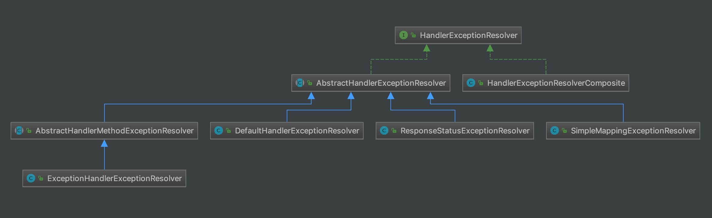

# HandlerExceptionResolver 组件


## 1. 概述

本文，我们来分享 HandlerExceptionResolver 组件。在 [《精尽 Spring MVC 源码分析 —— 组件一览》](http://svip.iocoder.cn/Spring-MVC/Components-intro) 中，我们对它已经做了介绍：

`org.springframework.web.servlet.HandlerExceptionResolver` ，处理器异常解析器接口，将处理器( `handler` )执行时发生的异常，解析( 转换 )成对应的 ModelAndView 结果。代码如下：

```
// HandlerExceptionResolver.java

public interface HandlerExceptionResolver {

    /**
     * 解析异常，转换成对应的 ModelAndView 结果
     */
    @Nullable
    ModelAndView resolveException(
            HttpServletRequest request, HttpServletResponse response, @Nullable Object handler, Exception ex);

}
```

- 也就是说，如果异常被**解析成功**，则会返回 ModelAndView 对象。

## 2. 类图

HandlerExceptionResolver 的类图如下：

[](http://static.iocoder.cn/images/Spring/2022-06-01/01.png)类图

## 3. 初始化

仔细一瞅，类还是不少的哈。我们以**默认配置的 Spring Boot 场景**下为例，来一起看看 DispatcherServlet 的 `#initHandlerExceptionResolvers(ApplicationContext context)` 方法，初始化 `handlerExceptionResolvers` 变量。代码如下：

```
// DispatcherServlet.java

/** Detect all HandlerExceptionResolvers or just expect "handlerExceptionResolver" bean?. */
private boolean detectAllHandlerExceptionResolvers = true;
    
@Nullable
private List<HandlerExceptionResolver> handlerExceptionResolvers;

private void initHandlerExceptionResolvers(ApplicationContext context) {
    // 置空 handlerExceptionResolvers 处理
    this.handlerExceptionResolvers = null;

    // 情况一，自动扫描 HandlerExceptionResolver 类型的 Bean 们
    if (this.detectAllHandlerExceptionResolvers) {
        // Find all HandlerExceptionResolvers in the ApplicationContext, including ancestor contexts.
        Map<String, HandlerExceptionResolver> matchingBeans = BeanFactoryUtils
                .beansOfTypeIncludingAncestors(context, HandlerExceptionResolver.class, true, false);
        if (!matchingBeans.isEmpty()) {
            this.handlerExceptionResolvers = new ArrayList<>(matchingBeans.values());
            // We keep HandlerExceptionResolvers in sorted order.
            AnnotationAwareOrderComparator.sort(this.handlerExceptionResolvers);
        }
    // 情况二，获得名字为 HANDLER_EXCEPTION_RESOLVER_BEAN_NAME 的 Bean 们
    } else {
        try {
            HandlerExceptionResolver her =
                    context.getBean(HANDLER_EXCEPTION_RESOLVER_BEAN_NAME, HandlerExceptionResolver.class);
            this.handlerExceptionResolvers = Collections.singletonList(her);
        } catch (NoSuchBeanDefinitionException ex) {
            // Ignore, no HandlerExceptionResolver is fine too.
        }
    }

    // Ensure we have at least some HandlerExceptionResolvers, by registering
    // default HandlerExceptionResolvers if no other resolvers are found.
    // 情况三，如果未获得到，则获得默认配置的 HandlerExceptionResolver 类
    if (this.handlerExceptionResolvers == null) {
        this.handlerExceptionResolvers = getDefaultStrategies(context, HandlerExceptionResolver.class);
        if (logger.isTraceEnabled()) {
            logger.trace("No HandlerExceptionResolvers declared in servlet '" + getServletName() +
                    "': using default strategies from DispatcherServlet.properties");
        }
    }
}
```

- 一共有三种情况，初始化 `handlerExceptionResolvers` 属性。

- 默认情况下，

  ```
  detectAllHandlerExceptionResolvers
  ```

   

  为

   

  ```
  true
  ```

   

  ，所以走

  情况一

  的逻辑，自动扫描 HandlerExceptionResolver 类型的 Bean 们。在

  默认配置的 Spring Boot 场景

  下，

  ```
  handlerExceptionResolvers
  ```

   

  的结果是：

  - `org.springframework.boot.autoconfigure.web.DefaultErrorAttributes`
  - HandlerExceptionResolverComposite

所以，我们可以先忽略掉 SpringBoot 中实现的 DefaultErrorAttributes 类，而来到 [「4. HandlerExceptionResolverComposite」](http://svip.iocoder.cn/Spring-MVC/HandlerExceptionResolver/#) 中。

> 艿艿：DefaultErrorAttributes 的代码逻辑非常简单，并且是相对“酱油”的逻辑，胖友自己去瞅瞅即可。

## 4. HandlerExceptionResolverComposite

`org.springframework.web.servlet.handler.HandlerExceptionResolverComposite` ，实现 HandlerExceptionResolver、Ordered 接口，复合的 HandlerExceptionResolver 实现类。

### 4.1 构造方法

```
// HandlerExceptionResolverComposite.java

/**
 * resolvers 数组
 */
@Nullable
private List<HandlerExceptionResolver> resolvers;

/**
 * 优先级，最低
 */
private int order = Ordered.LOWEST_PRECEDENCE;
```

那么，还是让我们来看看，在**默认配置的 Spring Boot 场景**下，是通过 WebMvcConfigurationSupport 的 `#handlerExceptionResolver()` 方法，进行初始化。代码如下：

```
// WebMvcConfigurationSupport.java

@Bean
public HandlerExceptionResolver handlerExceptionResolver() {
    // <1> 创建 HandlerExceptionResolver 数组
    List<HandlerExceptionResolver> exceptionResolvers = new ArrayList<>();
    // <1.1> 添加配置的 HandlerExceptionResolver 到 exceptionResolvers 中
    configureHandlerExceptionResolvers(exceptionResolvers);
    // <1.2> 如果 exceptionResolvers 为空，添加默认 HandlerExceptionResolver 数组
    if (exceptionResolvers.isEmpty()) {
        addDefaultHandlerExceptionResolvers(exceptionResolvers);
    }
    // <1.3> 子类定义的 HandlerExceptionResolver 数组，到 exceptionResolvers 中
    extendHandlerExceptionResolvers(exceptionResolvers);

    // <2> 创建 HandlerExceptionResolverComposite 数组
    HandlerExceptionResolverComposite composite = new HandlerExceptionResolverComposite();
    composite.setOrder(0);
    composite.setExceptionResolvers(exceptionResolvers);
    return composite;
}
```

- `@Bean` 注解，注册一个类型为 HandlerExceptionResolver 的 Bean 对象。所以，在 [「3. 初始化」](http://svip.iocoder.cn/Spring-MVC/HandlerExceptionResolver/#) 可以被扫描到。

- `<1>` 处，创建 HandlerExceptionResolver 数组 `exceptionResolvers` 。

  - `<1.1>` 处，添加配置的 HandlerExceptionResolver 到 `exceptionResolvers` 中。默认情况下，不会配置。所以感兴趣的胖友，自己去看。

  - `<1.2>` 处，因为此时 `exceptionResolvers` 为空，所以调用 `#addDefaultHandlerExceptionResolvers(List<HandlerExceptionResolver> exceptionResolvers)` 方法，添加**默认** HandlerExceptionResolver 数组。代码如下：

    ```
    // WebMvcConfigurationSupport.java
    
    protected final void addDefaultHandlerExceptionResolvers(List<HandlerExceptionResolver> exceptionResolvers) {
    	// 创建 ExceptionHandlerExceptionResolver 对象
    	ExceptionHandlerExceptionResolver exceptionHandlerResolver = createExceptionHandlerExceptionResolver();
    	exceptionHandlerResolver.setContentNegotiationManager(mvcContentNegotiationManager());
    	exceptionHandlerResolver.setMessageConverters(getMessageConverters());
    	exceptionHandlerResolver.setCustomArgumentResolvers(getArgumentResolvers());
    	exceptionHandlerResolver.setCustomReturnValueHandlers(getReturnValueHandlers());
    	if (jackson2Present) {
    		exceptionHandlerResolver.setResponseBodyAdvice(
    				Collections.singletonList(new JsonViewResponseBodyAdvice()));
    	}
    	if (this.applicationContext != null) {
    		exceptionHandlerResolver.setApplicationContext(this.applicationContext);
    	}
    	exceptionHandlerResolver.afterPropertiesSet();
    	exceptionResolvers.add(exceptionHandlerResolver);
    
    	// 创建 ResponseStatusExceptionResolver 对象
    	ResponseStatusExceptionResolver responseStatusResolver = new ResponseStatusExceptionResolver();
    	responseStatusResolver.setMessageSource(this.applicationContext);
    	exceptionResolvers.add(responseStatusResolver);
    
    	// 创建 DefaultHandlerExceptionResolver 对象
    	exceptionResolvers.add(new DefaultHandlerExceptionResolver());
    }
    ```

    - 依次创建 ExceptionHandlerExceptionResolver、ResponseStatusExceptionResolver、DefaultHandlerExceptionResolver 对象，添加到 `exceptionResolvers` 中。

  - `<1.3>` 处，子类定义的 HandlerExceptionResolver 数组，到 `exceptionResolvers` 中。默认情况下，无定义。所以，可以无视先。

- `<2>` 处，创建 HandlerExceptionResolverComposite 数组。

### 4.2 resolveException

实现 `#resolveException(HttpServletRequest request, HttpServletResponse response, Object handler,Exception ex)` 方法，遍历 HandlerExceptionResolver 数组，逐个处理异常 `ex` ，如果成功，则返回 ModelAndView 对象。代码如下：

```java
// WebMvcConfigurationSupport.java

@Override
@Nullable
public ModelAndView resolveException(HttpServletRequest request, HttpServletResponse response,
        @Nullable Object handler,Exception ex) {
    if (this.resolvers != null) {
        // 遍历 HandlerExceptionResolver 数组，逐个处理异常 ex ，如果成功，则返回 ModelAndView 对象
        for (HandlerExceptionResolver handlerExceptionResolver : this.resolvers) {
            ModelAndView mav = handlerExceptionResolver.resolveException(request, response, handler, ex);
            if (mav != null) {
                return mav;
            }
        }
    }
    return null;
}
```

## 5. AbstractHandlerExceptionResolver

`org.springframework.web.servlet.handler.AbstractHandlerExceptionResolver`，实现 HandlerExceptionResolver、Ordered 接口，HandlerExceptionResolver 抽象类，作为所有 HandlerExceptionResolver 实现类的**基类**。

### 5.1 构造方法

```
// AbstractHandlerExceptionResolver.java

/**
 * 顺序，优先级最低
 */
private int order = Ordered.LOWEST_PRECEDENCE;

/**
 * 匹配的处理器对象的集合
 */
@Nullable
private Set<?> mappedHandlers;

/**
 * 匹配的处理器类型的数组
 */
@Nullable
private Class<?>[] mappedHandlerClasses;

@Nullable
private Log warnLogger;

/**
 * 防止响应缓存
 */
private boolean preventResponseCaching = false;
```

- 每个属性，我们放在下面的方法，进行详细解析。

### 5.2 shouldApplyTo

`#shouldApplyTo(HttpServletRequest request, Object handler)` 方法，判断当前 HandlerExceptionResolver 是否能应用到传入的 `handler` 处理器。代码如下：

```
// AbstractHandlerExceptionResolver.java

protected boolean shouldApplyTo(HttpServletRequest request, @Nullable Object handler) {
    if (handler != null) {
        // <1> 如果 mappedHandlers 包含 handler 对象，则返回 true
        if (this.mappedHandlers != null && this.mappedHandlers.contains(handler)) {
            return true;
        }
        // <2> 如果 mappedHandlerClasses 包含 handler 的类型，则返回 true
        if (this.mappedHandlerClasses != null) {
            for (Class<?> handlerClass : this.mappedHandlerClasses) {
                if (handlerClass.isInstance(handler)) {
                    return true;
                }
            }
        }
    }
    // Else only apply if there are no explicit handler mappings.
    // <3> 如果 mappedHandlers 和 mappedHandlerClasses 都为空，说明直接匹配
    return (this.mappedHandlers == null && this.mappedHandlerClasses == null);
}
```

- 有 `<1>`、`<2>`、`<3>` 种情况，可以满足条件。

### 5.3 prepareResponse

`#prepareResponse(Exception ex, HttpServletResponse response)` 方法，阻止响应缓存。代码如下：

```
// AbstractHandlerExceptionResolver.java

private static final String HEADER_CACHE_CONTROL = "Cache-Control";

protected void prepareResponse(Exception ex, HttpServletResponse response) {
	if (this.preventResponseCaching) {
		preventCaching(response);
	}
}

protected void preventCaching(HttpServletResponse response) {
	response.addHeader(HEADER_CACHE_CONTROL, "no-store");
}
```

- 如果想要阻止响应缓存，需要设置 `preventResponseCaching` 为 `true` 。

### 5.4 resolveException

实现 `#resolveException(HttpServletRequest request, HttpServletResponse response, Object handler, Exception ex)` 方法，代码如下：

```
// AbstractHandlerExceptionResolver.java

@Override
@Nullable
public ModelAndView resolveException(
        HttpServletRequest request, HttpServletResponse response, @Nullable Object handler, Exception ex) {
    // 判断是否可以应用
    if (shouldApplyTo(request, handler)) {
        // 阻止缓存
        prepareResponse(ex, response);
        // 执行解析异常，返回 ModelAndView 对象
        ModelAndView result = doResolveException(request, response, handler, ex);
        // 如果 ModelAndView 对象非空，则进行返回
        if (result != null) {
            // Print warn message when warn logger is not enabled...
            if (logger.isWarnEnabled() && (this.warnLogger == null || !this.warnLogger.isWarnEnabled())) {
                logger.warn("Resolved [" + ex + "]" + (result.isEmpty() ? "" : " to " + result));
            }
            // 打印异常日志
            // warnLogger with full stack trace (requires explicit config)
            logException(ex, request);
        }
        // 返回 ModelAndView 对象
        return result;
    // 不可应用，直接返回 null
    } else {
        return null;
    }
}
```

- 逻辑非常简单，胖友自己看着注释来瞅瞅即懂。

- `<1>` 处，调用 `#doResolveException(HttpServletRequest request, HttpServletResponse response, Object handler, Exception ex)` **抽象**方法，执行解析异常，返回 ModelAndView 对象。代码如下：

  ```
  // AbstractHandlerExceptionResolver.java
  
  @Nullable
  protected abstract ModelAndView doResolveException(
  		HttpServletRequest request, HttpServletResponse response, @Nullable Object handler, Exception ex);
  ```

  - 子类通过实现该抽象方法，实现自己的处理异常逻辑。

- `<2>` 处，调用 `#logException(Exception ex, HttpServletRequest request)` 方法，打印异常日志。代码如下：

  ```
  // AbstractHandlerExceptionResolver.java
  
  protected void logException(Exception ex, HttpServletRequest request) {
  	if (this.warnLogger != null && this.warnLogger.isWarnEnabled()) {
  		this.warnLogger.warn(buildLogMessage(ex, request));
  	}
  }
  ```

## 6. AbstractHandlerMethodExceptionResolver

`org.springframework.web.servlet.handler.AbstractHandlerMethodExceptionResolver` ，继承 AbstractHandlerExceptionResolver 抽象类，基于 `handler` 类型为 HandlerMethod 的 HandlerExceptionResolver 抽象类。

可能胖友会有疑惑，为什么 AbstractHandlerMethodExceptionResolver 只有一个 ExceptionHandlerExceptionResolver 子类，为什么还要做抽象呢？因为 ExceptionHandlerExceptionResolver 是基于 `@ExceptionHandler` 注解来配置对应的异常处理器，而如果未来我们想自定义其它的方式来配置对应的异常处理器，就可以来继承 AbstractHandlerMethodExceptionResolver 这个抽象类。😈

> 艿艿：有没发现 Spring MVC 中，存在大量的逻辑与配置分离的分层实现？嘻嘻

### 6.1 shouldApplyTo

重写 `#shouldApplyTo(HttpServletRequest request, Object handler)` 方法，代码如下：

```
// AbstractHandlerMethodExceptionResolver.java

@Override
protected boolean shouldApplyTo(HttpServletRequest request, @Nullable Object handler) {
    // 情况一，如果 handler 为空，则直接调用父方法
    if (handler == null) {
        return super.shouldApplyTo(request, null);
    // 情况二，处理 handler 为 HandlerMethod 类型的情况
    } else if (handler instanceof HandlerMethod) {
        // <x> 获得真正的 handler
        HandlerMethod handlerMethod = (HandlerMethod) handler;
        handler = handlerMethod.getBean();
        // 调用父方法
        return super.shouldApplyTo(request, handler);
    // 情况三，直接返回 false
    } else {
        return false;
    }
}
```

- 重点在于情况二，需要在 `<x>` 处，调用 `HandlerMethod#getBean()` 方法，获得真正的 `handler` 处理器。为什么呢？胖友自己翻翻前面的文章，找找原因。😈

### 6.2 doResolveException

重写 `#doResolveException(HttpServletRequest request, HttpServletResponse response, Object handler, Exception ex)` 方法，代码如下：

```
// AbstractHandlerMethodExceptionResolver.java

@Override
@Nullable
protected final ModelAndView doResolveException(
		HttpServletRequest request, HttpServletResponse response, @Nullable Object handler, Exception ex) {
	return doResolveHandlerMethodException(request, response, (HandlerMethod) handler, ex);
}

@Nullable
protected abstract ModelAndView doResolveHandlerMethodException(
		HttpServletRequest request, HttpServletResponse response, @Nullable HandlerMethod handlerMethod, Exception ex);
```

- 将 `handler` 转换成 HandlerMethod 类型，并提供新的抽象方法。

## 7. ExceptionHandlerExceptionResolver

`org.springframework.web.servlet.mvc.method.annotation.ExceptionHandlerExceptionResolver` ，实现 ApplicationContextAware、InitializingBean 接口，继承 AbstractHandlerMethodExceptionResolver 抽象类，基于 `@ExceptionHandler` 配置 HandlerMethod 的 HandlerExceptionResolver 实现类。

可能有的胖友并没有使用 `@ExceptionHandler` 注解来实现过异常的处理，可以先看看 [《Spring 异常处理 ExceptionHandler 的使用》](https://www.jianshu.com/p/12e1a752974d) 。

- 一般情况下，艿艿喜欢使用**第三种**。

### 7.1 构造方法

```
// ExceptionHandlerExceptionResolver.java

@Nullable
private List<HandlerMethodArgumentResolver> customArgumentResolvers;

@Nullable
private HandlerMethodArgumentResolverComposite argumentResolvers;

@Nullable
private List<HandlerMethodReturnValueHandler> customReturnValueHandlers;

@Nullable
private HandlerMethodReturnValueHandlerComposite returnValueHandlers;

private List<HttpMessageConverter<?>> messageConverters;

private ContentNegotiationManager contentNegotiationManager = new ContentNegotiationManager();

private final List<Object> responseBodyAdvice = new ArrayList<>();

@Nullable
private ApplicationContext applicationContext;

private final Map<Class<?>, ExceptionHandlerMethodResolver> exceptionHandlerCache =
		new ConcurrentHashMap<>(64);

private final Map<ControllerAdviceBean, ExceptionHandlerMethodResolver> exceptionHandlerAdviceCache =
		new LinkedHashMap<>();

public ExceptionHandlerExceptionResolver() {
	StringHttpMessageConverter stringHttpMessageConverter = new StringHttpMessageConverter();
	stringHttpMessageConverter.setWriteAcceptCharset(false);  // see SPR-7316

	// 初始化 messageConverters
	this.messageConverters = new ArrayList<>();
	this.messageConverters.add(new ByteArrayHttpMessageConverter());
	this.messageConverters.add(stringHttpMessageConverter);
	try {
		this.messageConverters.add(new SourceHttpMessageConverter<>());
	} catch (Error err) {
		// Ignore when no TransformerFactory implementation is available
	}
	this.messageConverters.add(new AllEncompassingFormHttpMessageConverter());
}
```

- 和 [《精尽 Spring MVC 源码解析 —— HandlerAdapter 组件（一）之 HandlerAdapter》](http://svip.iocoder.cn/Spring-MVC/HandlerAdapter-1-HandlerAdapter) 的 [「7. RequestMappingHandlerAdapter」](http://svip.iocoder.cn/Spring-MVC/HandlerExceptionResolver/#) 类似，有大量的相同变量，也是最终调用 ServletInvocableHandlerMethod 的方法。😈 可能胖友有点闷逼？继续往下瞅，哈哈哈哈。

### 7.2 afterPropertiesSet

`#afterPropertiesSet()` 方法，进一步初始化 ExceptionHandlerExceptionResolver 。代码如下：

```
// ExceptionHandlerExceptionResolver.java

@Override
public void afterPropertiesSet() {
    // Do this first, it may add ResponseBodyAdvice beans
    // 初始化 exceptionHandlerAdviceCache、responseBodyAdvice
    initExceptionHandlerAdviceCache();

    // 初始化 argumentResolvers 参数
    if (this.argumentResolvers == null) {
        List<HandlerMethodArgumentResolver> resolvers = getDefaultArgumentResolvers();
        this.argumentResolvers = new HandlerMethodArgumentResolverComposite().addResolvers(resolvers);
    }
    // 初始化 returnValueHandlers 参数
    if (this.returnValueHandlers == null) {
        List<HandlerMethodReturnValueHandler> handlers = getDefaultReturnValueHandlers();
        this.returnValueHandlers = new HandlerMethodReturnValueHandlerComposite().addHandlers(handlers);
    }
}
```

- `<1>` 处，调用 `#initExceptionHandlerAdviceCache()` 方法，初始化 `exceptionHandlerAdviceCache`、`responseBodyAdvice` 。详细解析，见 [「7.2.1 initExceptionHandlerAdviceCache」](http://svip.iocoder.cn/Spring-MVC/HandlerExceptionResolver/#) 。
- `<2>` 处，初始化 `argumentResolvers` 属性。其中，`#getDefaultArgumentResolvers()` 方法，获得默认的 HandlerMethodArgumentResolver 数组。详细解析，见 [「7.2.2 getDefaultArgumentResolvers」](http://svip.iocoder.cn/Spring-MVC/HandlerExceptionResolver/#) 。
- `<3>` 处，初始化 `returnValueHandlers` 属性。其中，`#getDefaultReturnValueHandlers()` 方法，获得默认的 HandlerMethodReturnValueHandler 数组。详细解析，见 [「7.2.3 getDefaultReturnValueHandlers」](http://svip.iocoder.cn/Spring-MVC/HandlerExceptionResolver/#) 。

#### 7.2.1 initExceptionHandlerAdviceCache

`#initExceptionHandlerAdviceCache()` 方法，初始化 `exceptionHandlerAdviceCache`、`responseBodyAdvice` 。代码如下：

```
// ExceptionHandlerExceptionResolver.java

private void initExceptionHandlerAdviceCache() {
    if (getApplicationContext() == null) {
        return;
    }

    // <1> 扫描 @ControllerAdvice 注解的 Bean 们，并将进行排序
    List<ControllerAdviceBean> adviceBeans = ControllerAdviceBean.findAnnotatedBeans(getApplicationContext());
    AnnotationAwareOrderComparator.sort(adviceBeans);

    // <2> 遍历 ControllerAdviceBean 数组
    for (ControllerAdviceBean adviceBean : adviceBeans) {
        Class<?> beanType = adviceBean.getBeanType();
        if (beanType == null) {
            throw new IllegalStateException("Unresolvable type for ControllerAdviceBean: " + adviceBean);
        }
        // <2.1> 扫描该 ControllerAdviceBean 对应的类型
        ExceptionHandlerMethodResolver resolver = new ExceptionHandlerMethodResolver(beanType);
        // <2.2> 有 @ExceptionHandler 注解，则添加到 exceptionHandlerAdviceCache 中
        if (resolver.hasExceptionMappings()) {
            this.exceptionHandlerAdviceCache.put(adviceBean, resolver);
        }
        
        // <2.3> 如果该 beanType 类型是 ResponseBodyAdvice 子类，则添加到 responseBodyAdvice 中
        if (ResponseBodyAdvice.class.isAssignableFrom(beanType)) {
            this.responseBodyAdvice.add(adviceBean);
        }
    }

    // 打印日志
    if (logger.isDebugEnabled()) {
        int handlerSize = this.exceptionHandlerAdviceCache.size();
        int adviceSize = this.responseBodyAdvice.size();
        if (handlerSize == 0 && adviceSize == 0) {
            logger.debug("ControllerAdvice beans: none");
        } else {
            logger.debug("ControllerAdvice beans: " +
                    handlerSize + " @ExceptionHandler, " + adviceSize + " ResponseBodyAdvice");
        }
    }
}
```

- `<1>` 处，调用 `ControllerAdviceBean#findAnnotatedBeans(ApplicationContext context)` 方法，扫描 `@ControllerAdvice` 注解的 Bean 们，并将进行排序。可能有胖友不熟悉这个注解，可以看看 [《Spring 3.2 新注解 @ControllerAdvice》](http://jinnianshilongnian.iteye.com/blog/1866350) 。

- ```
  <2>
  ```

   

  处，遍历 ControllerAdviceBean 数组。

  - `<2.1>` + `<2.2>` 处，扫描该 ControllerAdviceBean 对应的类型，如果有 `@ExceptionHandler` 注解，则添加到 `exceptionHandlerAdviceCache` 中。关于 ExceptionHandlerMethodResolver 类，胖友可以先跳到 [「7.3 ExceptionHandlerMethodResolver」](http://svip.iocoder.cn/Spring-MVC/HandlerExceptionResolver/#) 小节，看完后回来。
  - `<2.3>` 处，如果该 `beanType` 类型是 ResponseBodyAdvice 子类，则添加到 `responseBodyAdvice` 中。

#### 7.2.2 getDefaultArgumentResolvers

`#getDefaultArgumentResolvers()` 方法，获得默认的 HandlerMethodArgumentResolver 数组。见 [传送门](https://github.com/spring-projects/spring-framework/blob/master/spring-webmvc/src/main/java/org/springframework/web/servlet/mvc/method/annotation/ExceptionHandlerExceptionResolver.java#L318-L341) 。

#### 7.2.3 getDefaultReturnValueHandlers

`#getDefaultReturnValueHandlers()` 方法，获得默认的 HandlerMethodReturnValueHandler 数组。见 [传送门](https://github.com/spring-projects/spring-framework/blob/master/spring-webmvc/src/main/java/org/springframework/web/servlet/mvc/method/annotation/ExceptionHandlerExceptionResolver.java#L343-L375) 。

### 7.3 ExceptionHandlerMethodResolver

> 艿艿：关于 ExceptionHandlerMethodResolver 类，因为只有 ExceptionHandlerExceptionResolver 类在用，所以放在此处。😈 不过 ExceptionHandlerExceptionResolver 的类名，看起来好容易混淆。。。

`org.springframework.web.method.annotation.ExceptionHandlerMethodResolver`，注解了 `@ExceptionHandler` 的方法的解析器。

#### 7.3.1 构造方法

```
// ExceptionHandlerMethodResolver.java

/**
 * A filter for selecting {@code @ExceptionHandler} methods.
 *
 * MethodFilter 对象，用于过滤带有 @ExceptionHandler 注解的方法
 */
public static final MethodFilter EXCEPTION_HANDLER_METHODS = method ->
        AnnotatedElementUtils.hasAnnotation(method, ExceptionHandler.class);

/**
 * 已经映射的方法
 *
 * 在 {@link #ExceptionHandlerMethodResolver(Class)} 构造方法中初始化
 */
private final Map<Class<? extends Throwable>, Method> mappedMethods = new HashMap<>(16);

/**
 * 已经匹配的方法
 *
 * 在 {@link #resolveMethod(Exception)} 方法中初始化
 */
private final Map<Class<? extends Throwable>, Method> exceptionLookupCache = new ConcurrentReferenceHashMap<>(16);

public ExceptionHandlerMethodResolver(Class<?> handlerType) {
    // <1> 遍历 @ExceptionHandler 注解的方法
    for (Method method : MethodIntrospector.selectMethods(handlerType, EXCEPTION_HANDLER_METHODS)) {
        // <2> 遍历处理的异常集合
        for (Class<? extends Throwable> exceptionType : detectExceptionMappings(method)) {
            // <3> 添加到 mappedMethods 中
            addExceptionMapping(exceptionType, method);
        }
    }
}
```

- `mappedMethods` 和 `exceptionLookupCache` 差别在于，后者是经过查找，比较优先级后所产生的。

- `<1>` 处，遍历 `@ExceptionHandler` 注解的方法。

- `<2>` 处，调用 `#detectExceptionMappings(Method method)` 方法，获得方法的异常数组。代码如下：

  ```
  // ExceptionHandlerMethodResolver.java
  
  private List<Class<? extends Throwable>> detectExceptionMappings(Method method) {
      List<Class<? extends Throwable>> result = new ArrayList<>();
      // 首先，从方法上的 @ExceptionHandler 注解中，获得所处理的异常，添加到 result 中
      detectAnnotationExceptionMappings(method, result);
      // 其次，如果获取不到，从方法参数中，获得所处理的异常，添加到 result 中
      if (result.isEmpty()) {
          for (Class<?> paramType : method.getParameterTypes()) {
              if (Throwable.class.isAssignableFrom(paramType)) {
                  result.add((Class<? extends Throwable>) paramType);
              }
          }
      }
      // 如果获取不到，则抛出 IllegalStateException 异常
      if (result.isEmpty()) {
          throw new IllegalStateException("No exception types mapped to " + method);
      }
      return result;
  }
  
  private void detectAnnotationExceptionMappings(Method method, List<Class<? extends Throwable>> result) {
      ExceptionHandler ann = AnnotatedElementUtils.findMergedAnnotation(method, ExceptionHandler.class);
      Assert.state(ann != null, "No ExceptionHandler annotation");
      result.addAll(Arrays.asList(ann.value()));
  }
  ```

- `<3>` 处，调用 `#addExceptionMapping(Class<? extends Throwable> exceptionType, Method method)` 方法，添加到 `mappedMethods` 中。代码如下：

  ```
  // ExceptionHandlerMethodResolver.java
  
  private void addExceptionMapping(Class<? extends Throwable> exceptionType, Method method) {
      // 添加到 mappedMethods 中
      Method oldMethod = this.mappedMethods.put(exceptionType, method);
      // 如果已存在，说明冲突，所以抛出 IllegalStateException 异常
      if (oldMethod != null && !oldMethod.equals(method)) {
          throw new IllegalStateException("Ambiguous @ExceptionHandler method mapped for [" +
                  exceptionType + "]: {" + oldMethod + ", " + method + "}");
      }
  }
  ```

#### 7.3.2 hasExceptionMappings

`#hasExceptionMappings()` 方法，判断 `mappedMethods` 非空。代码如下：

```
// ExceptionHandlerMethodResolver.java

public boolean hasExceptionMappings() {
	return !this.mappedMethods.isEmpty();
}
```

#### 7.3.3 resolveMethod

`#resolveMethod(Exception exception)` 方法，解析异常对应的方法。代码如下：

```
// ExceptionHandlerMethodResolver.java

@Nullable
public Method resolveMethod(Exception exception) {
	return resolveMethodByThrowable(exception);
}

@Nullable
public Method resolveMethodByThrowable(Throwable exception) {
	// 首先，获得异常对应的方法
	Method method = resolveMethodByExceptionType(exception.getClass());
	// 其次，获取不到，则使用异常 cause 对应的方法
	if (method == null) {
		Throwable cause = exception.getCause();
		if (cause != null) {
			method = resolveMethodByExceptionType(cause.getClass());
		}
	}
	return method;
}
```

- 按照 `exception` 和 `exception.cause` 的先后，调用 `#resolveMethodByExceptionType(Class<? extends Throwable> exceptionType)` 方法，获得异常对应的方法。代码如下：

  ```
  // ExceptionHandlerMethodResolver.java
  
  @Nullable
  public Method resolveMethodByExceptionType(Class<? extends Throwable> exceptionType) {
  	// 首先，先从 exceptionLookupCache 缓存中获得
  	Method method = this.exceptionLookupCache.get(exceptionType);
  	// 其次，获取不到，则从 mappedMethods 中获得，并添加到 exceptionLookupCache 中
  	if (method == null) {
  		method = getMappedMethod(exceptionType);
  		this.exceptionLookupCache.put(exceptionType, method);
  	}
  	return method;
  }
  ```

  - 代码比较简单，胖友自己瞅瞅。

  - 调用 `#getMappedMethod(Class<? extends Throwable> exceptionType)` 方法，获得异常对应的方法。代码如下：

    ```
    // ExceptionHandlerMethodResolver.java
    
    @Nullable
    private Method getMappedMethod(Class<? extends Throwable> exceptionType) {
        List<Class<? extends Throwable>> matches = new ArrayList<>();
        // 遍历 mappedMethods 数组，匹配异常，添加到 matches 中
        for (Class<? extends Throwable> mappedException : this.mappedMethods.keySet()) {
            if (mappedException.isAssignableFrom(exceptionType)) {
                matches.add(mappedException);
            }
        }
        // 将匹配的结果，排序，选择第一个
        if (!matches.isEmpty()) {
            matches.sort(new ExceptionDepthComparator(exceptionType));
            return this.mappedMethods.get(matches.get(0));
        } else {
            return null;
        }
    }
    ```

    - 代码还是比较简单，胖友自己瞅瞅。
    - 关于 `org.springframework.core.ExceptionDepthComparator` 比较器，胖友自己点击 [传送门](https://github.com/spring-projects/spring-framework/blob/master/spring-core/src/main/java/org/springframework/core/ExceptionDepthComparator.java) 查看。大体的逻辑是，比较它们和目标类的**继承层级**，越小越匹配。

### 7.4 getExceptionHandlerMethod

`#getExceptionHandlerMethod(HandlerMethod handlerMethod, Exception exception)` 方法，获得异常对应的 ServletInvocableHandlerMethod 对象。代码如下：

```
// ExceptionHandlerMethodResolver.java

@Nullable
protected ServletInvocableHandlerMethod getExceptionHandlerMethod(
        @Nullable HandlerMethod handlerMethod, Exception exception) {
    // 处理器的类型
    Class<?> handlerType = null;

    // <1> 首先，如果 handlerMethod 非空，则先获得 Controller 对应的 @ExceptionHandler 处理器对应的方法
    if (handlerMethod != null) {
        // Local exception handler methods on the controller class itself.
        // To be invoked through the proxy, even in case of an interface-based proxy.
        // 获得 handlerType
        handlerType = handlerMethod.getBeanType();
        // 获得 handlerType 对应的 ExceptionHandlerMethodResolver 对象
        ExceptionHandlerMethodResolver resolver = this.exceptionHandlerCache.get(handlerType);
        if (resolver == null) {
            resolver = new ExceptionHandlerMethodResolver(handlerType);
            this.exceptionHandlerCache.put(handlerType, resolver);
        }
        // 获得异常对应的 Method 方法
        Method method = resolver.resolveMethod(exception);
        // 如果获得到 Method 方法，则创建 ServletInvocableHandlerMethod 对象，并返回
        if (method != null) {
            return new ServletInvocableHandlerMethod(handlerMethod.getBean(), method);
        }
        // For advice applicability check below (involving base packages, assignable types
        // and annotation presence), use target class instead of interface-based proxy.
        // 获得 handlerType 的原始类。因为，此处有可能是代理对象
        if (Proxy.isProxyClass(handlerType)) {
            handlerType = AopUtils.getTargetClass(handlerMethod.getBean());
        }
    }

    // <2> 其次，使用 ControllerAdvice 对应的 @ExceptionHandler 处理器对应的方法
    for (Map.Entry<ControllerAdviceBean, ExceptionHandlerMethodResolver> entry : this.exceptionHandlerAdviceCache.entrySet()) {
        ControllerAdviceBean advice = entry.getKey();
        // 如果 ControllerAdvice 支持当前的 handlerType
        if (advice.isApplicableToBeanType(handlerType)) {
            // 获得 handlerType 对应的 ExceptionHandlerMethodResolver 对象
            ExceptionHandlerMethodResolver resolver = entry.getValue();
            // 获得异常对应的 Method 方法
            Method method = resolver.resolveMethod(exception);
            // 如果获得到 Method 方法，则创建 ServletInvocableHandlerMethod 对象，并返回
            if (method != null) {
                return new ServletInvocableHandlerMethod(advice.resolveBean(), method);
            }
        }
    }

    // 最差，获取不到
    return null;
}
```

- 虽然代码比较多，但是总体分成 `<1>`、`<2>` 两大种情况。
- ========== 第一种 `@Controller` 级 ==========
- `<1>` 处，首先，如果 `handlerMethod` 非空，则先获得 Controller 对应的 `@ExceptionHandler` 处理器对应的方法。
- 剩余的部分，胖友看代码注释
- ========== 第二种 `@ControllerAdvice` 级 ==========
- `<2>` 处，其次，使用 ControllerAdvice 对应的 `@ExceptionHandler` 处理器对应的方法。
- 剩余的部分，胖友看代码注释
- ========= 分割线 =========
- 当然，也有可能获取不到的情况，则会返回 `null` 。

### 7.5 doResolveHandlerMethodException

实现 `#doResolveHandlerMethodException(ttpServletRequest request, HttpServletResponse response, HandlerMethod handlerMethod, Exception exception)` 方法，代码如下：

```
// ExceptionHandlerMethodResolver.java

@Override
@Nullable
protected ModelAndView doResolveHandlerMethodException(HttpServletRequest request,
        HttpServletResponse response, @Nullable HandlerMethod handlerMethod, Exception exception) {

    // <1> 获得异常对应的 ServletInvocableHandlerMethod 对象
    ServletInvocableHandlerMethod exceptionHandlerMethod = getExceptionHandlerMethod(handlerMethod, exception);
    if (exceptionHandlerMethod == null) {
        return null;
    }

    // <1.1> 设置 ServletInvocableHandlerMethod 对象的相关属性
    if (this.argumentResolvers != null) {
        exceptionHandlerMethod.setHandlerMethodArgumentResolvers(this.argumentResolvers);
    }
    if (this.returnValueHandlers != null) {
        exceptionHandlerMethod.setHandlerMethodReturnValueHandlers(this.returnValueHandlers);
    }

    // <1.2> 创建 ServletWebRequest 对象
    ServletWebRequest webRequest = new ServletWebRequest(request, response);
    // <1.3> 创建 ModelAndViewContainer 对象
    ModelAndViewContainer mavContainer = new ModelAndViewContainer();

    try {
        if (logger.isDebugEnabled()) {
            logger.debug("Using @ExceptionHandler " + exceptionHandlerMethod);
        }
        // <2> 执行 ServletInvocableHandlerMethod 的调用
        Throwable cause = exception.getCause();
        if (cause != null) {
            // Expose cause as provided argument as well
            exceptionHandlerMethod.invokeAndHandle(webRequest, mavContainer, exception, cause, handlerMethod);
        } else {
            // Otherwise, just the given exception as-is
            exceptionHandlerMethod.invokeAndHandle(webRequest, mavContainer, exception, handlerMethod);
        }
    } catch (Throwable invocationEx) {
        // <2.1> 发生异常，则直接返回
        // Any other than the original exception is unintended here,
        // probably an accident (e.g. failed assertion or the like).
        if (invocationEx != exception && logger.isWarnEnabled()) {
            logger.warn("Failure in @ExceptionHandler " + exceptionHandlerMethod, invocationEx);
        }
        // Continue with default processing of the original exception...
        return null;
    }

    // <3.1> 如果 mavContainer 已处理，则返回“空”的 ModelAndView 对象。
    if (mavContainer.isRequestHandled()) {
        return new ModelAndView();
    // <3.2> 如果 mavContainer 未处，则基于 `mavContainer` 生成 ModelAndView 对象
    } else {
        ModelMap model = mavContainer.getModel();
        HttpStatus status = mavContainer.getStatus();
        // <3.2.1> 创建 ModelAndView 对象，并设置相关属性
        ModelAndView mav = new ModelAndView(mavContainer.getViewName(), model, status);
        mav.setViewName(mavContainer.getViewName());
        if (!mavContainer.isViewReference()) {
            mav.setView((View) mavContainer.getView());
        }
        // <3.2.2> TODO 1004 flashMapManager
        if (model instanceof RedirectAttributes) {
            Map<String, ?> flashAttributes = ((RedirectAttributes) model).getFlashAttributes();
            RequestContextUtils.getOutputFlashMap(request).putAll(flashAttributes);
        }
        return mav;
    }
}
```

- ```
  <1>
  ```

   

  处，调用

   

  ```
  #getExceptionHandlerMethod(HandlerMethod handlerMethod, Exception exception)
  ```

   

  方法，获得异常对应的 ServletInvocableHandlerMethod 对象。详细解析，见

   

  「7.4 getExceptionHandlerMethod」

   

  。

  - `<1.1>` 处，设置 ServletInvocableHandlerMethod 对象的相关属性。

- `<1.2>` 处，创建 ServletWebRequest 对象。

- `<1.3>` 处，创建 ModelAndViewContainer 对象。

- 【重要】

  ```
  <2>
  ```

   

  处，执行 ServletInvocableHandlerMethod 的调用。

  - 在 [《精尽 Spring MVC 源码解析 —— HandlerAdapter 组件（二）之 ServletInvocableHandlerMethod》](http://svip.iocoder.cn/Spring-MVC/HandlerAdapter-2-ServletInvocableHandlerMethod) 中，已经详细解析。如果不太记得的胖友，回去复习下。
  - 【也很重要】比较特别的是，此处传入了 `Object... providedArgs` 参数为 `exception` 和 `handlerMethod` 变量，这也是为什么 `@ExceptionHanlder` 注解的方法，可以设置为这两个参数。😈
  - `<2.1>` 处，发生异常，则直接返回。

- `<3.1>` 处，如果 `mavContainer` **已处理**，则返回“空”的 ModelAndView 对象。😈 这样，就不会被后续的 ViewResolver 所处理。为什么呢？胖友自己回看下 DispatcherServlet 的 `#processHandlerException(HttpServletRequest request, HttpServletResponse response, Object handler, Exception ex)` 方法，就很容易明白。没有明白的话，仔细思考下，或者来星球讨论一波。

- ```
  <3.2>
  ```

   

  处，如果

   

  ```
  mavContainer
  ```

   

  未处，则基于

   

  ```
  mavContainer
  ```

   

  生成 ModelAndView 对象。

  - `<3.2.1>` 处，创建 ModelAndView 对象，并设置相关属性。
  - `<3.2.2>` 处， TODO 1004 flashMapManager

## 8. ResponseStatusExceptionResolver

`org.springframework.web.servlet.mvc.annotation.ResponseStatusExceptionResolver` ，实现 MessageSourceAware 接口，继承 AbstractHandlerExceptionResolver 抽象类，基于 `@ResponseStatus` 提供错误响应的 HandlerExceptionResolver 实现类。

### 8.1 构造方法

```
// ResponseStatusExceptionResolver.java

@Nullable
private MessageSource messageSource;
```

### 8.2 applyStatusAndReason

`#applyStatusAndReason(int statusCode, @Nullable String reason, HttpServletResponse response)` 方法，设置错误响应。代码如下：

```
// ResponseStatusExceptionResolver.java

protected ModelAndView applyStatusAndReason(int statusCode, @Nullable String reason, HttpServletResponse response)
        throws IOException {
    // 情况一，如果无错误提示，则响应只设置状态码
    if (!StringUtils.hasLength(reason)) {
        response.sendError(statusCode);
    // 情况二，如果有错误信息，则响应设置状态码 + 错误提示
    } else {
        // 进一步解析错误提示，如果有 messageSource 的情况下
        String resolvedReason = (this.messageSource != null ?
                this.messageSource.getMessage(reason, null, reason, LocaleContextHolder.getLocale()) :
                reason);
        // 设置
        response.sendError(statusCode, resolvedReason);
    }

    // 创建“空” ModelAndView 对象，并返回
    return new ModelAndView();
}
```

- 注意，此处返回的也是“空”的 ModelAndView 对象。

### 8.3 doResolveException

实现 `#doResolveException(HttpServletRequest request, HttpServletResponse response, Object handler, Exception ex)` 方法，代码如下：

```
// ResponseStatusExceptionResolver.java

@Override
@Nullable
protected ModelAndView doResolveException(
        HttpServletRequest request, HttpServletResponse response, @Nullable Object handler, Exception ex) {
    try {
        // <1> 情况一，如果异常是 ResponseStatusException 类型，进行解析并设置到响应
        if (ex instanceof ResponseStatusException) {
            return resolveResponseStatusException((ResponseStatusException) ex, request, response, handler);
        }

        // <2> 情况二，如果有 @ResponseStatus 注解，进行解析并设置到响应
        ResponseStatus status = AnnotatedElementUtils.findMergedAnnotation(ex.getClass(), ResponseStatus.class);
        if (status != null) {
            return resolveResponseStatus(status, request, response, handler, ex);
        }

        // <3> 情况三，使用异常的 cause 在走一次情况一、情况二的逻辑。
        if (ex.getCause() instanceof Exception) {
            ex = (Exception) ex.getCause();
            return doResolveException(request, response, handler, ex);
        }
    } catch (Exception resolveEx) {
        logger.warn("Failure while trying to resolve exception [" + ex.getClass().getName() + "]", resolveEx);
    }
    return null;
}
```

- 分成三种情况。

- `<1>` 处，情况一，如果异常是 ResponseStatusException 类型，调用 `#resolveResponseStatus(ResponseStatusException ex, HttpServletRequest request, HttpServletResponse response, Object handler)` 方法，进行解析并设置到响应。代码如下：

  ```
  // ResponseStatusExceptionResolver.java
  
  protected ModelAndView resolveResponseStatusException(ResponseStatusException ex,
  		HttpServletRequest request, HttpServletResponse response, @Nullable Object handler) throws Exception {
  
  	int statusCode = ex.getStatus().value();
  	String reason = ex.getReason();
  	return applyStatusAndReason(statusCode, reason, response);
  }
  ```

- `<2>` 处，情况二，如果异常有 `@ResponseStatus` 注解，调用 `#resolveResponseStatus(ResponseStatus responseStatus, HttpServletRequest request, HttpServletResponse response, Object handler, Exception ex)` 方法，进行解析并设置到响应。代码如下：

  ```
  // ResponseStatusExceptionResolver.java
  
  protected ModelAndView resolveResponseStatus(ResponseStatus responseStatus, HttpServletRequest request,
  		HttpServletResponse response, @Nullable Object handler, Exception ex) throws Exception {
  
  	int statusCode = responseStatus.code().value();
  	String reason = responseStatus.reason();
  	return applyStatusAndReason(statusCode, reason, response);
  }
  ```

- `<3>` 处，情况三，使用异常的 `cause` 在走一次情况一、情况二的逻辑。

## 9. DefaultHandlerExceptionResolver

`org.springframework.web.servlet.mvc.support.DefaultHandlerExceptionResolver` ，继承 AbstractHandlerExceptionResolver 抽象类，默认 HandlerExceptionResolver 实现类，针对各种异常，设置错误响应。

其中，实现 `#doResolveException(HttpServletRequest request, HttpServletResponse response, Object handler, Exception ex)` 方法，代码如下：

```
// DefaultHandlerExceptionResolver.java

@Override
@Nullable
protected ModelAndView doResolveException(
		HttpServletRequest request, HttpServletResponse response, @Nullable Object handler, Exception ex) {

	try {
		if (ex instanceof HttpRequestMethodNotSupportedException) {
			return handleHttpRequestMethodNotSupported(
					(HttpRequestMethodNotSupportedException) ex, request, response, handler);
		} else if (ex instanceof HttpMediaTypeNotSupportedException) {
			return handleHttpMediaTypeNotSupported(
					(HttpMediaTypeNotSupportedException) ex, request, response, handler);
		} else if (ex instanceof HttpMediaTypeNotAcceptableException) {
			return handleHttpMediaTypeNotAcceptable(
					(HttpMediaTypeNotAcceptableException) ex, request, response, handler);
		} else if (ex instanceof MissingPathVariableException) {
			return handleMissingPathVariable(
					(MissingPathVariableException) ex, request, response, handler);
		} else if (ex instanceof MissingServletRequestParameterException) {
			return handleMissingServletRequestParameter(
					(MissingServletRequestParameterException) ex, request, response, handler);
		} else if (ex instanceof ServletRequestBindingException) {
			return handleServletRequestBindingException(
					(ServletRequestBindingException) ex, request, response, handler);
		} else if (ex instanceof ConversionNotSupportedException) {
			return handleConversionNotSupported(
					(ConversionNotSupportedException) ex, request, response, handler);
		} else if (ex instanceof TypeMismatchException) {
			return handleTypeMismatch(
					(TypeMismatchException) ex, request, response, handler);
		} else if (ex instanceof HttpMessageNotReadableException) {
			return handleHttpMessageNotReadable(
					(HttpMessageNotReadableException) ex, request, response, handler);
		} else if (ex instanceof HttpMessageNotWritableException) {
			return handleHttpMessageNotWritable(
					(HttpMessageNotWritableException) ex, request, response, handler);
		} else if (ex instanceof MethodArgumentNotValidException) {
			return handleMethodArgumentNotValidException(
					(MethodArgumentNotValidException) ex, request, response, handler);
		} else if (ex instanceof MissingServletRequestPartException) {
			return handleMissingServletRequestPartException(
					(MissingServletRequestPartException) ex, request, response, handler);
		} else if (ex instanceof BindException) {
			return handleBindException((BindException) ex, request, response, handler);
		} else if (ex instanceof NoHandlerFoundException) {
			return handleNoHandlerFoundException(
					(NoHandlerFoundException) ex, request, response, handler);
		} else if (ex instanceof AsyncRequestTimeoutException) {
			return handleAsyncRequestTimeoutException(
					(AsyncRequestTimeoutException) ex, request, response, handler);
		}
	} catch (Exception handlerEx) {
		if (logger.isWarnEnabled()) {
			logger.warn("Failure while trying to resolve exception [" + ex.getClass().getName() + "]", handlerEx);
		}
	}
	return null;
}
```

比较简单，就不啰嗦解析。感兴趣的胖友，自己去瞅瞅这个类即可。

## 10. SimpleMappingExceptionResolver

> 艿艿：这个类是选读的，不敢兴趣的胖友，可以绕过。

`org.springframework.web.servlet.handler.SimpleMappingExceptionResolver` ，继承 AbstractHandlerExceptionResolver 抽象类，是 Spring MVC 提供的一个简易匹配的异常处理方式。

可通过 XML 中进行配置，示例如下：

```
<bean class="org.springframework.web.servlet.handler.SimpleMappingExceptionResolver">
	<!-- 默认异常视图 -->
	<property name="defaultErrorView" value="error" />
	<!-- 视图中获取exception信息变量名 -->
	<property name="exceptionAttribute" value="ex" />
	<!-- 异常同视图映射关系 -->
	<property name="exceptionMappings">
		<props>
			<prop key="com.lcifn.springmvc.exception.BusinessException">businessEx</prop>
		</props>
	</property>
</bean>
```

### 10.1 构造方法

```
// SimpleMappingExceptionResolver.java

/** The default name of the exception attribute: "exception". */
public static final String DEFAULT_EXCEPTION_ATTRIBUTE = "exception";

/**
 * 异常的视图映射
 *
 * KEY：异常的全类名
 * VALUE：视图名
 */
@Nullable
private Properties exceptionMappings;

/**
 * 排除的异常的数组
 */
@Nullable
private Class<?>[] excludedExceptions;

/**
 * 默认视图名
 */
@Nullable
private String defaultErrorView;

/**
 * 默认的状态码
 */
@Nullable
private Integer defaultStatusCode;

/**
 * 状态码的映射
 *
 * KEY：视图名
 * VALUE：状态码
 */
private Map<String, Integer> statusCodes = new HashMap<>();

/**
 * 异常设置到 {@link ModelAndView} 的属性名
 */
@Nullable
private String exceptionAttribute = DEFAULT_EXCEPTION_ATTRIBUTE;
```

- 属性比较多，随着下面的方法，一起瞅瞅。

### 10.2 doResolveException

实现 `#doResolveException(HttpServletRequest request, HttpServletResponse response, Object handler, Exception ex)` 方法，代码如下：

```
// SimpleMappingExceptionResolver.java

@Override
@Nullable
protected ModelAndView doResolveException(
        HttpServletRequest request, HttpServletResponse response, @Nullable Object handler, Exception ex) {
    // Expose ModelAndView for chosen error view.
    // <1> 获得异常对应的视图
    String viewName = determineViewName(ex, request);
    if (viewName != null) {
        // Apply HTTP status code for error views, if specified.
        // Only apply it if we're processing a top-level request.
        // <2> 获得视图对应的状态码
        Integer statusCode = determineStatusCode(request, viewName);
        // <3> 设置状态码到响应
        if (statusCode != null) {
            applyStatusCodeIfPossible(request, response, statusCode);
        }
        // <4> 创建 ModelAndView 对象，并返回
        return getModelAndView(viewName, ex, request);
    } else {
        return null;
    }
}
```

- `<1>` 处，调用 `#determineViewName(Exception ex, HttpServletRequest request)` 方法，获得异常对应的视图。代码如下：

  ```
  // SimpleMappingExceptionResolver.java
  
  @Nullable
  protected String determineViewName(Exception ex, HttpServletRequest request) {
      String viewName = null;
      // 如果是排除的异常，返回 null
      if (this.excludedExceptions != null) {
          for (Class<?> excludedEx : this.excludedExceptions) {
              if (excludedEx.equals(ex.getClass())) {
                  return null;
              }
          }
      }
      // Check for specific exception mappings.
      // 获得异常对应的视图
      if (this.exceptionMappings != null) {
          viewName = findMatchingViewName(this.exceptionMappings, ex);
      }
      // Return default error view else, if defined.
      // 如果获得不到视图，并且有默认视图，则使用默认视图
      if (viewName == null && this.defaultErrorView != null) {
          if (logger.isDebugEnabled()) {
              logger.debug("Resolving to default view '" + this.defaultErrorView + "'");
          }
          viewName = this.defaultErrorView;
      }
      return viewName;
  }
  ```

  - 其中，调用 `#findMatchingViewName(Properties exceptionMappings, Exception ex)` 方法，获得异常对应的视图。代码如下：

    ```
    // SimpleMappingExceptionResolver.java
    
    @Nullable
    protected String findMatchingViewName(Properties exceptionMappings, Exception ex) {
        String viewName = null;
        String dominantMapping = null;
        int deepest = Integer.MAX_VALUE;
        // 遍历 exceptionMappings 数组，寻找最匹配的视图名
        for (Enumeration<?> names = exceptionMappings.propertyNames(); names.hasMoreElements();) {
            String exceptionMapping = (String) names.nextElement();
            // 获得层级
            int depth = getDepth(exceptionMapping, ex);
            // 如果层级更低，则使用它
            if (depth >= 0 && (depth < deepest || (depth == deepest &&
                    dominantMapping != null && exceptionMapping.length() > dominantMapping.length()))) { // 层级相同，类全名更长，则选择它
                deepest = depth;
                dominantMapping = exceptionMapping;
                viewName = exceptionMappings.getProperty(exceptionMapping);
            }
        }
        // 返回 viewName
        if (viewName != null && logger.isDebugEnabled()) {
            logger.debug("Resolving to view '" + viewName + "' based on mapping [" + dominantMapping + "]");
        }
        return viewName;
    }
    
    protected int getDepth(String exceptionMapping, Exception ex) {
        return getDepth(exceptionMapping, ex.getClass(), 0);
    }
    
    private int getDepth(String exceptionMapping, Class<?> exceptionClass, int depth) {
        // 匹配上
        if (exceptionClass.getName().contains(exceptionMapping)) {
            // Found it!
            return depth;
        }
        // If we've gone as far as we can go and haven't found it...
        // 未匹配上
        if (exceptionClass == Throwable.class) {
            return -1;
        }
        // 递归父类，继续匹配
        return getDepth(exceptionMapping, exceptionClass.getSuperclass(), depth + 1);
    }
    ```

    - 简单，胖友自己瞅瞅即可。

- `<2>` 处，调用 `#determineStatusCode(HttpServletRequest request, String viewName)` 方法，获得视图对应的状态码。代码如下：

  ```
  // SimpleMappingExceptionResolver.java
  
  @Nullable
  protected Integer determineStatusCode(HttpServletRequest request, String viewName) {
  	// 从 statusCodes 中，获得视图名对应的状态码
  	if (this.statusCodes.containsKey(viewName)) {
  		return this.statusCodes.get(viewName);
  	}
  	// 获得不到，使用默认状态码
  	return this.defaultStatusCode;
  }
  ```

- `<3>` 处，调用 `#applyStatusCodeIfPossible(HttpServletRequest request, HttpServletResponse response, int statusCode)` 方法，设置状态码到响应。代码如下：

  ```
  // SimpleMappingExceptionResolver.java
  
  protected void applyStatusCodeIfPossible(HttpServletRequest request, HttpServletResponse response, int statusCode) {
  	if (!WebUtils.isIncludeRequest(request)) {
  		if (logger.isDebugEnabled()) {
  			logger.debug("Applying HTTP status " + statusCode);
  		}
  		response.setStatus(statusCode);
  		request.setAttribute(WebUtils.ERROR_STATUS_CODE_ATTRIBUTE, statusCode);
  	}
  }
  ```

- `<4>` 处，调用 `#getModelAndView(String viewName, Exception ex)` 方法，创建 ModelAndView 对象。代码如下：

  ```
  // SimpleMappingExceptionResolver.java
  
  protected ModelAndView getModelAndView(String viewName, Exception ex) {
  	ModelAndView mv = new ModelAndView(viewName);
  	// 添加 exceptionAttribute
  	if (this.exceptionAttribute != null) {
  		mv.addObject(this.exceptionAttribute, ex);
  	}
  	return mv;
  }
  ```

## 666. 彩蛋

虽然很长，但是实际上，灰常简单。嘿嘿。

参考和推荐如下文章：

- 韩路彪 [《看透 Spring MVC：源代码分析与实践》](https://item.jd.com/11807414.html) 的 [「第16章 HandlerExceptionResolver」](http://svip.iocoder.cn/Spring-MVC/HandlerExceptionResolver/#) 小节