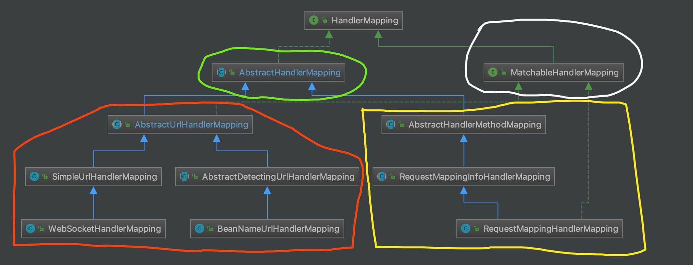

#  HandlerMapping 组件（三）之 AbstractHandlerMethodMapping


## 1. 概述

本文接 [《精尽 Spring MVC 源码分析 —— HandlerMapping 组件（一）之 AbstractHandlerMapping》](http://svip.iocoder.cn/Spring-MVC/HandlerMapping-1-AbstractHandlerMapping) 一文，分享 AbstractHandlerMapping 的右半边 **AbstractHandlerMethodMapping** 系，即下图右半边**黄色**部分：

[](http://static.iocoder.cn/images/Spring/2022-03-01/01.png)类图

- 一共有三个子类，继承关系很简单，AbstractHandlerMethodMapping <= RequestMappingInfoHandlerMapping <= RequestMappingHandlerMapping 。所以，我们在下面的每一小节，分享一个类。

## 2. 注解

Spring MVC 的请求匹配的注解，我们已经是熟悉的不能再熟悉，如下:

- [`org.springframework.web.bind.annotation.@RequestMapping`](https://github.com/spring-projects/spring-framework/blob/master/spring-web/src/main/java/org/springframework/web/bind/annotation/RequestMapping.java)
- [`org.springframework.web.bind.annotation.@GetMapping`](https://github.com/spring-projects/spring-framework/blob/master/spring-web/src/main/java/org/springframework/web/bind/annotation/GetMapping.java)
- [`org.springframework.web.bind.annotation.@PostMapping`](https://github.com/spring-projects/spring-framework/blob/master/spring-web/src/main/java/org/springframework/web/bind/annotation/PostMapping.java)
- [`org.springframework.web.bind.annotation.@PutMapping`](https://github.com/spring-projects/spring-framework/blob/master/spring-web/src/main/java/org/springframework/web/bind/annotation/PutMapping.java)
- [`org.springframework.web.bind.annotation.@DeleteMapping`](https://github.com/spring-projects/spring-framework/blob/master/spring-web/src/main/java/org/springframework/web/bind/annotation/DeleteMapping.java)
- [`org.springframework.web.bind.annotation.@PatchMapping`](https://github.com/spring-projects/spring-framework/blob/master/spring-web/src/main/java/org/springframework/web/bind/annotation/PatchMapping.java)

具体每个注解有哪些属性，胖友点击链接瞅瞅即可。毕竟，太熟悉了。哈哈哈哈。

## 3. AbstractHandlerMethodMapping

`org.springframework.web.servlet.result.method.AbstractHandlerMethodMapping` ，实现 InitializingBean 接口，继承 AbstractHandlerMapping 抽象类，以 **Method** 作为 **Handler** 的 HandlerMapping 抽象类，提供 Mapping 的初始化、注册等通用的骨架方法。这就是我们常说的[“模板方法模式”](http://www.iocoder.cn/DesignPattern/xiaomingge/Template-Method/) 。

那么具体是什么呢？AbstractHandlerMethodMapping 定义为了 `<T>` 泛型，交给子类做决定。例如，子类 RequestMappingInfoHandlerMapping 使用 RequestMappingInfo 类作为 `<T>` 泛型，也就是我们在 [「2. 注解」](http://svip.iocoder.cn/Spring-MVC/HandlerMapping-3-AbstractHandlerMethodMapping/#) 看到的 `@RequestMapping` 等注解。

### 3.1 构造方法

```
// AbstractHandlerMethodMapping.java

public abstract class AbstractHandlerMethodMapping<T> extends AbstractHandlerMapping implements InitializingBean {

    /**
     * Mapping 注册表
     */
    private final MappingRegistry mappingRegistry = new MappingRegistry();

    /**
     * Mapping 命名策略
     */
    @Nullable
    private HandlerMethodMappingNamingStrategy<T> namingStrategy;
}
```

- `<T>` 泛型，就是我们上面提到的，Mapping 的类型。

- `mappingRegistry` 属性，Mapping 注册表。详细解析，见 [「3.2 MappingRegistry」](http://svip.iocoder.cn/Spring-MVC/HandlerMapping-3-AbstractHandlerMethodMapping/#) 。

- `namingStrategy` 属性，`org.springframework.web.servlet.handler.HandlerMethodMappingNamingStrategy` 接口，😈 名字好长，Handler **的** Method **的** Mapping **的**名字生成策略接口。代码如下：

  ```
  // HandlerMethodMappingNamingStrategy.java
  
  @FunctionalInterface
  public interface HandlerMethodMappingNamingStrategy<T> {
  
  /**
   * 获得名字
   *
   * Determine the name for the given HandlerMethod and mapping.
   * @param handlerMethod the handler method
   * @param mapping the mapping
   * @return the name
   */
  	String getName(HandlerMethod handlerMethod, T mapping);
  
  }
  ```

  - 可能不太好理解，获得 Mapping 的名字。这样，我们就可以根据 Mapping 的名字，获得 Handler 。

  - `org.springframework.web.servlet.mvc.method.RequestMappingInfoHandlerMethodMappingNamingStrategy` 实现该接口，代码如下：

    ```
    // RequestMappingInfoHandlerMethodMappingNamingStrategy.java
    
    public class RequestMappingInfoHandlerMethodMappingNamingStrategy
            implements HandlerMethodMappingNamingStrategy<RequestMappingInfo> {
    
        /** Separator between the type and method-level parts of a HandlerMethod mapping name. */
        public static final String SEPARATOR = "#";
    
        @Override
        public String getName(HandlerMethod handlerMethod, RequestMappingInfo mapping) {
            // 情况一，mapping 名字非空，则使用 mapping 的名字
            if (mapping.getName() != null) {
                return mapping.getName();
            }
            // 情况二，使用类名大写 + "#" + 方法名
            StringBuilder sb = new StringBuilder();
            String simpleTypeName = handlerMethod.getBeanType().getSimpleName();
            for (int i = 0 ; i < simpleTypeName.length(); i++) {
                if (Character.isUpperCase(simpleTypeName.charAt(i))) {
                    sb.append(simpleTypeName.charAt(i));
                }
            }
            sb.append(SEPARATOR).append(handlerMethod.getMethod().getName());
            return sb.toString();
        }
    
    }
    ```

    - 比较好理解，分成两种情况。
    - 情况一，如果 Mapping 已经配置名字，则直接返回。例如，`@RequestMapping(name = "login", value = "user/login")` 注解的方法，它对应的 Mapping 的名字就是 `"login"` 。
    - 情况二，如果 Mapping 未配置名字，则使用使用类名大写 + `"#"` + 方法名。例如，`@RequestMapping(value = "user/login")` 注解的方法，假设它所在的类为 UserController ，对应的方法名为 login ，则它对应的 Mapping 的名字就是 `USERCONTROLLER#login` 。

### 3.2 MappingRegistry

MappingRegistry ，是 AbstractHandlerMethodMapping 的私有类，Mapping 注册表。

#### 3.2.1 构造方法

```java
// AbstractHandlerMethodMapping.java#MappingRegistry

/**
 * 注册表
 *
 * KEY: Mapping
 */
private final Map<T, MappingRegistration<T>> registry = new HashMap<>();

/**
 * 注册表2
 *
 * KEY：Mapping
 */
private final Map<T, HandlerMethod> mappingLookup = new LinkedHashMap<>();

/**
 * 直接 URL 的映射
 *
 * KEY：直接 URL
 * VALUE：Mapping 数组
 */
private final MultiValueMap<String, T> urlLookup = new LinkedMultiValueMap<>();

/**
 * Mapping 的名字与 HandlerMethod 的映射
 *
 * KEY：Mapping 的名字
 * VALUE：HandlerMethod 数组
 */
private final Map<String, List<HandlerMethod>> nameLookup = new ConcurrentHashMap<>();

/**
 * TODO 1012 cors
 */
private final Map<HandlerMethod, CorsConfiguration> corsLookup = new ConcurrentHashMap<>();

/**
 * 读写锁
 */
private final ReentrantReadWriteLock readWriteLock = new ReentrantReadWriteLock();
```

- `registry` 属性，注册表 1 。其中，KEY 为 Mapping ，即 `<T>` 泛型。

- `mappingLookup` 属性，注册表 2 。其中，KEY 为 Mapping ，即 `<T>` 泛型。

- `urlLookup` 属性，直接 URL 的映射。其中，KEY 为直接 URL ，VALUE 为 Mapping 数组。比较不好理解，我们放在 [「3.2.2 register」](http://svip.iocoder.cn/Spring-MVC/HandlerMapping-3-AbstractHandlerMethodMapping/#) 一起看。

- `nameLookup` 属性，Mapping 的名字与 HandlerMethod 的映射。其中，KEY 为 Mapping 的名字( 就是 [「3.1 构造方法」](http://svip.iocoder.cn/Spring-MVC/HandlerMapping-3-AbstractHandlerMethodMapping/#) 中，我们看到的 HandlerMethodMappingNamingStrategy 生成的 Mapping 的名字 )，VALUE 为 HandlerMethod 数组。

- `readWriteLock` 属性，读写锁。下文，会看到它的使用。涉及它的有两个方法：

  ```java
  // AbstractHandlerMethodMapping.java#MappingRegistry
  
  /**
   * 获得读锁
   *
   * Acquire the read lock when using getMappings and getMappingsByUrl.
   */
  public void acquireReadLock() {
  	this.readWriteLock.readLock().lock();
  }
  
  /**
   * 获得写锁
   *
   * Release the read lock after using getMappings and getMappingsByUrl.
   */
  public void releaseReadLock() {
  	this.readWriteLock.readLock().unlock();
  }
  ```

#### 3.2.2 register

`#register(T mapping, Object handler, Method method)` 方法，注册。代码如下：

```
// AbstractHandlerMethodMapping.java#MappingRegistry

public void register(T mapping, Object handler, Method method) {
    // <1> 获得写锁
    this.readWriteLock.writeLock().lock();
    try {
        // <2.1> 创建 HandlerMethod 对象
        HandlerMethod handlerMethod = createHandlerMethod(handler, method);
        // <2.2> 校验当前 mapping 不存在，否则抛出 IllegalStateException 异常
        assertUniqueMethodMapping(handlerMethod, mapping);
        // <2.3> 添加 mapping + HandlerMethod 到 mappingLookup 中
        this.mappingLookup.put(mapping, handlerMethod);

        // <3.1> 获得 mapping 对应的普通 URL 数组
        List<String> directUrls = getDirectUrls(mapping);
        // <3.2> 添加到 url + mapping 到 urlLookup 集合中
        for (String url : directUrls) {
            this.urlLookup.add(url, mapping);
        }

        // <4> 初始化 nameLookup
        String name = null;
        if (getNamingStrategy() != null) {
            // <4.1> 获得 Mapping 的名字
            name = getNamingStrategy().getName(handlerMethod, mapping);
            // <4.2> 添加到 mapping 的名字 + HandlerMethod 到 nameLookup 中
            addMappingName(name, handlerMethod);
        }

        // <5> TODO 1012 cors
        CorsConfiguration corsConfig = initCorsConfiguration(handler, method, mapping);
        if (corsConfig != null) {
            this.corsLookup.put(handlerMethod, corsConfig);
        }

        // <6> 创建 MappingRegistration 对象，并 mapping + MappingRegistration 添加到 registry 中
        this.registry.put(mapping, new MappingRegistration<>(mapping, handlerMethod));
    } finally {
        // <7> 释放写锁
        this.readWriteLock.writeLock().unlock();
    }
}
```

- `<1>` 处，获得写锁。

- `<2.1>` 处，调用 `#createHandlerMethod(Object handler, Method method)` 方法，创建 HandlerMethod 对象。详细解析，见 [「3.3 createHandlerMethod」](http://svip.iocoder.cn/Spring-MVC/HandlerMapping-3-AbstractHandlerMethodMapping/#) 。

- `<2.2>` 处，调用 `#assertUniqueMethodMapping(HandlerMethod newHandlerMethod, T mapping)` 方法，校验当前 `mapping` 不存在，否则抛出 IllegalStateException 异常。代码如下：

  ```
  // AbstractHandlerMethodMapping.java#MappingRegistry
  
  private void assertUniqueMethodMapping(HandlerMethod newHandlerMethod, T mapping) {
  	HandlerMethod handlerMethod = this.mappingLookup.get(mapping);
  	if (handlerMethod != null && !handlerMethod.equals(newHandlerMethod)) { // 存在，且不相等，说明不唯一
  		throw new IllegalStateException(
  				"Ambiguous mapping. Cannot map '" + newHandlerMethod.getBean() + "' method \n" +
  						newHandlerMethod + "\nto " + mapping + ": There is already '" +
  						handlerMethod.getBean() + "' bean method\n" + handlerMethod + " mapped.");
  	}
  }
  ```

- `<2.3>` 处，添加 `mapping` + HandlerMethod 到 `mappingLookup` 中。

- `<3.1>` 处，调用 `#getDirectUrls(T mapping)` 方法，获得 mapping 对应的直接 URL 数组。代码如下：

  ```
  // AbstractHandlerMethodMapping.java#MappingRegistry
  
  private List<String> getDirectUrls(T mapping) {
  	List<String> urls = new ArrayList<>(1);
  	// 遍历 Mapping 对应的路径
  	for (String path : getMappingPathPatterns(mapping)) {
  		// 非**模式**路径
  		if (!getPathMatcher().isPattern(path)) {
  			urls.add(path);
  		}
  	}
  	return urls;
  }
  ```

  - 例如，`@RequestMapping("/user/login")` 注解对应的路径，**就是**直接路径。
  - 例如，`@RequestMapping("/user/${id}")` 注解对应的路径，**不是**直接路径。

- `<3.2>` 处，添加到 直接 url + `mapping` 到 `urlLookup` 集合中。

- `<4.1>` 处，调用 `HandlerMethodMappingNamingStrategy#getName(HandlerMethod handlerMethod, T mapping)` 方法，获得 Mapping 的名字。

- `<4.2>` 处，调用 `#addMappingName(String name, HandlerMethod handlerMethod)` 方法，添加 `mapping` 的名字 + HandlerMethod 到 `nameLookup` 中。代码如下：

  ```
  // AbstractHandlerMethodMapping.java#MappingRegistry
  
  private void addMappingName(String name, HandlerMethod handlerMethod) {
      // 获得 Mapping 的名字，对应的 HandlerMethod 数组
      List<HandlerMethod> oldList = this.nameLookup.get(name);
  	if (oldList == null) {
  		oldList = Collections.emptyList();
  	}
  
  	// 如果已经存在，则不用添加
  	for (HandlerMethod current : oldList) {
  		if (handlerMethod.equals(current)) {
  			return;
  		}
  	}
  
  	// 添加到 nameLookup 中
  	List<HandlerMethod> newList = new ArrayList<>(oldList.size() + 1); // 重新创建的原因是，保证数组的大小固定。因为，基本不太存在扩容的可能性，申请大了就浪费了。
  	newList.addAll(oldList);
  	newList.add(handlerMethod);
  	this.nameLookup.put(name, newList);
  }
  ```

  - 比较简单，胖友自己瞅瞅就懂了。

- `<5>` 处，TODO 1012 cors

- `<6>` 处，创建 MappingRegistration 对象，并 `mapping` + MappingRegistration 添加到 `registry` 中。关于 MappingRegistration 类，详细解析，见 [「3.4 MappingRegistration」](http://svip.iocoder.cn/Spring-MVC/HandlerMapping-3-AbstractHandlerMethodMapping/#) 。

- `<7>` 处，释放写锁。

#### 3.2.3 unregister

`#unregister(T mapping)` 方法，取消注册。代码如下：

```
// AbstractHandlerMethodMapping.java#MappingRegistry

public void unregister(T mapping) {
    // 获得写锁
    this.readWriteLock.writeLock().lock();
    try {
        // 从 registry 中移除
        MappingRegistration<T> definition = this.registry.remove(mapping);
        if (definition == null) {
            return;
        }

        // 从 mappingLookup 中移除
        this.mappingLookup.remove(definition.getMapping());

        // 从 urlLookup 移除
        for (String url : definition.getDirectUrls()) {
            List<T> list = this.urlLookup.get(url);
            if (list != null) {
                list.remove(definition.getMapping());
                if (list.isEmpty()) {
                    this.urlLookup.remove(url);
                }
            }
        }

        // 从 nameLookup 移除
        removeMappingName(definition);

        // 从 corsLookup 中移除
        this.corsLookup.remove(definition.getHandlerMethod());
    } finally {
        // 释放写锁
        this.readWriteLock.writeLock().unlock();
    }
}
```

- 比较简单，胖友自己瞅瞅。另外，`#removeMappingName(MappingRegistration<T> definition)` 方法，胖友也自己瞅瞅。

### 3.3 createHandlerMethod

`#createHandlerMethod(Object handler, Method method)` 方法，创建 HandlerMethod 对象。代码如下：

```
// AbstractHandlerMethodMapping.java

protected HandlerMethod createHandlerMethod(Object handler, Method method) {
    HandlerMethod handlerMethod;
    // <1> 如果 handler 类型为 String， 说明对应一个 Bean 对象，例如 UserController 使用 @Controller 注解后，默认 handler 为它的 beanName ，即 `userController`
    if (handler instanceof String) {
        String beanName = (String) handler;
        handlerMethod = new HandlerMethod(beanName,
                obtainApplicationContext().getAutowireCapableBeanFactory(), method);
    // <2> 如果 handler 类型非 String ，说明是一个已经是一个 handler 对象，就无需处理，直接创建 HandlerMethod 对象
    } else {
        handlerMethod = new HandlerMethod(handler, method);
    }
    return handlerMethod;
}
```

- `<1>` 处，如果 `handler` 类型**为** String， 说明对应一个 Bean 对象，例如 UserController 使用 `@Controller` 注解后， `handler` 为它的默认的 `beanName = userController` 。
- `<2>` 处，如果 `handler` 类型**非** String ，说明是一个已经是一个 `handler` 对象，就无需处理，直接创建 HandlerMethod 对象。
- 到了此处，我们已经可以觉察，实际上，HandlerMethod 是 `handler` + `method` 的组合，一个对象的某个方法。

#### 3.3.1 HandlerMethod

`org.springframework.web.method.HandlerMethod` ，处理器的方法的封装对象。属性如下：

```
// HandlerMethod.java

/**
 * Bean 对象
 */
private final Object bean;

@Nullable
private final BeanFactory beanFactory;

/**
 * Bean 的类型
 */
private final Class<?> beanType;

/**
 * 方法
 */
private final Method method;

/**
 * {@link #method} 的桥接方法
 *
 * 详细说明
 *
 * 1. https://www.jianshu.com/p/250030ea9b28
 * 2. https://blog.csdn.net/mhmyqn/article/details/47342577
 */
private final Method bridgedMethod;

/**
 * 方法参数数组
 */
private final MethodParameter[] parameters;

/**
 * 响应的状态码，即 {@link ResponseStatus#code()}
 */
@Nullable
private HttpStatus responseStatus;
/**
 * 响应的状态码原因，即 {@link ResponseStatus#reason()}
 */
@Nullable
private String responseStatusReason;

/**
 * 解析自哪个 HandlerMethod 对象
 *
 * 仅构造方法中传入 HandlerMethod 类型的参数适用，例如 {@link #HandlerMethod(HandlerMethod)}
 */
@Nullable
private HandlerMethod resolvedFromHandlerMethod;

/**
 * 父接口的方法的参数注解数组
 */
@Nullable
private volatile List<Annotation[][]> interfaceParameterAnnotations;
```

- 属性，虽然比较多，但是比较好理解。我们顺着构造方法，一起来看看。

**HandlerMethod(String beanName, BeanFactory beanFactory, Method method) 构造方法**

对应 `#createHandlerMethod(Object handler, Method method)` 方法的 `<1>` 的情况，代码如下：

```
// HandlerMethod.java

/**
 * Create an instance from a bean name, a method, and a {@code BeanFactory}.
 * The method {@link #createWithResolvedBean()} may be used later to
 * re-create the {@code HandlerMethod} with an initialized bean.
 */
public HandlerMethod(String beanName, BeanFactory beanFactory, Method method) {
	Assert.hasText(beanName, "Bean name is required");
	Assert.notNull(beanFactory, "BeanFactory is required");
	Assert.notNull(method, "Method is required");
	// <1> 将 beanName 赋值给 bean 属性，说明 beanFactory + bean 的方式，获得 handler 对象
	this.bean = beanName;
	this.beanFactory = beanFactory;
	// <2> 初始化 beanType 属性
	Class<?> beanType = beanFactory.getType(beanName);
	if (beanType == null) {
		throw new IllegalStateException("Cannot resolve bean type for bean with name '" + beanName + "'");
	}
	this.beanType = ClassUtils.getUserClass(beanType);
	// <3> 初始化 method、bridgedMethod 属性
	this.method = method;
	this.bridgedMethod = BridgeMethodResolver.findBridgedMethod(method);
	// <4> 初始化 parameters 属性
	this.parameters = initMethodParameters();
	// <5> 初始化 responseStatus、responseStatusReason 属性
	evaluateResponseStatus();
}
```

- `<1>` 处， 将 `beanName` 赋值给 `bean` 属性，说明 `beanFactory` + `bean` 的方式，获得 `handler` 对象。

- `<2>` 处，初始化 `beanType` 属性。

- `<3>` 处，初始化 `method`、`bridgedMethod` 属性。

- `<5>` 处，调用 `#evaluateResponseStatus()` 方法，初始化 `responseStatus`、`responseStatusReason` 属性。代码如下：

  ```
  // HandlerMethod.java
  
  private void evaluateResponseStatus() {
  	ResponseStatus annotation = getMethodAnnotation(ResponseStatus.class);
  	if (annotation == null) {
  		annotation = AnnotatedElementUtils.findMergedAnnotation(getBeanType(), ResponseStatus.class);
  	}
  	if (annotation != null) {
  		this.responseStatus = annotation.code();
  		this.responseStatusReason = annotation.reason();
  	}
  }
  ```

- `<4>` 处，调用 `#initMethodParameters()` 方法，初始化 `parameters` 属性。代码如下：

  ```
  // HandlerMethod.java
  
  private MethodParameter[] initMethodParameters() {
  	int count = this.bridgedMethod.getParameterCount();
  	// 创建 MethodParameter 数组
  	MethodParameter[] result = new MethodParameter[count];
  	// 遍历 bridgedMethod 的参数，逐个解析参数类型
  	for (int i = 0; i < count; i++) {
  		HandlerMethodParameter parameter = new HandlerMethodParameter(i);
  		GenericTypeResolver.resolveParameterType(parameter, this.beanType);
  		result[i] = parameter;
  	}
  	return result;
  }
  ```

  - 关于 MethodParameter 和 GenericTypeResolver 类，本文就不详细解析，胖友自己去瞅瞅。
  - 关于 HandlerMethodParameter ，TODO 1014 HandlerMethodParameter

------

**HandlerMethod(Object bean, Method method) 构造方法**

对应 `#createHandlerMethod(Object handler, Method method)` 方法的 `<2>` 的情况，代码如下：

```
// HandlerMethod.java

/**
 * Create an instance from a bean instance and a method.
 */
public HandlerMethod(Object bean, Method method) {
	Assert.notNull(bean, "Bean is required");
	Assert.notNull(method, "Method is required");
	// 初始化 bean
	this.bean = bean;
	this.beanFactory = null; // 置空 beanFactory ，因为不用
	// 初始化 beanType 属性
	this.beanType = ClassUtils.getUserClass(bean);
	// 初始化 method 和 bridgedMethod 属性
	this.method = method;
	this.bridgedMethod = BridgeMethodResolver.findBridgedMethod(method);
	// 初始化 parameters 属性
	this.parameters = initMethodParameters();
	// 初始化 responseStatus、responseStatusReason 属性
	evaluateResponseStatus();
}
```

- 灰常简单。

### 3.4 MappingRegistration

MappingRegistration ，是 AbstractHandlerMethodMapping 的私有静态类，Mapping 注册登记。代码如下：

```
// AbstractHandlerMethodMapping.java

private static class MappingRegistration<T> {

    /**
     * Mapping 对象
     */
    private final T mapping;

    /**
     * HandlerMethod 对象
     */
    private final HandlerMethod handlerMethod;

    /**
     * 直接 URL 数组
     */
    private final List<String> directUrls;

    /**
     * {@link #mapping} 的名字
     */
    @Nullable
    private final String mappingName;

    public MappingRegistration(T mapping, HandlerMethod handlerMethod,
            @Nullable List<String> directUrls, @Nullable String mappingName) {

        Assert.notNull(mapping, "Mapping must not be null");
        Assert.notNull(handlerMethod, "HandlerMethod must not be null");
        this.mapping = mapping;
        this.handlerMethod = handlerMethod;
        this.directUrls = (directUrls != null ? directUrls : Collections.emptyList());
        this.mappingName = mappingName;
    }

    // ... 省略 getting 方法
}
```

### 3.5 afterPropertiesSet

> 艿艿：打起精神，虽然前面已经看了很多代码。此处，我们才真正进行**初始化**。

**实现** `#afterPropertiesSet()` 方法，进行初始化。代码如下：

```
// AbstractHandlerMethodMapping.java

/**
 * 是否只扫描可访问的 HandlerMethod 们
 */
private boolean detectHandlerMethodsInAncestorContexts = false;

@Override
public void afterPropertiesSet() {
	// <x> 初始化处理器的方法们
	initHandlerMethods();
}

/**
 * Scan beans in the ApplicationContext, detect and register handler methods.
 * @see #getCandidateBeanNames()
 * @see #processCandidateBean
 * @see #handlerMethodsInitialized
 */
protected void initHandlerMethods() {
	// <1.1> 遍历 Bean ，逐个处理
	for (String beanName : getCandidateBeanNames()) {
		if (!beanName.startsWith(SCOPED_TARGET_NAME_PREFIX)) {
			// <1.2> 处理 Bean
			processCandidateBean(beanName);
		}
	}
	// <2> 初始化处理器的方法们。目前是空方法，暂无具体的实现
	handlerMethodsInitialized(getHandlerMethods());
}
```

- `<1.1>` 处，调用 `#getCandidateBeanNames()` 方法，获得所有 Bean 的名字们，然后进行遍历处理。代码如下：

  ```
  // AbstractHandlerMethodMapping.java
  
  /**
   * Determine the names of candidate beans in the application context.
   * @since 5.1
   * @see #setDetectHandlerMethodsInAncestorContexts
   * @see BeanFactoryUtils#beanNamesForTypeIncludingAncestors
   */
  protected String[] getCandidateBeanNames() {
  	return (this.detectHandlerMethodsInAncestorContexts ? // 可访问
  			BeanFactoryUtils.beanNamesForTypeIncludingAncestors(obtainApplicationContext(), Object.class) :
  			obtainApplicationContext().getBeanNamesForType(Object.class));
  }
  ```

- `<1.2>` 处，调用 `#processCandidateBean(String beanName)` 方法，处理 Bean。详细解析，见 [「3.5.1 processCandidateBean」](http://svip.iocoder.cn/Spring-MVC/HandlerMapping-3-AbstractHandlerMethodMapping/#) 。

- `<2>` 处，调用 `#handlerMethodsInitialized(Map<T, HandlerMethod> handlerMethods)` 方法，初始化处理器的方法们。目前是空方法，暂无具体的实现。代码如下：

  ```
  // AbstractHandlerMethodMapping.java
      
  /**
   * Invoked after all handler methods have been detected.
   * @param handlerMethods a read-only map with handler methods and mappings.
   */
  protected void handlerMethodsInitialized(Map<T, HandlerMethod> handlerMethods) {
  }
  ```

  - 所以，可以忽略这个方法。

#### 3.5.1 processCandidateBean

`#processCandidateBean(String beanName)` 方法，判断 Bean 是否为处理器，如果是，则扫描处理器方法。代码如下：

```
// AbstractHandlerMethodMapping.java

/**
 * Determine the type of the specified candidate bean and call
 * {@link #detectHandlerMethods} if identified as a handler type.
 * <p>This implementation avoids bean creation through checking
 * {@link org.springframework.beans.factory.BeanFactory#getType}
 * and calling {@link #detectHandlerMethods} with the bean name.
 * @param beanName the name of the candidate bean
 * @since 5.1
 * @see #isHandler
 * @see #detectHandlerMethods
 */
protected void processCandidateBean(String beanName) {
    // <1> 获得 Bean 对应的类型
    Class<?> beanType = null;
    try {
        beanType = obtainApplicationContext().getType(beanName);
    } catch (Throwable ex) {
        // An unresolvable bean type, probably from a lazy bean - let's ignore it.
        if (logger.isTraceEnabled()) {
            logger.trace("Could not resolve type for bean '" + beanName + "'", ex);
        }
    }
    // 判断 Bean 是否为处理器，如果是，则扫描处理器方法
    if (beanType != null && isHandler(beanType)) { // <2.1>
        detectHandlerMethods(beanName); // <2.2>
    }
}
```

- `<1>` 处，获得 Bean 对应的类型。

- `<2.1>` 处，调用 `#isHandler(Class<?> beanType)` **抽象**方法，判断 Bean 的类型是否为处理器。代码如下：

  ```
  // AbstractHandlerMethodMapping.java
  
  /**
   * Whether the given type is a handler with handler methods.
   * @param beanType the type of the bean being checked
   * @return "true" if this a handler type, "false" otherwise.
   */
  protected abstract boolean isHandler(Class<?> beanType);
  ```

  - 该方法在 RequestMappingHandlerMapping 类中实现。详细解析，见 [「5.3 isHandler」](http://svip.iocoder.cn/Spring-MVC/HandlerMapping-3-AbstractHandlerMethodMapping/#) 。

- `<2.2>` 处，调用 `#detectHandlerMethods(Object handler)` 方法， 扫描处理器的方法们。详细解析，见 [「3.5.2 detectHandlerMethods」](http://svip.iocoder.cn/Spring-MVC/HandlerMapping-3-AbstractHandlerMethodMapping/#) 。

#### 3.5.2 detectHandlerMethods

`#handlerMethodsInitialized(Map<T, HandlerMethod> handlerMethods)` 方法，初始化处理器的方法们。代码如下：

```
// AbstractHandlerMethodMapping.java

/**
 * Look for handler methods in a handler.
 * @param handler the bean name of a handler or a handler instance
 */
protected void detectHandlerMethods(final Object handler) {
    // <1> 获得处理器类型
    Class<?> handlerType = (handler instanceof String ?
            obtainApplicationContext().getType((String) handler) : handler.getClass());

    if (handlerType != null) {
        // <2> 获得真实的类。因为，handlerType 可能是代理类
        final Class<?> userType = ClassUtils.getUserClass(handlerType);
        // <3> 获得匹配的方法的集合
        Map<Method, T> methods = MethodIntrospector.selectMethods(userType,
                (MethodIntrospector.MetadataLookup<T>) method -> getMappingForMethod(method, userType)); // 抽象方法，子类实现
        if (logger.isTraceEnabled()) {
            logger.trace("Mapped " + methods.size() + " handler method(s) for " + userType + ": " + methods);
        }
        // <4> 遍历方法，逐个注册 HandlerMethod
        methods.forEach((key, mapping) -> {
            Method invocableMethod = AopUtils.selectInvocableMethod(key, userType);
            registerHandlerMethod(handler, invocableMethod, mapping);
        });
    }
}
```

- `<1>` 处，获得处理器类型。这里也分成两种情况，和 [「3.3 createHandlerMethod」](http://svip.iocoder.cn/Spring-MVC/HandlerMapping-3-AbstractHandlerMethodMapping/#) 的一样，就不重复赘述了。

- `<2>` 处，调用 `ClassUtils#getUserClass(handlerType)` 方法，获得真实的类。因为，handlerType 可能是代理类。代码如下：

  ```
  // ClassUtils.java
  
  public static Class<?> getUserClass(Class<?> clazz) {
  	// 如果 CG_CLASS 代理类，则获取其父类
  	if (clazz.getName().contains(CGLIB_CLASS_SEPARATOR)) {
  		Class<?> superclass = clazz.getSuperclass();
  		if (superclass != null && superclass != Object.class) {
  			return superclass;
  		}
  	}
  	return clazz;
  }
  ```

- `<3>` 处，获得匹配的方法的集合。通过 `#getMappingForMethod(Method method, Class<?> handlerType)` **抽象**方法，获得方法的 Mapping 信息。代码如下：

  ```
  // AbstractHandlerMethodMapping.java
  
  /**
   * Provide the mapping for a handler method. A method for which no
   * mapping can be provided is not a handler method.
   * @param method the method to provide a mapping for
   * @param handlerType the handler type, possibly a sub-type of the method's
   * declaring class
   * @return the mapping, or {@code null} if the method is not mapped
   */
  @Nullable
  protected abstract T getMappingForMethod(Method method, Class<?> handlerType);
  ```

  - 该方法在 RequestMappingHandlerMapping 类中实现。详细解析，见 [「5.4 getMappingForMethod」](http://svip.iocoder.cn/Spring-MVC/HandlerMapping-3-AbstractHandlerMethodMapping/#) 。

- `<4>` 处，遍历方法，逐个调用 `#registerHandlerMethod(Object handler, Method method, T mapping)` 方法，注册 HandlerMethod 。代码如下：

  ```
  // AbstractHandlerMethodMapping.java
  
  /**
   * 注册 HandlerMethod
   *
   * Register a handler method and its unique mapping. Invoked at startup for
   * each detected handler method.
   * @param handler the bean name of the handler or the handler instance
   * @param method the method to register
   * @param mapping the mapping conditions associated with the handler method
   * @throws IllegalStateException if another method was already registered
   * under the same mapping
   */
  protected void registerHandlerMethod(Object handler, Method method, T mapping) {
  	this.mappingRegistry.register(mapping, handler, method);
  }
  ```

  - 这样，Mapping 和 `handler` + `method` ，就成功注册到 `mappingRegistry` 中。😈 那么，可能比较重要的问题是，究竟 Mapping 是什么？实际上，在 RequestMappingHandlerMapping 中，就是 `@RequestMapping` 解析成的 RequestMappingInfo 对象。淡定淡定，继续细细往下看。

### 3.6 getHandlerInternal

> 艿艿：这个方法，就是我们在 [《精尽 Spring MVC 源码分析 —— HandlerMapping 组件（一）之 AbstractHandlerMapping》](http://svip.iocoder.cn/Spring-MVC/HandlerMapping-1-AbstractHandlerMapping) 中，看到 AbstractHandlerMapping 给子类暴露的**很核心**的方法。

**实现** `#getHandlerInternal(ServerWebExchange exchange)` 方法，获得请求对应的 HandlerMethod 对象。代码如下：

```
// AbstractHandlerMethodMapping.java

// AbstractHandlerMethodMapping.java

/**
 * Look up a handler method for the given request.
 */
@Override
protected HandlerMethod getHandlerInternal(HttpServletRequest request) throws Exception {
    // <1> 获得请求的路径
    String lookupPath = getUrlPathHelper().getLookupPathForRequest(request);
    // <2> 获得写锁
    this.mappingRegistry.acquireReadLock();
    try {
        // <3> 获得 HandlerMethod 对象
        HandlerMethod handlerMethod = lookupHandlerMethod(lookupPath, request);
        // <4> 进一步，获得 HandlerMethod 对象
        return (handlerMethod != null ? handlerMethod.createWithResolvedBean() : null);
    } finally {
        // <5> 释放写锁
        this.mappingRegistry.releaseReadLock();
    }
}
```

- `<1>` 处，获得请求的路径。

- `<2>` 处，获得读锁。

- `<3>` 处，调用 `#lookupHandlerMethod(ServerWebExchange exchange)` 方法，获得 HandlerMethod 对象。详细解析，见 [「3.6.1 lookupHandlerMethod」](http://svip.iocoder.cn/Spring-MVC/HandlerMapping-3-AbstractHandlerMethodMapping/#) 。

- `<4>` 处，如果获得到 HandlerMethod 对象，则调用 `HandlerMethod#createWithResolvedBean()` 方法，进一步，获得 HandlerMethod 对象。代码如下：

  ```
  // HandlerMethod.java
  
  /**
   * If the provided instance contains a bean name rather than an object instance,
   * the bean name is resolved before a {@link HandlerMethod} is created and returned.
   */
  public HandlerMethod createWithResolvedBean() {
  	Object handler = this.bean;
  	// 如果是 bean 是 String类型，则获取对应的 handler 对象。例如，bean = userController 字符串，获取后，handler = UserController 对象
  	if (this.bean instanceof String) {
  		Assert.state(this.beanFactory != null, "Cannot resolve bean name without BeanFactory");
  		String beanName = (String) this.bean;
  		handler = this.beanFactory.getBean(beanName);
  	}
  	// 创建 HandlerMethod 对象
  	return new HandlerMethod(this, handler);
  }
  ```

  - 比较简单，胖友自己瞅瞅。

- `<5>` 处，释放读锁。

#### 3.6.1 lookupHandlerMethod

`#lookupHandlerMethod(ServerWebExchange exchange)` 方法，获得 HandlerMethod 对象。代码如下：

```
// AbstractHandlerMethodMapping.java
    
/**
 * Look up the best-matching handler method for the current request.
 * If multiple matches are found, the best match is selected.
 * @param lookupPath mapping lookup path within the current servlet mapping
 * @param request the current request
 * @return the best-matching handler method, or {@code null} if no match
 * @see #handleMatch(Object, String, HttpServletRequest)
 * @see #handleNoMatch(Set, String, HttpServletRequest)
 */
protected HandlerMethod lookupHandlerMethod(String lookupPath, HttpServletRequest request) throws Exception {
    // <1> Match 数组，存储匹配上当前请求的结果
    List<Match> matches = new ArrayList<>();
    // <1.1> 优先，基于直接 URL 的 Mapping 们，进行匹配
    List<T> directPathMatches = this.mappingRegistry.getMappingsByUrl(lookupPath);
    if (directPathMatches != null) {
        addMatchingMappings(directPathMatches, matches, request);
    }
    // <1.2> 其次，扫描注册表的 Mapping 们，进行匹配
    if (matches.isEmpty()) {
        // No choice but to go through all mappings...
        addMatchingMappings(this.mappingRegistry.getMappings().keySet(), matches, request);
    }

    // <2> 如果匹配到，则获取最佳匹配的 Match 对象的 handlerMethod 属性
    if (!matches.isEmpty()) {
        // <2.1> 创建 MatchComparator 对象，排序 matches 结果
        Comparator<Match> comparator = new MatchComparator(getMappingComparator(request));
        matches.sort(comparator);
        // <2.2> 获得首个 Match 对象
        Match bestMatch = matches.get(0);
        // <2.3> 处理存在多个 Match 对象的情况！！
        if (matches.size() > 1) {
            if (logger.isTraceEnabled()) {
                logger.trace(matches.size() + " matching mappings: " + matches);
            }
            // TODO 1012 cors
            if (CorsUtils.isPreFlightRequest(request)) {
                return PREFLIGHT_AMBIGUOUS_MATCH;
            }
            // 比较 bestMatch 和 secondBestMatch ，如果相等，说明有问题，抛出 IllegalStateException 异常
            // 因为，两个优先级一样高，说明无法判断谁更优先
            Match secondBestMatch = matches.get(1);
            if (comparator.compare(bestMatch, secondBestMatch) == 0) {
                Method m1 = bestMatch.handlerMethod.getMethod();
                Method m2 = secondBestMatch.handlerMethod.getMethod();
                String uri = request.getRequestURI();
                throw new IllegalStateException(
                        "Ambiguous handler methods mapped for '" + uri + "': {" + m1 + ", " + m2 + "}");
            }
        }
        // <2.4> 处理首个 Match 对象
        handleMatch(bestMatch.mapping, lookupPath, request);
        // <2.5> 返回首个 Match 对象的 handlerMethod 属性
        return bestMatch.handlerMethod;
    // <3> 如果匹配不到，则处理不匹配的情况
    } else {
        return handleNoMatch(this.mappingRegistry.getMappings().keySet(), lookupPath, request);
    }
}
```

- `<1>` 处，Match 数组，存储匹配上当前请求的结果。其中，Match 是 AbstractHandlerMethodMapping 的内部类，代码如下：

  ```
  // AbstractHandlerMethodMapping.java
  
  /**
   * A thin wrapper around a matched HandlerMethod and its mapping, for the purpose of
   * comparing the best match with a comparator in the context of the current request.
   */
  private class Match {
  
      /**
       * Mapping 对象
       */
      private final T mapping;
      /**
       * HandlerMethod 对象
       */
      private final HandlerMethod handlerMethod;
  
      public Match(T mapping, HandlerMethod handlerMethod) {
          this.mapping = mapping;
          this.handlerMethod = handlerMethod;
      }
  
      @Override
      public String toString() {
          return this.mapping.toString();
      }
  
  }
  ```

  - 将 `mapping` 和 `handlerMethod` 封装在一起的对象。

- `<1.1>` 处，优先，基于**直接 URL 的 Mapping 们**，进行匹配。

- `<1.2>` 处，其次，基于**扫描注册表的 Mapping 们**，进行匹配。

- 上述 `<1.1>` 和 `<1.2>` 处，都会调用 `#addMatchingMappings(Collection<T> mappings, List<Match> matches, ServerWebExchange exchange)` 方法，将当前请求和注册表中的 Mapping 进行匹配。若匹配成功，则生成 Mapping 记录，添加到 `matches` 中。代码如下：

  ```
  // AbstractHandlerMethodMapping.java
  
  private void addMatchingMappings(Collection<T> mappings, List<Match> matches, ServerWebExchange exchange) {
      // 遍历 Mapping 数组
  	for (T mapping : mappings) {
  	    // <1> 执行匹配
  		T match = getMatchingMapping(mapping, exchange);
  		// <2> 如果匹配，则创建 Match 对象，添加到 matches 中
  		if (match != null) {
  			matches.add(new Match(match, this.mappingRegistry.getMappings().get(mapping)));
  		}
  	}
  }
  ```

  - `<1>` 处，遍历 Mapping 数组，逐个调用 `#getMatchingMapping(T mapping, ServerWebExchange exchange)` **抽象**方法，执行匹配。代码如下：

    ```
    // AbstractHandlerMethodMapping.java
    
    /**
     * Check if a mapping matches the current request and return a (potentially
     * new) mapping with conditions relevant to the current request.
     * @param mapping the mapping to get a match for
     * @param exchange the current exchange
     * @return the match, or {@code null} if the mapping doesn't match
     */
    @Nullable
    protected abstract T getMatchingMapping(T mapping, ServerWebExchange exchange);
    ```

    - 如果匹配，则返回的结果**非空**。
    - 该方法在 RequestMappingInfoHandlerMapping 类中实现。详细解析，见 [「5.4 getMappingForMethod」](http://svip.iocoder.cn/Spring-MVC/HandlerMapping-3-AbstractHandlerMethodMapping/#) 。

  - `<2>` 处，如果匹配，则创建 Match 对象，添加到 `matches` 中。

- `<2>` 处，如果匹配到，则获取**最佳匹配**的 Match 对象的 `handlerMethod` 属性。

  - `<2.1>` 处，创建 MatchComparator 对象，排序 `matches` 结果。其中 MatchComparator 实现 Comparator 接口，是 AbstractHandlerMethodMapping 的私有类，Match 排序器。代码如下：

    ```
    // AbstractHandlerMethodMapping.java
    
    private class MatchComparator implements Comparator<Match> {
    
    	private final Comparator<T> comparator;
    
    	public MatchComparator(Comparator<T> comparator) {
    		this.comparator = comparator;
    	}
    
    	@Override
    	public int compare(Match match1, Match match2) {
    		return this.comparator.compare(match1.mapping, match2.mapping);
    	}
    }
    ```

    - 重点在于 `#compare(Match match1, Match match2)` 方法的实现。通过 `mapping` 属性，即 Mapping 对象。详细解析，见 [「4.2 RequestMappingInfo」](http://svip.iocoder.cn/Spring-MVC/HandlerMapping-3-AbstractHandlerMethodMapping/#) 。

  - `<2.2>` 处，获得**首个** Match 对象 `bestMatch` 变量。

  - `<2.3>` 处，处理存在多个 Match 对象的情况！！获得**第二** Match 对象 `secondBestMatch` 变量。通过 `bestMatch` 和 `secondBestMatch` 的比较，如果一样的优先级，则抛出 IllegalStateException 异常。因为，两个优先级一样高，说明无法判断谁更优先。

  - `<2.4>` 处，调用 `#handleMatch(T mapping, String lookupPath, HttpServletRequest request)` 方法，设置匹配的路径 `lookupPath` 到请求属性种。代码如下：

    ```
    // AbstractHandlerMethodMapping.java
    
    protected void handleMatch(T mapping, String lookupPath, HttpServletRequest request) {
    	request.setAttribute(HandlerMapping.PATH_WITHIN_HANDLER_MAPPING_ATTRIBUTE, lookupPath);
    }
    ```

    - 实际上，这个方法，在 RequestMappingInfoHandlerMapping 中，会被重写。详细解析，见 [「5. RequestMappingInfoHandlerMapping」](http://svip.iocoder.cn/Spring-MVC/HandlerMapping-3-AbstractHandlerMethodMapping/#) 中。

  - `<2.5>` 处，返回**首个** Match 对象的 `handlerMethod` 属性，即它是最匹配的。

- `<3>` 处，如果匹配不到，调用 `#handleNoMatch(Set<T> mappings, String lookupPath, HttpServletRequest request)` 方法，处理不匹配的情况。代码如下：

  ```
  // AbstractHandlerMethodMapping.java
  
  /**
   * Invoked when no matching mapping is not found.
   * @param mappings all registered mappings
   * @param lookupPath mapping lookup path within the current servlet mapping
   * @param request the current request
   * @throws ServletException in case of errors
   */
  @Nullable
  protected HandlerMethod handleNoMatch(Set<T> mappings, String lookupPath, HttpServletRequest request)
  		throws Exception {
  	return null;
  }
  ```

  - 目前是空实现，在 RequestMappingInfoHandlerMapping 中，会被重写。详细解析，见 [「5. RequestMappingInfoHandlerMapping」](http://svip.iocoder.cn/Spring-MVC/HandlerMapping-3-AbstractHandlerMethodMapping/#) 中。

## 4. RequestMappingInfoHandlerMapping

`org.springframework.web.servlet.mvc.method.RequestMappingInfoHandlerMapping` ，继承 AbstractHandlerMethodMapping 抽象类，定义了使用的泛型 `<T>` 为 `org.springframework.web.servlet.mvc.method.RequestMappingInfo` 类，即 Mapping 类型就是 RequestMappingInfo 。

**这样有什么好处呢**？RequestMappingInfoHandlerMapping 定义了使用了 RequestMappingInfo 对象，而 其子类 RequestMappingHandlerMapping 使用了 `@RequestMapping` 注解，来生成 RequestMappingInfo 对象。这样，如果未来我们自己定义了自己的注解，或者其他方式来生成 RequestMappingHandlerMapping 对象，未尝不可。关于这点，胖友可以再仔细思考下。

- [「3. AbstractHandlerMethodMapping」](http://svip.iocoder.cn/Spring-MVC/HandlerMapping-3-AbstractHandlerMethodMapping/#) 的定位
- [「4. RequestMappingInfoHandlerMapping」](http://svip.iocoder.cn/Spring-MVC/HandlerMapping-3-AbstractHandlerMethodMapping/#) 的定位
- [「5. RequestMappingHandlerMapping」](http://svip.iocoder.cn/Spring-MVC/HandlerMapping-3-AbstractHandlerMethodMapping/#) 的定位

### 4.1 构造方法

```
// RequestMappingInfoHandlerMapping.java

public abstract class RequestMappingInfoHandlerMapping extends AbstractHandlerMethodMapping<RequestMappingInfo> {

	protected RequestMappingInfoHandlerMapping() {
		setHandlerMethodMappingNamingStrategy(new RequestMappingInfoHandlerMethodMappingNamingStrategy());
	}

}
```

- `<T>` 泛型，为 RequestMappingInfo 类型。
- 设置了 `AbstractHandlerMethodMapping.namingStrategy` 属性，为 RequestMappingInfoHandlerMethodMappingNamingStrategy 对象。关于它，在 [「3.1 构造方法」](http://svip.iocoder.cn/Spring-MVC/HandlerMapping-3-AbstractHandlerMethodMapping/#) 已经介绍了。

### 4.2 RequestMappingInfo

> RequestMappingInfo 不是 RequestMappingInfoHandlerMapping 的内部类，但是是 **RequestMappingInfo**-HandlerMapping 的**前缀**。

`org.springframework.web.servlet.mvc.method.RequestMappingInfo` ，实现 RequestCondition 接口，请求匹配信息。

> 关于 `org.springframework.web.servlet.mvc.condition.RequestCondition` ，请求条件接口，定义了三个方法，分别是
>
> - `#combine(T other)` 合并方法
> - `#getMatchingCondition(HttpServletRequest request)` 匹配方法
> - `#compareTo(T other, HttpServletRequest request)` 比较方法
>
> 原代码，胖友点击 [传送门](https://github.com/spring-projects/spring-framework/blob/master/spring-webmvc/src/main/java/org/springframework/web/servlet/mvc/condition/RequestCondition.java) 查看。

#### 4.2.1 构造方法

```
// RequestMappingInfo.java

/**
 * 名字
 */
@Nullable
private final String name;

/**
 * 请求路径的条件
 */
private final PatternsRequestCondition patternsCondition;

/**
 * 请求方法的条件
 */
private final RequestMethodsRequestCondition methodsCondition;

/**
 * 参数的条件
 */
private final ParamsRequestCondition paramsCondition;

/**
 * 请求头的条件
 */
private final HeadersRequestCondition headersCondition;

/**
 * 可消费的 Content-Type 的条件
 */
private final ConsumesRequestCondition consumesCondition;

/**
 * 可生产的 Content-Type 的条件
 */
private final ProducesRequestCondition producesCondition;

/**
 * 自定义的条件
 */
private final RequestConditionHolder customConditionHolder;
```

- 这里，我们可以看到各种条件。实际上，和 `@RequestMapping` 注解是一一对应的。所以，每个属性的详细解释，胖友也可以看看 [《使用 @RequestMapping 注解映射请求路径》](https://linesh.gitbooks.io/spring-mvc-documentation-linesh-translation/content/publish/21-3/2-mapping-requests-with-@requestmapping.html) 。

- 😈 实际上，我们日常使用最多的还是 `patternsCondition` 请求路径条件，和 `methodsCondition` 请求方法条件。

- RequestCondition 的整体类图如下，

  

  RequestCondition 类图

  - 还是比较多的，本文我们只会简单介绍 PatternsRequestCondition 的实现。
  - 😈 Google 了一圈，是不是已经有人详细写了 RequestCondition 的解析，发现还没人细写。说明，可能都不太感兴趣，哈哈哈哈。

#### 4.2.2 getMatchingCondition

`#getMatchingCondition(HttpServletRequest request)` 方法，从当前 RequestMappingInfo 获得匹配的条件。如果匹配，则基于其匹配的条件，创建**新的** RequestMappingInfo 对象。如果不匹配，则返回 `null` 。代码如下：

```
// RequestMappingInfo.java

@SuppressWarnings("Duplicates")
@Override
@Nullable
public RequestMappingInfo getMatchingCondition(HttpServletRequest request) {
    // 匹配 methodsCondition、paramsCondition、headersCondition、consumesCondition、producesCondition
	RequestMethodsRequestCondition methods = this.methodsCondition.getMatchingCondition(request);
	ParamsRequestCondition params = this.paramsCondition.getMatchingCondition(request);
	HeadersRequestCondition headers = this.headersCondition.getMatchingCondition(request);
	ConsumesRequestCondition consumes = this.consumesCondition.getMatchingCondition(request);
	ProducesRequestCondition produces = this.producesCondition.getMatchingCondition(request);
	// 如果任一为空，则返回 null ，表示匹配失败
	if (methods == null || params == null || headers == null || consumes == null || produces == null) {
		return null;
	}

	// 匹配 patternsCondition
	PatternsRequestCondition patterns = this.patternsCondition.getMatchingCondition(request);
	if (patterns == null) { // 如果 patterns 为空，则返回 null ，表示匹配失败
		return null;
	}

	// 匹配 customConditionHolder
	RequestConditionHolder custom = this.customConditionHolder.getMatchingCondition(request);
	if (custom == null) { // 如果 custom 为空，则返回 null ，表示匹配失败
		return null;
	}

	// 创建匹配的 RequestMappingInfo 对象。
	// 为什么要创建 RequestMappingInfo 对象呢？因为当前 RequestMappingInfo 对象，一个 methodsCondition 可以配置 GET、POST、DELETE 等等条件，但是实际就匹配一个请求类型，此时 methods 只代表其匹配的那个。
	return new RequestMappingInfo(this.name, patterns,
			methods, params, headers, consumes, produces, custom.getCondition());
}
```

- 虽然代码非常长，实际都是调用每个属性对应的 `#getMatchingCondition(HttpServletRequest request)` 方法，获得其匹配的**真正的**条件。

- 那么可能胖友会疑惑，如果一个 `@RequestMapping(value = "user/login")` 注解，并未写 **RequestMethod** 的条件，岂不是会报空？实际上不会。在这种情况下，会创建一个 RequestMethodsRequestCondition 对象，并且在匹配时，直接返回自身。代码如下：

  ```
  // RequestMappingInfo.java
  
  /**
   * RequestMethod 集合
   */
  private final Set<RequestMethod> methods;
  
  @Override
  @Nullable
  public RequestMethodsRequestCondition getMatchingCondition(HttpServletRequest request) {
  	if (CorsUtils.isPreFlightRequest(request)) {
  		return matchPreFlight(request);
  	}
  
  	// 空的情况下，就返回自身
  	if (getMethods().isEmpty()) {
  		if (RequestMethod.OPTIONS.name().equals(request.getMethod()) &&
  				!DispatcherType.ERROR.equals(request.getDispatcherType())) {
  			return null; // No implicit match for OPTIONS (we handle it)
  		}
  		return this;
  	}
  
  	// 非空，逐个匹配
  	return matchRequestMethod(request.getMethod());
  }
  ```

```
* 也就是说，没有 **RequestMethod** 的条件，一定匹配成功，且结果就是自身 RequestMethodsRequestCondition 对象。
```

- 这个方法，详细的代码，胖友自己瞅瞅落。

#### 4.2.3 compareTo

`#compareTo(RequestMappingInfo other, HttpServletRequest request)` 方法，比较优先级。代码如下：

```
// RequestMappingInfo.java

/**
 * Compares "this" info (i.e. the current instance) with another info in the context of a request.
 * <p>Note: It is assumed both instances have been obtained via
 * {@link #getMatchingCondition(HttpServletRequest)} to ensure they have conditions with
 * content relevant to current request.
 */
@Override
public int compareTo(RequestMappingInfo other, HttpServletRequest request) {
	int result;
	// Automatic vs explicit HTTP HEAD mapping
	// 针对 HEAD 请求方法，特殊处理
	if (HttpMethod.HEAD.matches(request.getMethod())) {
		result = this.methodsCondition.compareTo(other.getMethodsCondition(), request);
		if (result != 0) {
			return result;
		}
	}
	// 比较 patternsCondition
	result = this.patternsCondition.compareTo(other.getPatternsCondition(), request);
	if (result != 0) {
		return result;
	}
	// 比较 paramsCondition
	result = this.paramsCondition.compareTo(other.getParamsCondition(), request);
	if (result != 0) {
		return result;
	}
	// 比较 headersCondition
	result = this.headersCondition.compareTo(other.getHeadersCondition(), request);
	if (result != 0) {
		return result;
	}
	// 比较 consumesCondition
	result = this.consumesCondition.compareTo(other.getConsumesCondition(), request);
	if (result != 0) {
		return result;
	}
	// 比较 producesCondition
	result = this.producesCondition.compareTo(other.getProducesCondition(), request);
	if (result != 0) {
		return result;
	}
	// Implicit (no method) vs explicit HTTP method mappings
	// 比较 methodsCondition
	result = this.methodsCondition.compareTo(other.getMethodsCondition(), request);
	if (result != 0) {
		return result;
	}
	// 比较 customConditionHolder
	result = this.customConditionHolder.compareTo(other.customConditionHolder, request);
	if (result != 0) {
		return result;
	}
	return 0;
}
```

- 虽然代码非常长，实际都是按照优先级，逐个调用每个属性对应的 `#compareTo(RequestMethodsRequestCondition other, HttpServletRequest request)` 方法，直到比到**不相等**。

#### 4.2.4 PatternsRequestCondition

`org.springframework.web.servlet.mvc.condition.PatternsRequestCondition` ，继承 AbstractRequestCondition 抽象类，请求路径条件。

这是最重要的 RequestCondition 实现类，所以胖友一定要看看。😈 当然，艿艿这里先偷懒下，胖友可以看看 [《详解 SpringMVC 请求的时候是如何找到正确的 Controller [附带源码分析\]》](https://www.cnblogs.com/fangjian0423/p/springMVC-request-mapping.html) 的 [「PatternsRequestCondition」](http://svip.iocoder.cn/Spring-MVC/HandlerMapping-3-AbstractHandlerMethodMapping/#) 部分。

- 当然，艿艿还是写了 PatternsRequestCondition 的简单注释。

### 4.3 getMappingPathPatterns

`#getMappingPathPatterns(RequestMappingInfo info)` 方法，获得 Mapping 对应的请求路径集合。代码如下：

```
// RequestMappingInfoHandlerMapping.java

/**
 * Get the URL path patterns associated with this {@link RequestMappingInfo}.
 */
@Override
protected Set<String> getMappingPathPatterns(RequestMappingInfo info) {
	return info.getPatternsCondition().getPatterns();
}
```

- 该方法，在 [「3.2.2 register」](http://svip.iocoder.cn/Spring-MVC/HandlerMapping-3-AbstractHandlerMethodMapping/#) 中，看到对该方法的调用。

> 艿艿：因为担心调用栈太深，文章无法排版。所以文章相对来说，按照类的维度来写。所以，一些方法的解释，胖友一定要结合着看看。😈 最好，边看，边结合 IDEA 调试。

### 4.4 getMatchingMapping

`#getMatchingMapping(RequestMappingInfo info, HttpServletRequest request)` 方法，获得请求对应的 RequestMappingInfo 对象。代码如下：

```
// RequestMappingInfoHandlerMapping.java

/**
 * Check if the given RequestMappingInfo matches the current request and
 * return a (potentially new) instance with conditions that match the
 * current request -- for example with a subset of URL patterns.
 * @return an info in case of a match; or {@code null} otherwise.
 */
@Override
protected RequestMappingInfo getMatchingMapping(RequestMappingInfo info, HttpServletRequest request) {
	return info.getMatchingCondition(request);
}
```

- 方法内部，调用的就是 [「4.2.2 getMatchingCondition」](http://svip.iocoder.cn/Spring-MVC/HandlerMapping-3-AbstractHandlerMethodMapping/#) 的方法。
- 该方法，在 [「3.6.1 lookupHandlerMethod」](http://svip.iocoder.cn/Spring-MVC/HandlerMapping-3-AbstractHandlerMethodMapping/#) 中，看到对该方法的调用。

### 4.5 handleMatch

`#handleMatch(RequestMappingInfo info, String lookupPath, HttpServletRequest request)` 方法，覆写父类的方法，设置更多的属性，到请求中。代码如下：

```
// RequestMappingInfoHandlerMapping.java

/**
 * Expose URI template variables, matrix variables, and producible media types in the request.
 * @see HandlerMapping#URI_TEMPLATE_VARIABLES_ATTRIBUTE
 * @see HandlerMapping#MATRIX_VARIABLES_ATTRIBUTE
 * @see HandlerMapping#PRODUCIBLE_MEDIA_TYPES_ATTRIBUTE
 */
@Override
protected void handleMatch(RequestMappingInfo info, String lookupPath, HttpServletRequest request) {
	super.handleMatch(info, lookupPath, request);

	// 获得 bestPattern 和 uriVariables
	String bestPattern; // 最佳路径
	Map<String, String> uriVariables; // 路径上的变量集合
	Set<String> patterns = info.getPatternsCondition().getPatterns();
	if (patterns.isEmpty()) {
		bestPattern = lookupPath;
		uriVariables = Collections.emptyMap();
	} else {
		bestPattern = patterns.iterator().next();
		uriVariables = getPathMatcher().extractUriTemplateVariables(bestPattern, lookupPath);
	}
	request.setAttribute(BEST_MATCHING_PATTERN_ATTRIBUTE, bestPattern);

	// 设置 MATRIX_VARIABLES_ATTRIBUTE 属性，到请求中
	if (isMatrixVariableContentAvailable()) {
		Map<String, MultiValueMap<String, String>> matrixVars = extractMatrixVariables(request, uriVariables);
		request.setAttribute(HandlerMapping.MATRIX_VARIABLES_ATTRIBUTE, matrixVars);
	}

	// 设置 URI_TEMPLATE_VARIABLES_ATTRIBUTE 属性，到请求中
	Map<String, String> decodedUriVariables = getUrlPathHelper().decodePathVariables(request, uriVariables);
	request.setAttribute(HandlerMapping.URI_TEMPLATE_VARIABLES_ATTRIBUTE, decodedUriVariables);

	// 设置 PRODUCIBLE_MEDIA_TYPES_ATTRIBUTE 属性，到请求中
	if (!info.getProducesCondition().getProducibleMediaTypes().isEmpty()) {
		Set<MediaType> mediaTypes = info.getProducesCondition().getProducibleMediaTypes();
		request.setAttribute(PRODUCIBLE_MEDIA_TYPES_ATTRIBUTE, mediaTypes);
	}
}
```

这个方法，会调用如下两个方法，感兴趣的胖友，自己研究下：

- `isMatrixVariableContentAvailable()` 方法
- `extractMatrixVariables(HttpServletRequest request, Map<String, String> uriVariables)` 方法

### 4.6 handleNoMatch

`#handleNoMatch(Set<RequestMappingInfo> infos, String lookupPath, HttpServletRequest request)` 方法，覆写父类方法，处理无匹配 Mapping 的情况。主要用途是，给出为什么找不到 Mapping 的原因。代码如下：

```
// RequestMappingInfoHandlerMapping.java

/**
 * Iterate all RequestMappingInfo's once again, look if any match by URL at
 * least and raise exceptions according to what doesn't match.
 * @throws HttpRequestMethodNotSupportedException if there are matches by URL
 * but not by HTTP method
 * @throws HttpMediaTypeNotAcceptableException if there are matches by URL
 * but not by consumable/producible media types
 */
@Override
protected HandlerMethod handleNoMatch(
        Set<RequestMappingInfo> infos, String lookupPath, HttpServletRequest request) throws ServletException {
    // <1> 创建 PartialMatchHelper 对象，解析可能的错误
    PartialMatchHelper helper = new PartialMatchHelper(infos, request);
    if (helper.isEmpty()) {
        return null;
    }

    // <2> 方法错误
    if (helper.hasMethodsMismatch()) {
        Set<String> methods = helper.getAllowedMethods();
        if (HttpMethod.OPTIONS.matches(request.getMethod())) {
            HttpOptionsHandler handler = new HttpOptionsHandler(methods);
            return new HandlerMethod(handler, HTTP_OPTIONS_HANDLE_METHOD);
        }
        throw new HttpRequestMethodNotSupportedException(request.getMethod(), methods);
    }

    // 可消费的 Content-Type 错误
    if (helper.hasConsumesMismatch()) {
        Set<MediaType> mediaTypes = helper.getConsumableMediaTypes();
        MediaType contentType = null;
        if (StringUtils.hasLength(request.getContentType())) {
            try {
                contentType = MediaType.parseMediaType(request.getContentType());
            } catch (InvalidMediaTypeException ex) {
                throw new HttpMediaTypeNotSupportedException(ex.getMessage());
            }
        }
        throw new HttpMediaTypeNotSupportedException(contentType, new ArrayList<>(mediaTypes));
    }

    // 可生产的 Content-Type 错误
    if (helper.hasProducesMismatch()) {
        Set<MediaType> mediaTypes = helper.getProducibleMediaTypes();
        throw new HttpMediaTypeNotAcceptableException(new ArrayList<>(mediaTypes));
    }

    // <5> 参数错误
    if (helper.hasParamsMismatch()) {
        List<String[]> conditions = helper.getParamConditions();
        throw new UnsatisfiedServletRequestParameterException(conditions, request.getParameterMap());
    }

    return null;
}
```

- `<1>` 处，核心代码在 PartialMatchHelper 中实现，当然 😈 本文还是不详细解析，感兴趣的朋友，自己瞅瞅。
- `<2>` 处，方法错误。这是一个非常常见的错误，例如说 `POST user/login` 存在，但是我们请求了 `GET user/login` 。
- `<5>` 处，参数错误。
- 如果胖友想要对这个方法抛出的异常，作进一步的处理，可以参考 [《Spring Boot 全局异常处理及自定义异常类》](https://blog.csdn.net/qq_34083066/article/details/79424142) 。

## 5. RequestMappingHandlerMapping

`org.springframework.web.servlet.mvc.method.annotation.RequestMappingHandlerMapping`，实现 MatchableHandlerMapping 接口、EmbeddedValueResolverAware 接口，继承 RequestMappingInfoHandlerMapping 抽象类，基于 `@RequestMapping` 注解来构建 RequestMappingInfo 对象。

### 5.1 构造方法

```
// RequestMappingHandlerMapping.java

private boolean useSuffixPatternMatch = true;

private boolean useRegisteredSuffixPatternMatch = false;

private boolean useTrailingSlashMatch = true;

private Map<String, Predicate<Class<?>>> pathPrefixes = new LinkedHashMap<>();

private ContentNegotiationManager contentNegotiationManager = new ContentNegotiationManager();

@Nullable
private StringValueResolver embeddedValueResolver;

/**
 * RequestMappingInfo.BuilderConfiguration 配置
 */
private RequestMappingInfo.BuilderConfiguration config = new RequestMappingInfo.BuilderConfiguration();
```

- 如果胖友想设置如上的值，可以参考 [《Spring mvc autowire RequestMappingHandlerMapping》](https://stackoverflow.com/questions/31893335/spring-mvc-autowire-requestmappinghandlermapping) 。

### 5.2 afterPropertiesSet

```
// RequestMappingHandlerMapping.java

@Override
public void afterPropertiesSet() {
	// 构建 RequestMappingInfo.BuilderConfiguration 对象
	this.config = new RequestMappingInfo.BuilderConfiguration();
	this.config.setUrlPathHelper(getUrlPathHelper());
	this.config.setPathMatcher(getPathMatcher());
	this.config.setSuffixPatternMatch(this.useSuffixPatternMatch);
	this.config.setTrailingSlashMatch(this.useTrailingSlashMatch);
	this.config.setRegisteredSuffixPatternMatch(this.useRegisteredSuffixPatternMatch);
	this.config.setContentNegotiationManager(getContentNegotiationManager());

	// 调用父类，初始化
	super.afterPropertiesSet();
}
```

### 5.3 isHandler

> 艿艿：😈 看到此处，有没很感动的感觉。

实现 `#isHandler(Class<?> beanType)` 方法，判断是否为处理器。代码如下：

```
// RequestMappingHandlerMapping.java

/**
 * {@inheritDoc}
 * <p>Expects a handler to have either a type-level @{@link Controller}
 * annotation or a type-level @{@link RequestMapping} annotation.
 */
@Override
protected boolean isHandler(Class<?> beanType) {
	return (AnnotatedElementUtils.hasAnnotation(beanType, Controller.class) ||
			AnnotatedElementUtils.hasAnnotation(beanType, RequestMapping.class));
}
```

### 5.4 getMappingForMethod

> 艿艿：😈 看到此处，有没更感动的感觉。

`#getMappingForMethod(Method method, Class<?> handlerType)` 方法，获得方法上的 RequestMappingInfo 对象，基于 `@RequestMapping` 构造。代码如下：

```
// RequestMappingHandlerMapping.java

/**
 * Uses method and type-level @{@link RequestMapping} annotations to create
 * the RequestMappingInfo.
 * @return the created RequestMappingInfo, or {@code null} if the method
 * does not have a {@code @RequestMapping} annotation.
 * @see #getCustomMethodCondition(Method)
 * @see #getCustomTypeCondition(Class)
 */
@Override
@Nullable
protected RequestMappingInfo getMappingForMethod(Method method, Class<?> handlerType) {
    // <1> 基于方法上的 @RequestMapping 注解，创建 RequestMappingInfo 对象
    RequestMappingInfo info = createRequestMappingInfo(method);
    if (info != null) {
        // <2> 基于类上的 @RequestMapping 注解，合并进去
        RequestMappingInfo typeInfo = createRequestMappingInfo(handlerType);
        if (typeInfo != null) {
            info = typeInfo.combine(info);
        }
        // <3> 如果有前缀，则设置到 info 中
        String prefix = getPathPrefix(handlerType);
        if (prefix != null) {
            info = RequestMappingInfo.paths(prefix).build().combine(info);
        }
    }
    return info;
}
```

- `<1>` 处，调用 `#createRequestMappingInfo(AnnotatedElement element)` 方法，基于方法上的 `@RequestMapping` 注解，创建 RequestMappingInfo 对象。代码如下：

  ```
  // RequestMappingHandlerMapping.java
  
  /**
   * Delegates to {@link #createRequestMappingInfo(RequestMapping, RequestCondition)},
   * supplying the appropriate custom {@link RequestCondition} depending on whether
   * the supplied {@code annotatedElement} is a class or method.
   * @see #getCustomTypeCondition(Class)
   * @see #getCustomMethodCondition(Method)
   */
  @Nullable
  private RequestMappingInfo createRequestMappingInfo(AnnotatedElement element) {
  	// <1> 获得 @RequestMapping 注解
  	RequestMapping requestMapping = AnnotatedElementUtils.findMergedAnnotation(element, RequestMapping.class);
  	// <2> 获得自定义的条件。目前都是空方法，可以无视
  	RequestCondition<?> condition = (element instanceof Class ?
  			getCustomTypeCondition((Class<?>) element) : getCustomMethodCondition((Method) element));
  	// <3> 基于 @RequestMapping 注解，创建 RequestMappingInfo 对象
  	return (requestMapping != null ? createRequestMappingInfo(requestMapping, condition) : null);
  }
  ```

  - `<1>` 处，获得 `@RequestMapping` 注解。当然，`@GetMapping`、`@PostMapping` 等等注解，也可以被扫描到。

  - `<2>` 处，获得自定义的条件。目前都是空方法，可以无视。代码如下：

    ```
    // RequestMappingHandlerMapping.java
    
    /**
     * Provide a custom type-level request condition.
     * The custom {@link RequestCondition} can be of any type so long as the
     * same condition type is returned from all calls to this method in order
     * to ensure custom request conditions can be combined and compared.
     * <p>Consider extending {@link AbstractRequestCondition} for custom
     * condition types and using {@link CompositeRequestCondition} to provide
     * multiple custom conditions.
     * @param handlerType the handler type for which to create the condition
     * @return the condition, or {@code null}
     */
    @Nullable
    protected RequestCondition<?> getCustomTypeCondition(Class<?> handlerType) {
    	return null;
    }
    
    /**
     * Provide a custom method-level request condition.
     * The custom {@link RequestCondition} can be of any type so long as the
     * same condition type is returned from all calls to this method in order
     * to ensure custom request conditions can be combined and compared.
     * <p>Consider extending {@link AbstractRequestCondition} for custom
     * condition types and using {@link CompositeRequestCondition} to provide
     * multiple custom conditions.
     * @param method the handler method for which to create the condition
     * @return the condition, or {@code null}
     */
    @Nullable
    protected RequestCondition<?> getCustomMethodCondition(Method method) {
    	return null;
    }
    ```

    - 可以暂时无视。

  - `<3>` 处，调用 `#createRequestMappingInfo(RequestMapping requestMapping, RequestCondition<?> customCondition)` 方法，基于 `@RequestMapping` 注解，创建 RequestMappingInfo 对象。代码如下：

    ```
    // RequestMappingHandlerMapping.java
    
    /**
     * Create a {@link RequestMappingInfo} from the supplied
     * {@link RequestMapping @RequestMapping} annotation, which is either
     * a directly declared annotation, a meta-annotation, or the synthesized
     * result of merging annotation attributes within an annotation hierarchy.
     */
    protected RequestMappingInfo createRequestMappingInfo(RequestMapping requestMapping, @Nullable RequestCondition<?> customCondition) {
    // 创建 RequestMappingInfo.Builder 对象，设置对应属性
    	RequestMappingInfo.Builder builder = RequestMappingInfo
    			.paths(resolveEmbeddedValuesInPatterns(requestMapping.path()))
    			.methods(requestMapping.method())
    			.params(requestMapping.params())
    			.headers(requestMapping.headers())
    			.consumes(requestMapping.consumes())
    			.produces(requestMapping.produces())
    			.mappingName(requestMapping.name());
    	if (customCondition != null) {
    		builder.customCondition(customCondition);
    	}
    	// 创建 RequestMappingInfo 对象
    	return builder.options(this.config).build();
    }
    ```

    - 关于 RequestMappingInfo.Builder 类，胖友自己可以简单看看。

- `<2>` 处，基于类上的 `@RequestMapping` 注解，创建 RequestMappingInfo 对象，并合并进去。

- `<3>` 处，如果有前缀，则设置到 `info` 中。

### 5.5 match

`#match(HttpServletRequest request, String pattern)` 方法，执行匹配。代码如下：

```
// RequestMappingHandlerMapping.java

@Override
public RequestMatchResult match(HttpServletRequest request, String pattern) {
	// 创建 RequestMappingInfo 对象
	RequestMappingInfo info = RequestMappingInfo.paths(pattern).options(this.config).build();
	// 获得匹配的 RequestMappingInfo 对象
	RequestMappingInfo matchingInfo = info.getMatchingCondition(request);
	if (matchingInfo == null) { // 如果不匹配，则返回 null
		return null;
	}
	// 获得请求路径的集合
	Set<String> patterns = matchingInfo.getPatternsCondition().getPatterns();
	// 获得请求的路径
	String lookupPath = getUrlPathHelper().getLookupPathForRequest(request);
	// 创建 RequestMatchResult 结果
	return new RequestMatchResult(patterns.iterator().next(), lookupPath, getPathMatcher());
}
```

## 666. 彩蛋

卧槽，又好长一篇。有点吐血了！！！！！

参考和推荐如下文章：

- 韩路彪 [《看透 Spring MVC：源代码分析与实践》](https://item.jd.com/11807414.html) 的 [「12.3 AbstractHandlerMethodMapping 系列」](http://svip.iocoder.cn/Spring-MVC/HandlerMapping-3-AbstractHandlerMethodMapping/#) 小节