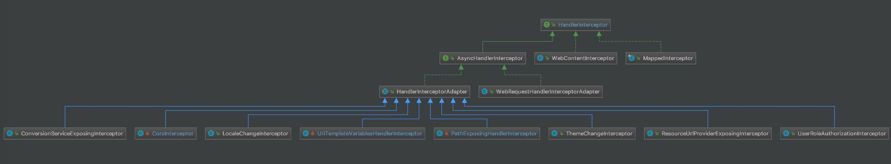

# HandlerMapping 组件（二）之 HandlerInterceptor


## 1. 概述

本文，我们来分享 Spring MVC 的拦截器，可能是大家最最最熟悉的组件。如果胖友没有实现过自定义的 Spring MVC 的拦截器，那可能有丢丢遗憾。所以，在看这篇文章之余，胖友也可以自己去尝试写一个 Spring MVC 的拦截器。

## 2. HandlerInterceptor

`org.springframework.web.servlet.HandlerInterceptor` ，处理器拦截器接口。代码如下：

```java
// HandlerInterceptor.java

public interface HandlerInterceptor {

    /**
     * 拦截处理器，在 {@link HandlerAdapter#handle(HttpServletRequest, HttpServletResponse, Object)} 执行之前
     */
    default boolean preHandle(HttpServletRequest request, HttpServletResponse response, Object handler)
            throws Exception {
        return true;
    }

    /**
     * 拦截处理器，在 {@link HandlerAdapter#handle(HttpServletRequest, HttpServletResponse, Object)} 执行成功之后
     */
    default void postHandle(HttpServletRequest request, HttpServletResponse response, Object handler,
            @Nullable ModelAndView modelAndView) throws Exception {
    }

    /**
     * 拦截处理器，在 {@link HandlerAdapter} 执行完之后，无论成功还是失败
     *
     * 并且，只有 {@link #preHandle(HttpServletRequest, HttpServletResponse, Object)} 执行成功之后，才会被执行
     */
    default void afterCompletion(HttpServletRequest request, HttpServletResponse response, Object handler,
            @Nullable Exception ex) throws Exception {
    }

}
```

一共有三个方法，胖友看看方法上的注释。

## 3. HandlerExecutionChain

`org.springframework.web.servlet.HandlerExecutionChain` ，处理器执行链。

### 3.1 构造方法

```java
// HandlerExecutionChain.java

/**
 * 处理器
 */
private final Object handler;
/**
 * 拦截器数组
 */
@Nullable
private HandlerInterceptor[] interceptors;
/**
 * 拦截器数组。
 *
 * 在实际使用时，会调用 {@link #getInterceptors()} 方法，初始化到 {@link #interceptors} 中
 */
@Nullable
private List<HandlerInterceptor> interceptorList;

/**
 * 已执行 {@link HandlerInterceptor#preHandle(HttpServletRequest, HttpServletResponse, Object)} 的位置
 *
 * 主要用于实现 {@link #applyPostHandle(HttpServletRequest, HttpServletResponse, ModelAndView)} 的逻辑
 */
private int interceptorIndex = -1;

/**
 * Create a new HandlerExecutionChain.
 * @param handler the handler object to execute
 */
public HandlerExecutionChain(Object handler) {
    this(handler, (HandlerInterceptor[]) null);
}

/**
 * Create a new HandlerExecutionChain.
 * @param handler the handler object to execute
 * @param interceptors the array of interceptors to apply
 * (in the given order) before the handler itself executes
 */
public HandlerExecutionChain(Object handler, @Nullable HandlerInterceptor... interceptors) {
    if (handler instanceof HandlerExecutionChain) {
        HandlerExecutionChain originalChain = (HandlerExecutionChain) handler;
        this.handler = originalChain.getHandler();
        // 初始化到 interceptorList 中
        this.interceptorList = new ArrayList<>();
        CollectionUtils.mergeArrayIntoCollection(originalChain.getInterceptors(), this.interceptorList); // 逻辑比较简单，就是将前者添加到后者中，即添加到 interceptorList 中
        CollectionUtils.mergeArrayIntoCollection(interceptors, this.interceptorList); // 逻辑比较简单，就是将前者添加到后者中，即添加到 interceptorList 中
    } else {
        this.handler = handler;
        this.interceptors = interceptors;
    }
}
```

### 3.2 addInterceptor

`#addInterceptor(HandlerInterceptor interceptor)` 方法，添加拦截器到 `interceptorList` 中。代码如下：

```java
// HandlerExecutionChain.java

public void addInterceptor(HandlerInterceptor interceptor) {
	initInterceptorList().add(interceptor);
}
```

- 首先，会调用 `#initInterceptorList()` 方法，保证 `interceptorList` 已初始化。代码如下：

  ```java
  // HandlerExecutionChain.java
  
  private List<HandlerInterceptor> initInterceptorList() {
  	// 如果 interceptorList 为空，则初始化为 ArrayList
  	if (this.interceptorList == null) {
  		this.interceptorList = new ArrayList<>();
  		// 如果 interceptors 非空，则添加到 interceptorList 中
  		if (this.interceptors != null) {
  			// An interceptor array specified through the constructor
  			CollectionUtils.mergeArrayIntoCollection(this.interceptors, this.interceptorList);
  		}
  	}
  	// 置空 interceptors
  	this.interceptors = null;
  	// 返回 interceptorList
  	return this.interceptorList;
  }
  ```

  - 虽然代码有点长，但是逻辑很简单。实际上，我们将 `interceptorList` 是 `interceptors` 的**配置**。

- 然后，添加 `interceptor` 到 `interceptorList` 中。

------

`#addInterceptor(HandlerInterceptor interceptor)` 方法，添加拦截器们到 `interceptorList` 中。代码如下：

```java
// HandlerExecutionChain.java

public void addInterceptors(HandlerInterceptor... interceptors) {
	if (!ObjectUtils.isEmpty(interceptors)) {
		CollectionUtils.mergeArrayIntoCollection(interceptors, initInterceptorList());
	}
}
```

### 3.3 getInterceptors

`#getInterceptors()` 方法，获得 `interceptors` 数组。代码如下：

```java
// HandlerExecutionChain.java

@Nullable
public HandlerInterceptor[] getInterceptors() {
	// 将 interceptorList 初始化到 interceptors 中
	if (this.interceptors == null && this.interceptorList != null) {
		this.interceptors = this.interceptorList.toArray(new HandlerInterceptor[0]);
	}
	// 返回 interceptors 数组
	return this.interceptors;
}
```

### 3.4 applyPreHandle

`#applyPreHandle(HttpServletRequest request, HttpServletResponse response)` 方法，应用拦截器的前置处理。代码如下：

```java
// HandlerExecutionChain.java

/**
 * 应用拦截器的前置处理
 *
 * Apply preHandle methods of registered interceptors.
 * @return {@code true} if the execution chain should proceed with the
 * next interceptor or the handler itself. Else, DispatcherServlet assumes
 * that this interceptor has already dealt with the response itself.
 */
boolean applyPreHandle(HttpServletRequest request, HttpServletResponse response) throws Exception {
    // <1> 获得拦截器数组
    HandlerInterceptor[] interceptors = getInterceptors();
    if (!ObjectUtils.isEmpty(interceptors)) {
        // <2> 遍历拦截器数组
        for (int i = 0; i < interceptors.length; i++) {
            HandlerInterceptor interceptor = interceptors[i];
            // <3> 前置处理
            if (!interceptor.preHandle(request, response, this.handler)) {
                // <3.1> 触发已完成处理
                triggerAfterCompletion(request, response, null);
                // 返回 false ，前置处理失败
                return false;
            }
            // <3.2> 标记 interceptorIndex 位置
            this.interceptorIndex = i;
        }
    }
    // <4> 返回 true ，前置处理成功
    return true;
}
```

- `<1>` 处，调用 `#getInterceptors()` 方法，获得拦截器数组。即，[「3.3 getInterceptors」](http://svip.iocoder.cn/Spring-MVC/HandlerMapping-2-HandlerInterceptor/#) 处的逻辑。
- `<2>` 处，遍历拦截器数组，逐个调用。
- `<3>处`，调用HandlerInterceptor#preHandle(HttpServletRequest request, HttpServletResponse response, Object handler)方法，执行拦截器的前置处理。如果成功，则返回true,，否则返回false。
  - <3.1>处，执行失败，则调用#triggerAfterCompletion(HttpServletRequest request, HttpServletResponse response, Exception ex)方法，触发已完成处理。详细解析，见「3.5 triggerAfterCompletion」。注意，此处不是触发当前拦截器的已完成逻辑，而是触发[0, interceptorIndex)这几个拦截器已完成的逻辑( **不包括**当前这个拦截器 )，并且是按照**倒序**执行的。
    - 返回 `false` ，因为有拦截器执行失败。
  - `<3.2>` 处，标记 `interceptorIndex` 位置。
- `<4>` 处，返回 `true` ，如果全部拦截器执行成功。

### 3.5 triggerAfterCompletion

`#triggerAfterCompletion(HttpServletRequest request, HttpServletResponse response, Exception ex)` 方法，触发拦截器的已完成处理。代码如下：

```java
// HandlerExecutionChain.java

/**
 * Trigger afterCompletion callbacks on the mapped HandlerInterceptors.
 * Will just invoke afterCompletion for all interceptors whose preHandle invocation
 * has successfully completed and returned true.
 */
void triggerAfterCompletion(HttpServletRequest request, HttpServletResponse response, @Nullable Exception ex)
		throws Exception {
	// 获得拦截器数组
	HandlerInterceptor[] interceptors = getInterceptors();
	if (!ObjectUtils.isEmpty(interceptors)) {
		// 遍历拦截器数组
		for (int i = this.interceptorIndex; i >= 0; i--) { // 倒序！！！
			HandlerInterceptor interceptor = interceptors[i];
			try {
				// 已完成处理
				interceptor.afterCompletion(request, response, this.handler, ex);
			} catch (Throwable ex2) { // 注意，如果执行失败，仅仅会打印错误日志，不会结束循环
				logger.error("HandlerInterceptor.afterCompletion threw exception", ex2);
			}
		}
	}
}
```

- 代码比较简单，正如上文所说。胖友自己瞅瞅，每一行的注释，都要仔细看。

### 3.6 applyPostHandle

`#applyPostHandle(HttpServletRequest request, HttpServletResponse response, ModelAndView mv)` 方法，应用拦截器的后置处理。代码如下：

```java
// HandlerExecutionChain.java

void applyPostHandle(HttpServletRequest request, HttpServletResponse response, @Nullable ModelAndView mv)
		throws Exception {
    // 获得拦截器数组
    HandlerInterceptor[] interceptors = getInterceptors();
	if (!ObjectUtils.isEmpty(interceptors)) {
        // 遍历拦截器数组
        for (int i = interceptors.length - 1; i >= 0; i--) { // 倒序
			HandlerInterceptor interceptor = interceptors[i];
			// 后置处理
			interceptor.postHandle(request, response, this.handler, mv);
		}
	}
}
```

- 代码比较简单。胖友自己瞅瞅，每一行的注释，都要仔细看。

### 3.7 applyAfterConcurrentHandlingStarted

TODO 1003

## 4. HandlerInterceptor 实现类

HandlerInterceptor 的实现类，如下图所示：

[](http://static.iocoder.cn/images/Spring/2022-03-04/01.png)类图

比较多，本文我们只看几个重要的实现类。

### 4.1 MappedInterceptor

`org.springframework.web.servlet.handler.MappedInterceptor` ，实现 HandlerInterceptor 接口，支持地址匹配的 HandlerInterceptor 实现类。

示例如下：

```
<mvc:interceptors>
    <mvc:interceptor>
        <mvc:mapping path="/interceptor/**" />
        <mvc:exclude-mapping path="/interceptor/b/*" />
        <bean class="com.elim.learn.spring.mvc.interceptor.MyInterceptor" />
    </mvc:interceptor>
</mvc:interceptors>
```

- 每一个 `<mvc:interceptor />` 标签，将被解析成一个 MappedInterceptor Bean 对象。

#### 4.1.1 构造方法

```
// MappedInterceptor.java

/**
 * 匹配的路径
 */
@Nullable
private final String[] includePatterns;
/**
 * 不匹配的路径
 */
@Nullable
private final String[] excludePatterns;
/**
 * 路径匹配器
 */
@Nullable
private PathMatcher pathMatcher;

/**
 * HandlerInterceptor 拦截器对象
 */
private final HandlerInterceptor interceptor;

public MappedInterceptor(@Nullable String[] includePatterns, HandlerInterceptor interceptor) {
	this(includePatterns, null, interceptor);
}

public MappedInterceptor(@Nullable String[] includePatterns, @Nullable String[] excludePatterns,
		HandlerInterceptor interceptor) {
	this.includePatterns = includePatterns;
	this.excludePatterns = excludePatterns;
	this.interceptor = interceptor;
}

public MappedInterceptor(@Nullable String[] includePatterns, WebRequestInterceptor interceptor) {
	this(includePatterns, null, interceptor);
}

public MappedInterceptor(@Nullable String[] includePatterns, @Nullable String[] excludePatterns,
		WebRequestInterceptor interceptor) {

	this(includePatterns, excludePatterns, new WebRequestHandlerInterceptorAdapter(interceptor));
}
```

- 属性比较简单，胖友自己瞅瞅。
- `includePatterns` + `excludePatterns` + `pathMatcher` 属性，匹配路径。
- `interceptor` 拦截器。

#### 4.1.2 matches

`#matches(String lookupPath, PathMatcher pathMatcher)` 方法，判断路径是否匹配。代码如下：

```
// MappedInterceptor.java

/**
 * Determine a match for the given lookup path.
 * @param lookupPath the current request path
 * @param pathMatcher a path matcher for path pattern matching
 * @return {@code true} if the interceptor applies to the given request path
 */
public boolean matches(String lookupPath, PathMatcher pathMatcher) {
	PathMatcher pathMatcherToUse = (this.pathMatcher != null ? this.pathMatcher : pathMatcher);
	// 先排重
	if (!ObjectUtils.isEmpty(this.excludePatterns)) {
		for (String pattern : this.excludePatterns) {
			if (pathMatcherToUse.match(pattern, lookupPath)) { // 匹配
				return false;
			}
		}
	}
	// 特殊，如果包含为空，则默认就是包含
	if (ObjectUtils.isEmpty(this.includePatterns)) {
		return true;
	}
	// 后包含
	for (String pattern : this.includePatterns) {
		if (pathMatcherToUse.match(pattern, lookupPath)) { // 匹配
			return true;
		}
	}
	return false;
}
```

简单，胖友自己瞅瞅

#### 4.1.3 拦截方法实现

```
// MappedInterceptor.java

@Override
public boolean preHandle(HttpServletRequest request, HttpServletResponse response, Object handler)
		throws Exception {
	return this.interceptor.preHandle(request, response, handler);
}

@Override
public void postHandle(HttpServletRequest request, HttpServletResponse response, Object handler,
		@Nullable ModelAndView modelAndView) throws Exception {
	this.interceptor.postHandle(request, response, handler, modelAndView);
}

@Override
public void afterCompletion(HttpServletRequest request, HttpServletResponse response, Object handler,
		@Nullable Exception ex) throws Exception {
	this.interceptor.afterCompletion(request, response, handler, ex);
}
```

直接调用拦截器对应的方法。

### 4.2 其他

TODO WebRequestInterceptor
TODO ASYC
TODO

## 5. 拦截器配置

在 Spring MVC 中，有多种方式，配置拦截器。那么对拦截器的配置是怎么解析和初始化的呢？下面，我们逐小节来解析。当然，本文暂时不会特别详细解析，而是交给胖友自己去研读。😝

### 5.1 `<mvc:interceptors />` 标签

实际上，我们已经看过 `<mvc:interceptors />` 的配置示例。那么，再来看一次，哈哈哈哈。

```
<mvc:interceptors>
    <mvc:interceptor>
        <mvc:mapping path="/interceptor/**" />
        <mvc:exclude-mapping path="/interceptor/b/*" />
        <bean class="com.elim.learn.spring.mvc.interceptor.MyInterceptor" />
    </mvc:interceptor>
</mvc:interceptors>
```

- 每一个 `<mvc:interceptor />` 标签，会被 `org.springframework.web.servlet.config.InterceptorsBeanDefinitionParser` 解析成 [「4.1 MappedInterceptor」](http://svip.iocoder.cn/Spring-MVC/HandlerMapping-2-HandlerInterceptor/#) 对象，注册到 Spring IOC 容器中。

- 在 AbstractHandlerMapping 的 `#detectMappedInterceptors(List<HandlerInterceptor> mappedInterceptors)` 方法中，会扫描 MappedInterceptor Bean 。代码如下：

  ```
  // AbstractHandlerMapping.java
  
  protected void detectMappedInterceptors(List<HandlerInterceptor> mappedInterceptors) {
  	// 扫描已注册的 MappedInterceptor 的 Bean 们，添加到 mappedInterceptors 中
  	// MappedInterceptor 会根据请求路径做匹配，是否进行拦截。
  	mappedInterceptors.addAll(
  			BeanFactoryUtils.beansOfTypeIncludingAncestors(
  					obtainApplicationContext(), MappedInterceptor.class, true, false).values());
  }
  ```

所以，这种方式，胖友只要看看 **InterceptorsBeanDefinitionParser** 类即可。

当然，基于这样的思路，我们直接配置 MappedInterceptor 的 Bean 对象也是可以的，无论是通过 XML ，还是通过 `@Bean` 注解。

### 5.2 Java Config

在使用 Spring Boot 时，这是主流的方式。示例如下：

```
// SecurityInterceptor.java

@Component
public class SecurityInterceptor extends HandlerInterceptorAdapter {

    // ... 省略无关代码

}

// MVCConfiguration.java

@EnableWebMvc
@Configuration
public class MVCConfiguration extends WebMvcConfigurerAdapter {

    @Autowired
    private SecurityInterceptor securityInterceptor;

    @Override
    public void addInterceptors(InterceptorRegistry registry) {
        registry.addInterceptor(securityInterceptor);
    }

}
```

- SecurityInterceptor 是拦截器，通过 `@Component` 注册到 Spring IOC 容器中。因为它是 HandlerInterceptorAdapter 的子类，而不是 MappedInterceptor 的子类，所以不会被 AbstractHandlerMapping 的 `#detectMappedInterceptors(List<HandlerInterceptor> mappedInterceptors)` 方法扫描到。
- 在 MVCConfiguration 的 `#addInterceptors(InterceptorRegistry registry)` 方法中，我们将 `securityInterceptor` 拦截器添加到 InterceptorRegistry 这个拦截器注册表中。

所以，这种方式，胖友可能要看的类是不少的，艿艿暂时没有细看。

- **InterceptorRegistry**
- **WebMvcConfigurerAdapter**

通过 WebMvcConfigurationSupport 的 `#getInterceptors()` 方法，获得拦截器们。代码如下：

```java
// WebMvcConfigurationSupport.java

@Nullable
private List<Object> interceptors;

protected final Object[] getInterceptors() {
    // 若 interceptors 未初始化，则进行初始化
	if (this.interceptors == null) {
		// 创建 InterceptorRegistry 对象
		InterceptorRegistry registry = new InterceptorRegistry();
		// 添加拦截器到 interceptors 中
		addInterceptors(registry); // <x>
		// 添加内置拦截器到 interceptors 中
		registry.addInterceptor(new ConversionServiceExposingInterceptor(mvcConversionService()));
		registry.addInterceptor(new ResourceUrlProviderExposingInterceptor(mvcResourceUrlProvider()));
		// 初始化到 interceptors 属性
		this.interceptors = registry.getInterceptors();
	}
	// 若 interceptors 已初始化，则直接返回
	return this.interceptors.toArray();
}
```

- 代码虽然比较长，重点在 `<x>` 处，调用 `#addInterceptors(InterceptorRegistry registry)` 方法，添加拦截器到 `interceptors` 中。代码如下：

  ```
  // WebMvcConfigurationSupport.java
  
  protected void addInterceptors(InterceptorRegistry registry) {
  }
  ```

  - 这是一个空方法，可由子类来进行实现。

- 我们一起来看 DelegatingWebMvcConfiguration 对 `#addInterceptors(InterceptorRegistry registry)` 方法，从 WebMvcConfigurer 对象中，获得拦截器，并添加到 `registry` 中。代码如下：

  ```java
  // DelegatingWebMvcConfiguration.java
  
  private final WebMvcConfigurerComposite configurers = new WebMvcConfigurerComposite();
  
  @Override
  protected void addInterceptors(InterceptorRegistry registry) {
      this.configurers.addInterceptors(registry);
  }
  
  // WebMvcConfigurerComposite.class
  
  @Override
  public void addInterceptors(InterceptorRegistry registry) {
      for (WebMvcConfigurer delegate : this.delegates) {
          delegate.addInterceptors(registry);
      }
  }
  ```

  - 其中，我们在示例给的 MVCConfiguration ，其实就是一个 WebMvcConfigurer 对象。这样，我们自己实现的 MVCConfiguration 的 `#addInterceptors(InterceptorRegistry registry)` 方法，就会被调用列。

而通过这样的方式的方式配置拦截器，最终通过 AbstractMappingHandler 的 `#setInterceptors(Object... interceptors)` 方法，设置到 MappingHandler 中。代码如下：

```java
// AbstractHandlerMapping.java

public void setInterceptors(Object... interceptors) {
	this.interceptors.addAll(Arrays.asList(interceptors));
}
```

- 当然，具体哪些地方调用 AbstractMappingHandler 的 `#setInterceptors(Object... interceptors)` 方法，请使用 IDEA 的**搜索**下，哪些地方调用了 WebMvcConfigurationSupport 的 `#getInterceptors()` 方法。

> 艿艿：关于这个过程，可以搭建一个 Spring Boot 项目，然后配置一个自定义拦截器，进行调试。


## 666. 彩蛋

正如文头所说，如果没实现过 Spring MVC 自定义拦截器的胖友，赶紧先来一发。😈

参考和推荐如下文章：

- 丶Format [《Spring MVC 拦截器详解[附带源码分析\]》](https://www.cnblogs.com/fangjian0423/p/springMVC-interceptor.html)
- 郝佳 [《Spring 源码深度解析》](https://item.jd.com/11311737.html) 的 [「11.3 DispatcherServlet」](http://svip.iocoder.cn/Spring-MVC/HandlerMapping-2-HandlerInterceptor/#) 小节
- 韩路彪 [《看透 Spring MVC：源代码分析与实践》](https://item.jd.com/11807414.html) 的 [「第12章 HandlerMapping」](http://svip.iocoder.cn/Spring-MVC/HandlerMapping-2-HandlerInterceptor/#) 小节