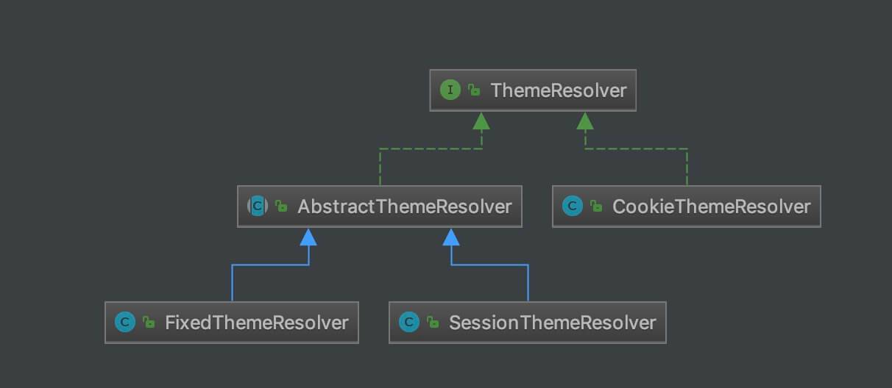

# ThemeResolver 组件


> ThemeResolver 实际使用很少，所以艿艿也没特别细看。
>
> 这里艿艿就转载 IAMTJW 的 [《Spring MVC 源码分析 —— 动态样式ThemeResolver（二）》](https://blog.csdn.net/qq924862077/article/details/53484532) 。

## 1. 概述

在上一篇博客 [《Spring MVC 源码分析 —— 动态样式ThemeResolver（一）》](https://blog.csdn.net/qq924862077/article/details/53438710) 中我们介绍了多样式ThemeResolver 的使用方法，接下来我们对源码进行简单的分析一下。

## 2. 类图

ThemeResolver 的体系结构如下：[](http://static.iocoder.cn/images/Spring/2022-06-10/01.png)ThemeResolver 类图

## 3. ThemeResolver

接口 ThemeResolver 中定义的接口是比较简单的，提供两个接口：

- （1）`#resolveThemeName` 方法，获取样式名。
- （2）`#setThemeName` 方法，设置样式名。

```
public interface ThemeResolver {

	/**
     * 从请求中，解析出使用的主题。例如，从请求头 User-Agent ，判断使用 PC 端，还是移动端的主题
     *
	 * Resolve the current theme name via the given request.
	 * Should return a default theme as fallback in any case.
	 * @param request request to be used for resolution
	 * @return the current theme name
	 */
	String resolveThemeName(HttpServletRequest request);

	/**
     * 设置请求，所使用的主题。
     *
	 * Set the current theme name to the given one.
	 * @param request request to be used for theme name modification
	 * @param response response to be used for theme name modification
	 * @param themeName the new theme name ({@code null} or empty to reset it)
	 * @throws UnsupportedOperationException if the ThemeResolver implementation
	 * does not support dynamic changing of the theme
	 */
	void setThemeName(HttpServletRequest request, @Nullable HttpServletResponse response, @Nullable String themeName);

}
```

## 4. AbstractThemeResolver

抽象类 AbstractThemeResolver ，提供两个方法：

- （1）`#setDefaultThemeName(...)` 方法，设置默认的样式名。
- （2）`#getDefaultThemeName(...)` 方法，获取默认的样式名。

```
public abstract class AbstractThemeResolver implements ThemeResolver {

	/**
	 * Out-of-the-box value for the default theme name: "theme".
	 */
	public static final String ORIGINAL_DEFAULT_THEME_NAME = "theme";

	private String defaultThemeName = ORIGINAL_DEFAULT_THEME_NAME;

	public void setDefaultThemeName(String defaultThemeName) {
		this.defaultThemeName = defaultThemeName;
	}

	public String getDefaultThemeName() {
		return this.defaultThemeName;
	}

}
```

}

## 5. SessionThemeResolver

实现类 SessionThemeResolver 的实现也是比较简单的，就是将`themeName` 保存到 Session 中就可以了。

```
public class SessionThemeResolver extends AbstractThemeResolver {

	/**
	 * Name of the session attribute that holds the theme name.
	 * Only used internally by this implementation.
	 * Use {@code RequestContext(Utils).getTheme()}
	 * to retrieve the current theme in controllers or views.
	 * @see org.springframework.web.servlet.support.RequestContext#getTheme
	 * @see org.springframework.web.servlet.support.RequestContextUtils#getTheme
	 */
	public static final String THEME_SESSION_ATTRIBUTE_NAME = SessionThemeResolver.class.getName() + ".THEME";


	@Override
	public String resolveThemeName(HttpServletRequest request) {
		String themeName = (String) WebUtils.getSessionAttribute(request, THEME_SESSION_ATTRIBUTE_NAME);
		// A specific theme indicated, or do we need to fallback to the default?
		return (themeName != null ? themeName : getDefaultThemeName());
	}

	@Override
	public void setThemeName(
			HttpServletRequest request, @Nullable HttpServletResponse response, @Nullable String themeName) {
		WebUtils.setSessionAttribute(request, THEME_SESSION_ATTRIBUTE_NAME,
				(StringUtils.hasText(themeName) ? themeName : null));
	}

}
```

## 6. FixedThemeResolver

实现 FixedThemeResolver 中没有具体的实现操作。

```
public class FixedThemeResolver extends AbstractThemeResolver {

	@Override
	public String resolveThemeName(HttpServletRequest request) {
		return getDefaultThemeName();
	}

	@Override
	public void setThemeName(
			HttpServletRequest request, @Nullable HttpServletResponse response, @Nullable String themeName) {
		throw new UnsupportedOperationException("Cannot change theme - use a different theme resolution strategy");
	}

}
```

## 7. CookieThemeResolver

实现类 CookieThemeResolver 的实现也是比较简单的，就是将`themeName` 保存到 Cookie 中就可以了。

```
public class CookieThemeResolver extends CookieGenerator implements ThemeResolver {

	/**
	 * The default theme name used if no alternative is provided.
	 */
	public static final String ORIGINAL_DEFAULT_THEME_NAME = "theme";

	/**
	 * Name of the request attribute that holds the theme name. Only used
	 * for overriding a cookie value if the theme has been changed in the
	 * course of the current request! Use RequestContext.getTheme() to
	 * retrieve the current theme in controllers or views.
	 * @see org.springframework.web.servlet.support.RequestContext#getTheme
	 */
	public static final String THEME_REQUEST_ATTRIBUTE_NAME = CookieThemeResolver.class.getName() + ".THEME";

	/**
	 * The default name of the cookie that holds the theme name.
	 */
	public static final String DEFAULT_COOKIE_NAME = CookieThemeResolver.class.getName() + ".THEME";


	private String defaultThemeName = ORIGINAL_DEFAULT_THEME_NAME;


	public CookieThemeResolver() {
		setCookieName(DEFAULT_COOKIE_NAME);
	}


	/**
	 * Set the name of the default theme.
	 */
	public void setDefaultThemeName(String defaultThemeName) {
		this.defaultThemeName = defaultThemeName;
	}

	/**
	 * Return the name of the default theme.
	 */
	public String getDefaultThemeName() {
		return this.defaultThemeName;
	}


	@Override
	public String resolveThemeName(HttpServletRequest request) {
		// Check request for preparsed or preset theme.
		String themeName = (String) request.getAttribute(THEME_REQUEST_ATTRIBUTE_NAME);
		if (themeName != null) {
			return themeName;
		}

		// Retrieve cookie value from request.
		String cookieName = getCookieName();
		if (cookieName != null) {
			Cookie cookie = WebUtils.getCookie(request, cookieName);
			if (cookie != null) {
				String value = cookie.getValue();
				if (StringUtils.hasText(value)) {
					themeName = value;
				}
			}
		}

		// Fall back to default theme.
		if (themeName == null) {
			themeName = getDefaultThemeName();
		}
		request.setAttribute(THEME_REQUEST_ATTRIBUTE_NAME, themeName);
		return themeName;
	}

	@Override
	public void setThemeName(
			HttpServletRequest request, @Nullable HttpServletResponse response, @Nullable String themeName) {

		Assert.notNull(response, "HttpServletResponse is required for CookieThemeResolver");

		if (StringUtils.hasText(themeName)) {
			// Set request attribute and add cookie.
			request.setAttribute(THEME_REQUEST_ATTRIBUTE_NAME, themeName);
			addCookie(response, themeName);
		} else {
			// Set request attribute to fallback theme and remove cookie.
			request.setAttribute(THEME_REQUEST_ATTRIBUTE_NAME, getDefaultThemeName());
			removeCookie(response);
		}
	}

}
```

## 666. 彩蛋

没有彩蛋~

参考和推荐如下文章：

- 韩路彪 [《看透 Spring MVC：源代码分析与实践》](https://item.jd.com/11807414.html) 的 [「第19章 ThemeResolver」](http://svip.iocoder.cn/Spring-MVC/ThemeResolver/#) 小节