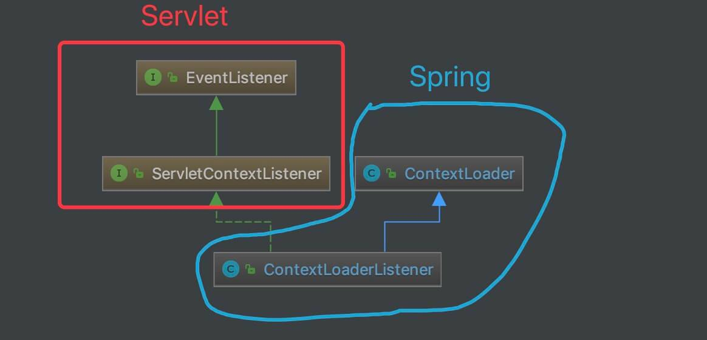

# 容器的初始化（一）之 Root WebApplicationContext 容器


## 1. 概述

随着 Spring Boot 逐步全面覆盖到我们的项目之中，我们已经基本忘却当年经典的 Servlet + Spring MVC 的组合，那让人熟悉的 `web.xml` 配置。而本文，我们想先抛开 Spring Boot 到一旁，回到从前，一起来看看 Servlet 是怎么和 Spring MVC 集成，怎么来初始化 Spring 容器的。

在开始看具体的源码实现之前，我们先一起来看看现在“陌生”的 `web.xml` 配置。代码如下：

```java
<!-- 省略非关键的配置 -->

<!-- [1] Spring配置 -->
<listener>
    <listener-class>org.springframework.web.context.ContextLoaderListener</listener-class>
</listener>
<!-- 指定Spring Bean的配置文件所在目录。默认配置在WEB-INF目录下 -->
<context-param>
    <param-name>contextConfigLocation</param-name>
    <param-value>classpath:config/applicationContext.xml</param-value>
</context-param>

<!-- ====================================== -->

<!-- [2] Spring MVC配置 -->
<servlet>
    <servlet-name>spring</servlet-name>
    <servlet-class>org.springframework.web.servlet.DispatcherServlet</servlet-class>
    <!-- 可以自定义servlet.xml配置文件的位置和名称，默认为WEB-INF目录下，名称为[<servlet-name>]-servlet.xml，如spring-servlet.xml
    <init-param>
        <param-name>contextConfigLocation</param-name>
        <param-value>/WEB-INF/spring-servlet.xml</param-value> // 默认
    </init-param>
    -->
    <load-on-startup>1</load-on-startup>
</servlet>
<servlet-mapping>
    <servlet-name>spring</servlet-name>
    <url-pattern>*.do</url-pattern>
</servlet-mapping>
```

- `[1]` 处，配置了 `org.springframework.web.context.ContextLoaderListener` 对象。这是一个 `javax.servlet.ServletContextListener` 对象，会初始化一个**Root** Spring WebApplicationContext 容器。这个过程，详细解析，见 [「3. Root WebApplicationContext 容器」](http://svip.iocoder.cn/Spring-MVC/context-init-Root-WebApplicationContext/#) 。
- `[2]` 处，配置了 `org.springframework.web.servlet.DispatcherServlet` 对象。这是一个 `javax.servlet.http.HttpServlet` 对象，它除了拦截我们制定的 `*.do` 请求外，也会初始化一个**属于它**的 Spring WebApplicationContext 容器。并且，这个容器是以 `[1]` 处的 Root 容器作为父容器。这个过程，详细解析，见 [《精尽 Spring MVC 源码分析 —— 容器的初始化（二）之 Servlet WebApplicationContext 容器》](http://svip.iocoder.cn/Spring-MVC/context-init-Servlet-WebApplicationContext) 。
- 可能胖友会有疑惑，为什么有了 `[2]` 创建了容器，还需要 `[1]` 创建了容器呢？因为可以配置多个 `[2]` 呀。当然，实际场景下，不太会配置多个 `[2]` 。😈
- 再总结一次，`[1]` 和 `[2]` 分别会创建其对应的 Spring WebApplicationContext 容器，并且它们是父子容器的关系。


因为有些胖友可能没接触过 `web.xml` 配置，详细的可以看看：

- J-Jian [《Spring MVC 的 web.xml 配置详解》](https://blog.csdn.net/mynewclass/article/details/78501604) **更加推荐**
- yaohong [《Spring MVC 配置文件 web.xml 详解各方总结》](https://www.cnblogs.com/yaohong/p/5905750.html) **更加详细**


## 2. 如何调试

执行 `ContextLoaderTests#testContextLoaderListenerWithDefaultContext()` 单元测试方法，即可执行本文涉及的一些逻辑。

当然，ContextLoaderTests 还提供了其他单元测试方法，胖友可以自己去尝试。

## 3. Root WebApplicationContext 容器

在概述中，我们已经看到，Root WebApplicationContext 容器的初始化，通过 ContextLoaderListener 来实现。在 Servlet 容器启动时，例如 Tomcat、Jetty 启动，则会被 ContextLoaderListener 监听到，从而调用 `#contextInitialized(ServletContextEvent event)` 方法，初始化 Root WebApplicationContext 容器。

而 ContextLoaderListener 的类图如下：



​																								*类图*

### 3.1 ContextLoaderListener

`org.springframework.web.context.ContextLoaderListener` ，实现 ServletContextListener 接口，继承 ContextLoader 类，实现 Servlet 容器启动和关闭时，分别初始化和销毁 WebApplicationContext 容器。

注意，这个 ContextLoaderListener 类，是在 `spring-web` 项目中。


#### 3.1.1 构造方法

```java
// ContextLoaderListener.java

public ContextLoaderListener() {
}

public ContextLoaderListener(WebApplicationContext context) {
	super(context);
}
```

这两个构造方法，是因为父类 ContextLoader 有这两个构造方法，所以必须重新定义。比较需要注意的是，第二个构造方法，可以直接传递一个 WebApplicationContext 对象，那样，实际 ContextLoaderListener 就无需在创建一个新的 WebApplicationContext 对象。😈


#### 3.1.2 contextInitialized

```java
// ContextLoaderListener.java

@Override
public void contextInitialized(ServletContextEvent event) {
    // 初始化 WebApplicationContext
	initWebApplicationContext(event.getServletContext());
}
```

- 调用父类 ContextLoader 的 `#initWebApplicationContext(ServletContext servletContext)` 方法，初始化 WebApplicationContext 对象。详细解析，见 [「3.2 ContextLoader」](http://svip.iocoder.cn/Spring-MVC/context-init-Root-WebApplicationContext/#) 。

#### 3.1.3 contextDestroyed

```java
// ContextLoaderListener.java

@Override
public void contextDestroyed(ServletContextEvent event) {
	closeWebApplicationContext(event.getServletContext());
	ContextCleanupListener.cleanupAttributes(event.getServletContext());
}
```

- 销毁 WebApplicationContext 容器的逻辑。本文，甚至本系列，都应该暂时不会详细解析。所以，感兴趣的胖友，需要自己研究咯。当然，在这并不着急。

### 3.2 ContextLoader

`org.springframework.web.context.ContextLoader` ，真正实现初始化和销毁 WebApplicationContext 容器的逻辑的类。

>注意，这个 ContextLoaderListener 类，是在 `spring-web` 项目中。

#### 3.2.1 构造方法

因为 ContextLoader 的属性比较多，我们逐块来看。

第一块，`defaultStrategies` **静态**属性，默认的配置 Properties 对象。代码如下：

```java
// ContextLoader.java

/**
 * Name of the class path resource (relative to the ContextLoader class)
 * that defines ContextLoader's default strategy names.
 */
private static final String DEFAULT_STRATEGIES_PATH = "ContextLoader.properties";

/**
 * 默认的配置 Properties 对象
 *
 * 从 {@link #DEFAULT_STRATEGIES_PATH} 中读取
 */
private static final Properties defaultStrategies;

static {
	// Load default strategy implementations from properties file.
	// This is currently strictly internal and not meant to be customized
	// by application developers.
	try {
		ClassPathResource resource = new ClassPathResource(DEFAULT_STRATEGIES_PATH, ContextLoader.class);
		defaultStrategies = PropertiesLoaderUtils.loadProperties(resource);
	} catch (IOException ex) {
		throw new IllegalStateException("Could not load 'ContextLoader.properties': " + ex.getMessage());
	}
}

```

从 `ContextLoader.properties` 中，读取默认的配置 Properties 对象。实际上，正如 `Load default strategy implementations from properties file. This is currently strictly internal and not meant to be customized by application developers.` 所注释，这是一个应用开发者无需关心的配置，而是 Spring 框架自身所定义的。打开来瞅瞅，代码如下：

```java
// spring-framework/spring-web/src/main/resources/org/springframework/web/context/ContextLoader.properties

# Default WebApplicationContext implementation class for ContextLoader.
# Used as fallback when no explicit context implementation has been specified as context-param.
# Not meant to be customized by application developers.

org.springframework.web.context.WebApplicationContext=org.springframework.web.context.support.XmlWebApplicationContext

```

- 这意味着什么呢？如果我们没有在 `<context-param />` 标签中，配置指定的 WebApplicationContext 类型，就使用 XmlWebApplicationContext 类。😈 一般情况下，我们也不会主动指定。

第二块，`context` 属性，**Root** WebApplicationContext 对象。代码如下

```java
// ContextLoader.java

/**
 * Root WebApplicationContext 对象
 *
 * The root WebApplicationContext instance that this loader manages.
 */
@Nullable
private WebApplicationContext context;

public ContextLoader() {
}

public ContextLoader(WebApplicationContext context) {
	this.context = context;
}
```

在下文中，我们将会看到，如果 `context` 是直接传入，则不会进行初始化，重新创建。


#### 3.2.2 initWebApplicationContext

`#initWebApplicationContext(ServletContext servletContext)` 方法，初始化 WebApplicationContext 对象。代码如下：

```java
// ContextLoader.java

public WebApplicationContext initWebApplicationContext(ServletContext servletContext) {
    // <1> 若已经存在 ROOT_WEB_APPLICATION_CONTEXT_ATTRIBUTE 对应的 WebApplicationContext 对象，则抛出 IllegalStateException 异常。
    // 例如，在 web.xml 中存在多个 ContextLoader 。
	if (servletContext.getAttribute(WebApplicationContext.ROOT_WEB_APPLICATION_CONTEXT_ATTRIBUTE) != null) {
		throw new IllegalStateException(
				"Cannot initialize context because there is already a root application context present - " +
				"check whether you have multiple ContextLoader* definitions in your web.xml!");
	}

	// <2> 打印日志
	servletContext.log("Initializing Spring root WebApplicationContext");
	Log logger = LogFactory.getLog(ContextLoader.class);
	if (logger.isInfoEnabled()) {
		logger.info("Root WebApplicationContext: initialization started");
	}

	// 记录开始时间
	long startTime = System.currentTimeMillis();

	try {
		// Store context in local instance variable, to guarantee that
		// it is available on ServletContext shutdown.
		if (this.context == null) {
		    // <3> 初始化 context ，即创建 context 对象
			this.context = createWebApplicationContext(servletContext);
		}
		// <4> 如果是 ConfigurableWebApplicationContext 的子类，如果未刷新，则进行配置和刷新
		if (this.context instanceof ConfigurableWebApplicationContext) {
			ConfigurableWebApplicationContext cwac = (ConfigurableWebApplicationContext) this.context;
			if (!cwac.isActive()) { // <4.1> 未刷新( 激活 )
				// The context has not yet been refreshed -> provide services such as
				// setting the parent context, setting the application context id, etc
				if (cwac.getParent() == null) { // <4.2> 无父容器，则进行加载和设置。
					// The context instance was injected without an explicit parent ->
					// determine parent for root web application context, if any.
					ApplicationContext parent = loadParentContext(servletContext);
					cwac.setParent(parent);
				}
				// <4.3> 配置 context 对象，并进行刷新
				configureAndRefreshWebApplicationContext(cwac, servletContext);
			}
		}
		// <5> 记录在 servletContext 中
		servletContext.setAttribute(WebApplicationContext.ROOT_WEB_APPLICATION_CONTEXT_ATTRIBUTE, this.context);

		// <6> 记录到 currentContext 或 currentContextPerThread 中
		ClassLoader ccl = Thread.currentThread().getContextClassLoader();
		if (ccl == ContextLoader.class.getClassLoader()) {
			currentContext = this.context;
		} else if (ccl != null) {
			currentContextPerThread.put(ccl, this.context);
		}

		// <7> 打印日志
		if (logger.isInfoEnabled()) {
			long elapsedTime = System.currentTimeMillis() - startTime;
			logger.info("Root WebApplicationContext initialized in " + elapsedTime + " ms");
		}

		// <8> 返回 context
		return this.context;
	} catch (RuntimeException | Error ex) {
	    // <9> 当发生异常，记录异常到 WebApplicationContext.ROOT_WEB_APPLICATION_CONTEXT_ATTRIBUTE 中，不再重新初始化。
		logger.error("Context initialization failed", ex);
		servletContext.setAttribute(WebApplicationContext.ROOT_WEB_APPLICATION_CONTEXT_ATTRIBUTE, ex);
		throw ex;
	}
}
```

- `<1>` 处，若已经存在 `ROOT_WEB_APPLICATION_CONTEXT_ATTRIBUTE` 对应的 WebApplicationContext 对象，则抛出 IllegalStateException 异常。例如，在 `web.xml` 中存在多个 ContextLoader 。

- `<2>` 处，打印日志。

- `<3>` 处，调用 `#createWebApplicationContext(ServletContext sc)` 方法，初始化 `context` ，即创建 WebApplicationContext 对象。详细解析，胖友先跳到 [「3.2.3 createWebApplicationContext」](http://svip.iocoder.cn/Spring-MVC/context-init-Root-WebApplicationContext/#) 。

- `<4>` 处，如果 `context` 是 ConfigurableWebApplicationContext 的子类，如果未刷新，则进行配置和刷新。

  - `<4.1>` 处，如果未未刷新( 激活 )。默认情况下，是符合这个条件的，所以会往下执行。😈

  - `<4.2>` 处，无父容器，则进行加载和设置。默认情况下，`#loadParentContext(ServletContext servletContext)` 方法，返回 `null` 。代码如下：

    ```java
    // ContextLoader.java
    
    @Nullable
    protected ApplicationContext loadParentContext(ServletContext servletContext) {
    	return null;
    }
    ```

    - 这是一个让子类实现的方法。当然，子类 ContextLoaderListener 并没有重写该方法。所以，实际上，`<4.2>` 处的逻辑，可以暂时忽略。

- `<4.3>` 处，调用 `#configureAndRefreshWebApplicationContext(ConfigurableWebApplicationContext wac, ServletContext sc)` 方法，配置 ConfigurableWebApplicationContext 对象，并进行刷新。详细解析，胖友先跳到 [「3.2.4 configureAndRefreshWebApplicationContext」](http://svip.iocoder.cn/Spring-MVC/context-init-Root-WebApplicationContext/#) 中。

- `<5>` 处，记录 `context` 在 ServletContext 中。这样，如果 `web.xml` 如果定义了多个 ContextLoader ，就会在 `<1>` 处报错。

- `<6>` 处，记录到 `currentContext` 或 `currentContextPerThread` 中，差异在于类加载器的不同。变量代码如下：

```java
// ContextLoader.java

/**
 * Map from (thread context) ClassLoader to corresponding 'current' WebApplicationContext.
 */
private static final Map<ClassLoader, WebApplicationContext> currentContextPerThread =
		new ConcurrentHashMap<>(1);
    
/**
 * The 'current' WebApplicationContext, if the ContextLoader class is
 * deployed in the web app ClassLoader itself.
 */
@Nullable
private static volatile WebApplicationContext currentContext;
```

- 目前这两个变量，在销毁 Spring WebApplicationContext 容器时会用到。暂时还看不太出其它的用途。搜索网络上的文章，也没人细说这个。如果知道的胖友，麻烦告知下。
- `<7>` 处，打印日志。
- `<8>` 处，返回 `context` 。
- `<9>` 处，当发生异常，记录异常到 `WebApplicationContext.ROOT_WEB_APPLICATION_CONTEXT_ATTRIBUTE` 中，不再重新初始化。即对应到 `<1>` 处的逻辑。

#### 3.2.3 createWebApplicationContext

`#createWebApplicationContext(ServletContext sc)` 方法，初始化 `context` ，即创建 WebApplicationContext 对象。代码如下：

```java
// ContextLoader.java

protected WebApplicationContext createWebApplicationContext(ServletContext sc) {
    // <1> 获得 context 的类
	Class<?> contextClass = determineContextClass(sc);
	// <2> 判断 context 的类，是否符合 ConfigurableWebApplicationContext 的类型
	if (!ConfigurableWebApplicationContext.class.isAssignableFrom(contextClass)) {
		throw new ApplicationContextException("Custom context class [" + contextClass.getName() +
				"] is not of type [" + ConfigurableWebApplicationContext.class.getName() + "]");
	}
	// <3> 创建 context 的类的对象
	return (ConfigurableWebApplicationContext) BeanUtils.instantiateClass(contextClass);
}
```

- `<1>` 处，调用 `#determineContextClass(ServletContext servletContext)` 方法，获得 `context` 的类。代码如下：

  ```java
  // ContextLoader.java
  
  /**
   * Config param for the root WebApplicationContext implementation class to use: {@value}.
   * @see #determineContextClass(ServletContext)
   */
  public static final String CONTEXT_CLASS_PARAM = "contextClass";
  
  protected Class<?> determineContextClass(ServletContext servletContext) {
      // 获得参数 contextClass 的值
  	String contextClassName = servletContext.getInitParameter(CONTEXT_CLASS_PARAM);
  	// 情况一，如果值非空，则获得该类
  	if (contextClassName != null) {
  		try {
  			return ClassUtils.forName(contextClassName, ClassUtils.getDefaultClassLoader());
  		} catch (ClassNotFoundException ex) {
  			throw new ApplicationContextException(
  					"Failed to load custom context class [" + contextClassName + "]", ex);
  		}
      // 情况二，从 defaultStrategies 获得该类
  	} else {
  		contextClassName = defaultStrategies.getProperty(WebApplicationContext.class.getName());
  		try {
  			return ClassUtils.forName(contextClassName, ContextLoader.class.getClassLoader());
  		} catch (ClassNotFoundException ex) {
  			throw new ApplicationContextException(
  					"Failed to load default context class [" + contextClassName + "]", ex);
  		}
  	}
  }
  ```

  - 分成**两种**情况。前者，从 ServletContext 配置的 `context` 类；后者，从 `ContextLoader.properties` 配置的 `context` 类。
  - 默认情况下，我们不会主动在 ServletContext 配置的 `context` 类，所以基本是使用 `ContextLoader.properties` 配置的 `context` 类，即 **XmlWebApplicationContext** 类。

- `<2>` 处，判断 `context` 的类，是否符合 ConfigurableWebApplicationContext 的类型。显然，XmlWebApplicationContext 是符合条件的，所以不会抛出 ApplicationContextException 异常。

- `<3>` 处，调用 `BeanUtils#instantiateClass(Class<T> clazz)` 方法，创建 `context` 的类的对象。

#### 3.2.4 configureAndRefreshWebApplicationContext

`#configureAndRefreshWebApplicationContext(ConfigurableWebApplicationContext wac, ServletContext sc)` 方法，配置 ConfigurableWebApplicationContext 对象，并进行刷新。代码如下：

```java
// ContextLoader.java

/**
 * Config param for the root WebApplicationContext id,
 * to be used as serialization id for the underlying BeanFactory: {@value}.
 */
public static final String CONTEXT_ID_PARAM = "contextId";

/**
 * Name of servlet context parameter (i.e., {@value}) that can specify the
 * config location for the root context, falling back to the implementation's
 * default otherwise.
 * @see org.springframework.web.context.support.XmlWebApplicationContext#DEFAULT_CONFIG_LOCATION
 */
public static final String CONFIG_LOCATION_PARAM = "contextConfigLocation";

protected void configureAndRefreshWebApplicationContext(ConfigurableWebApplicationContext wac, ServletContext sc) {
    // <1> 如果 wac 使用了默认编号，则重新设置 id 属性
    if (ObjectUtils.identityToString(wac).equals(wac.getId())) {
		// The application context id is still set to its original default value
		// -> assign a more useful id based on available information
        // 情况一，使用 contextId 属性
        String idParam = sc.getInitParameter(CONTEXT_ID_PARAM);
		if (idParam != null) {
			wac.setId(idParam);
        // 情况二，自动生成
        } else {
			// Generate default id...
			wac.setId(ConfigurableWebApplicationContext.APPLICATION_CONTEXT_ID_PREFIX +
					ObjectUtils.getDisplayString(sc.getContextPath()));
		}
	}

	// <2>设置 context 的 ServletContext 属性
	wac.setServletContext(sc);
    // <3> 设置 context 的配置文件地址
	String configLocationParam = sc.getInitParameter(CONFIG_LOCATION_PARAM);
	if (configLocationParam != null) {
		wac.setConfigLocation(configLocationParam);
	}

	// The wac environment's #initPropertySources will be called in any case when the context
	// is refreshed; do it eagerly here to ensure servlet property sources are in place for
	// use in any post-processing or initialization that occurs below prior to #refresh
	// <4> TODO 芋艿，暂时忽略
    ConfigurableEnvironment env = wac.getEnvironment();
	if (env instanceof ConfigurableWebEnvironment) {
		((ConfigurableWebEnvironment) env).initPropertySources(sc, null);
	}

	// <5> 执行自定义初始化 context TODO 芋艿，暂时忽略
	customizeContext(sc, wac);

	// 刷新 context ，执行初始化
	wac.refresh();
}
```

- 此处，注释上即写了 `wac` ，右写了 `context` ，实际上，是等价的东西。下面的文字，我们统一用 `wac` 。
- `<1>` 处，如果 `wac` 使用了默认编号，则重新设置 `id` 属性。默认情况下，我们不会对 `wac` 设置编号，所以会执行进去。而实际上，`id` 的生成规则，也分成使用 `contextId` 在 `<context-param />` 标签中设置，和自动生成两种情况。😈 默认情况下，会走第二种情况。
- `<2>` 处，设置 `wac` 的 ServletContext 属性。
- 【**关键**】`<3>` 处，设置 `context` 的配置文件地址。例如我们在 [「1. 概述」](http://svip.iocoder.cn/Spring-MVC/context-init-Root-WebApplicationContext/#) 中所看到的。

```xml
<context-param>
    <param-name>contextConfigLocation</param-name>
    <param-value>classpath:config/applicationContext.xml</param-value>
</context-param>
```

- `<4>` 处，TODO 芋艿，暂时忽略。非关键
- `<5>` 处，调用 `#customizeContext(ServletContext sc, ConfigurableWebApplicationContext wac)` 方法，执行自定义初始化 `wac` 。非关键方法，先直接略过。感兴趣的胖友，自己去瞅瞅。
- 【关键】`<6>` 处， 刷新 `wac` ，执行初始化。此处，就会进行一些的 Spring 容器的初始化。可能胖友对 Spring IOC 不是很了解，所以后面可以回过头看 [《精尽 Spring 源码》](http://svip.iocoder.cn/categories/Spring/?self) 。

😈 回到 [「3.2.2 initWebApplicationContext」](http://svip.iocoder.cn/Spring-MVC/context-init-Root-WebApplicationContext/#) ，我们继续撸。


#### 3.2.5 closeWebApplicationContext

`#closeWebApplicationContext(ServletContext servletContext)` 方法，关闭 WebApplicationContext 容器对象。代码如下：

```java
// ContextLoader.java

public void closeWebApplicationContext(ServletContext servletContext) {
	servletContext.log("Closing Spring root WebApplicationContext");
	try {
	    // 关闭 context
		if (this.context instanceof ConfigurableWebApplicationContext) {
			((ConfigurableWebApplicationContext) this.context).close();
		}
	} finally {
	    // 移除 currentContext 或 currentContextPerThread
		ClassLoader ccl = Thread.currentThread().getContextClassLoader();
		if (ccl == ContextLoader.class.getClassLoader()) {
			currentContext = null;
		} else if (ccl != null) {
			currentContextPerThread.remove(ccl);
		}
		// 从 ServletContext 中移除
		servletContext.removeAttribute(WebApplicationContext.ROOT_WEB_APPLICATION_CONTEXT_ATTRIBUTE);
	}
}
```

