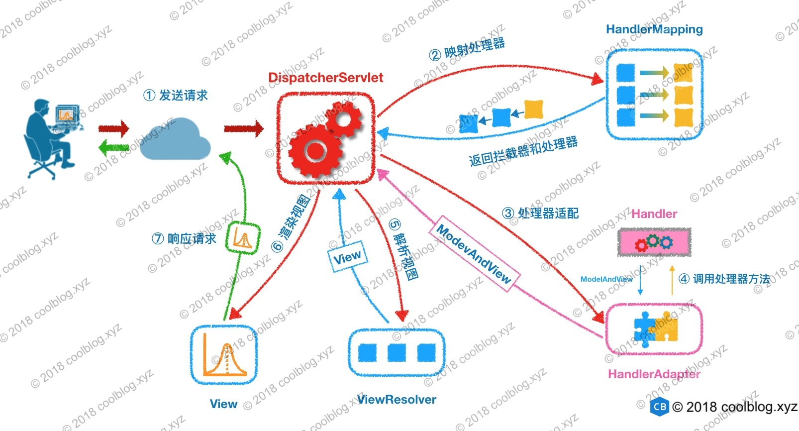
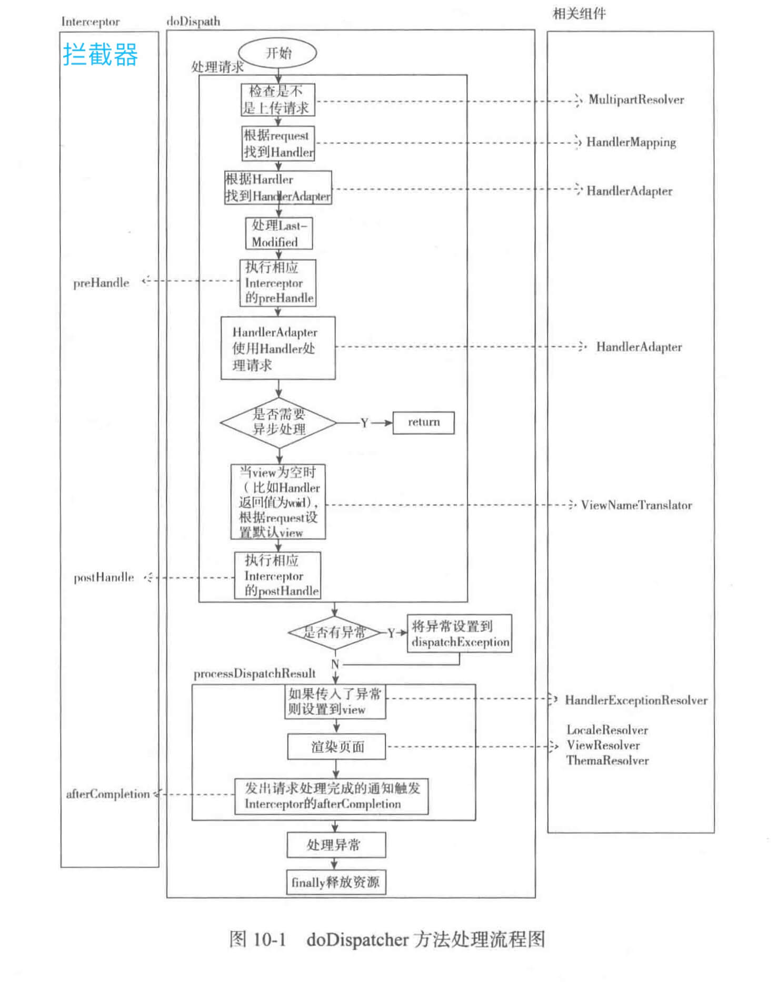

# 精尽 Spring MVC 面试题


## Spring MVC


### Spring MVC 框架有什么用？

Spring Web MVC 框架提供”模型-视图-控制器”( Model-View-Controller )架构和随时可用的组件，用于开发灵活且松散耦合的 Web 应用程序。

MVC 模式有助于分离应用程序的不同方面，如输入逻辑，业务逻辑和 UI 逻辑，同时在所有这些元素之间提供松散耦合。


介绍下Spring MVC 的核心组件？

Spring MVC  一共有九大核心组件，分别是：

- MultipartResolver
- LocaleResolver
- ThemeResolver
- HandlerMapping
- HandlerAdapter
- HandlerExceptionResolver
- RequestToViewNameTranslator
- ViewResolver
- FlashMapManager

虽然很多，但是在前后端分离的架构中，在 [「描述一下 DispatcherServlet 的工作流程？」](http://svip.iocoder.cn/Spring-MVC/Interview/#) 问题中，我们会明白，最关键的只有 HandlerMapping + HandlerAdapter + HandlerExceptionResolver 。

关于每个组件的说明，直接看 [《精尽 Spring MVC 源码分析 —— 组件一览》](http://svip.iocoder.cn/Spring-MVC/Components-intro/) 。


### 描述一下 DispatcherServlet 的工作流程？

DispatcherServlet 的工作流程可以用一幅图来说明：



​																			*DispatcherServlet 的工作流程*

① **发送请求**

用户向服务器发送 HTTP 请求，请求被 Spring MVC 的调度控制器 DispatcherServlet 捕获。

② **映射处理器**

DispatcherServlet 根据请求 URL ，调用 HandlerMapping 获得该 Handler 配置的所有相关的对象（包括 **Handler** 对象以及 Handler 对象对应的**拦截器**），最后以 HandlerExecutionChain 对象的形式返回。

- 即 HandlerExecutionChain 中，包含对应的 **Handler** 对象和**拦截器**们。

  此处，对应的方法如下：

  ```java
  > // HandlerMapping.java
  > 
  > @Nullable
  > HandlerExecutionChain getHandler(HttpServletRequest request) throws Exception;
  >
  ```

③ **处理器适配**

DispatcherServlet 根据获得的 Handler，选择一个合适的HandlerAdapter 。（附注：如果成功获得 HandlerAdapter 后，此时将开始执行拦截器的 `#preHandler(...)` 方法）。

提取请求提取请求 Request 中的模型数据，填充 Handler 入参，开始执行Handler（Controller)。 在填充Handler的入参过程中，根据你的配置，Spring 将帮你做一些额外的工作：

- HttpMessageConverter ：会将请求消息（如 JSON、XML 等数据）转换成一个对象。
- 数据转换：对请求消息进行数据转换。如 String 转换成 Integer、Double 等。
- 数据格式化：对请求消息进行数据格式化。如将字符串转换成格式化数字或格式化日期等。
- 数据验证： 验证数据的有效性（长度、格式等），验证结果存储到 BindingResult 或 Error 中。

Handler(Controller) 执行完成后，向 DispatcherServlet 返回一个 ModelAndView 对象。

此处，对应的方法如下：

```java
> // HandlerAdapter.java
> 
> @Nullable
> ModelAndView handle(HttpServletRequest request, HttpServletResponse response, Object handler) throws Exception;
>
```


⑤ **解析视图**

根据返回的 ModelAndView ，选择一个适合的 ViewResolver（必须是已经注册到 Spring 容器中的 ViewResolver)，解析出 View 对象，然后返回给 DispatcherServlet。

```java
 // ViewResolver.java
> 
> @Nullable
> View resolveViewName(String viewName, Locale locale) throws Exception;
>
```


⑥ ⑦ **渲染视图** + **响应请求**

ViewResolver 结合 Model 和 View，来渲染视图，并写回给用户( 浏览器 )。

```java
> // View.java
> 
> void render(@Nullable Map<String, ?> model, HttpServletRequest request, HttpServletResponse response) throws Exception;
>
```

这样一看，胖友可能有点懵逼，所以还是推荐看看：

- [《精尽 Spring MVC 源码分析 —— 组件一览》](http://svip.iocoder.cn/Spring-MVC/Components-intro/)
- [《精尽 Spring MVC 源码分析 —— 请求处理一览》](http://svip.iocoder.cn/Spring-MVC/DispatcherServlet-process-request-intro/)

**但是 Spring MVC 的流程真的一定是酱紫么**？

既然这么问，答案当然不是。对于目前主流的架构，前后端已经进行分离了，所以 Spring MVC 只负责 **M**odel 和 **C**ontroller 两块，而将 **V**iew 移交给了前端。所以，在上图中的步骤 ⑤ 和 ⑥ 两步，已经不在需要。

那变成什么样子了呢？在步骤 ③ 中，如果 Handler(Controller) 执行完后，如果判断方法有 `@ResponseBody` 注解，则直接将结果写回给用户( 浏览器 )。

但是 HTTP 是不支持返回 Java POJO 对象的，所以需要将结果使用 [HttpMessageConverter](http://svip.iocoder.cn/Spring-MVC/HandlerAdapter-5-HttpMessageConverter/) 进行转换后，才能返回。例如说，大家所熟悉的 [FastJsonHttpMessageConverter](https://github.com/alibaba/fastjson/wiki/在-Spring-中集成-Fastjson) ，将 POJO 转换成 JSON 字符串返回。

😈 是不是略微有点复杂，还是那句话，撸下源码，捅破这个窗口。当然，如果胖友精力有限，只要看整体流程的几篇即可。

嘻嘻，再来补充两个图，这真的是 Spring MVC 非常关键的问题，所以要用心理解。

FROM [《SpringMVC - 运行流程图及原理分析》](https://blog.csdn.net/J080624/article/details/77990164)

**流程示意图**：


​																					*流程示意图*

**代码序列图**：


​																					*代码序列图*


FROM [《看透 Spring MVC：源代码分析与实践》](https://item.jd.com/11807414.html) P123

**流程示意图**：



​																				《流程示意图》

### @Controller 注解有什么用？

`@Controller` 注解，它将一个类标记为 Spring Web MVC **控制器** Controller 。


### @RestController 和 @Controller 有什么区别？

`@RestController` 注解，在 `@Controller` 基础上，增加了 `@ResponseBody` 注解，更加适合目前前后端分离的架构下，提供 Restful API ，返回例如 JSON 数据格式。当然，返回什么样的数据格式，根据客户端的 `"ACCEPT"` 请求头来决定。

### @RequestMapping 注解有什么用？

`@RequestMapping` 注解，用于将特定 HTTP 请求方法映射到将处理相应请求的控制器中的特定类/方法。此注释可应用于两个级别：

- 类级别：映射请求的 URL。
- 方法级别：映射 URL 以及 HTTP 请求方法。

### @RequestMapping 和 @GetMapping 注解的不同之处在哪里？

- `@RequestMapping` 可注解在类和方法上；`@GetMapping` 仅可注册在方法上。
- `@RequestMapping` 可进行 GET、POST、PUT、DELETE 等请求方法；`@GetMapping` 是 `@RequestMapping` 的 GET 请求方法的特例，目的是为了提高清晰度。

### 返回 JSON 格式使用什么注解？

可以使用 **@ResponseBody** 注解，或者使用包含 `@ResponseBody` 注解的 **@RestController** 注解。

当然，还是需要配合相应的支持 JSON 格式化的 HttpMessageConverter 实现类。例如，Spring MVC 默认使用 MappingJackson2HttpMessageConverter 。

### 介绍一下 WebApplicationContext ？

WebApplicationContext 是实现ApplicationContext接口的子类，专门为 WEB 应用准备的。

- 它允许从相对于 Web 根目录的路径中**加载配置文件**，**完成初始化 Spring MVC 组件的工作**。
- 从 WebApplicationContext 中，可以获取 ServletContext 引用，整个 Web 应用上下文对象将作为属性放置在 ServletContext 中，以便 Web 应用环境可以访问 Spring 上下文。

关于这一块，如果想要详细了解，可以看看如下两篇文章：

- [《精尽 Spring MVC 源码分析 —— 容器的初始化（一）之 Root WebApplicationContext 容器》](http://svip.iocoder.cn/Spring-MVC/context-init-Root-WebApplicationContext/)
- [《精尽 Spring MVC 源码分析 —— 容器的初始化（二）之 Servlet WebApplicationContext 容器》](http://svip.iocoder.cn/Spring-MVC/context-init-Servlet-WebApplicationContext/)

### Spring MVC 的异常处理？

Spring MVC 提供了异常解析器 HandlerExceptionResolver 接口，将处理器( `handler` )执行时发生的异常，解析( 转换 )成对应的 ModelAndView 结果。代码如下：

```java
// HandlerExceptionResolver.java

public interface HandlerExceptionResolver {

    /**
     * 解析异常，转换成对应的 ModelAndView 结果
     */
    @Nullable
    ModelAndView resolveException(
            HttpServletRequest request, HttpServletResponse response, @Nullable Object handler, Exception ex);

}
```

- 也就是说，如果异常被解析成功，则会返回 ModelAndView 对象。
- 详细的源码解析，见 [《精尽 Spring MVC 源码解析 —— HandlerExceptionResolver 组件》](http://svip.iocoder.cn/Spring-MVC/HandlerExceptionResolver/) 。

一般情况下，我们使用`@ExceptionHandler` 注解来实现过异常的处理，可以先看看 [《Spring 异常处理 ExceptionHandler 的使用》](https://www.jianshu.com/p/12e1a752974d) 。

- 一般情况下，奶奶使用第三种


Spring MVC 有什么优点？

1.使用真的真的真的非常方便，无论是添加 HTTP 请求方法映射的方法，还是添加不同数据 格式的响应。

2.提供拦截器机制，可以方便的对请求进行拦截处理。

3.提供异常机制，可以方便的对异常做统一处理。

4.可以任意使用各种试图技术，而不仅仅局限于 JSP,例如 Freemarker、Thymeleaf 等等。

5.不依赖于 Servlet API (目标虽是如此，但是在实现的时候确实是依赖于 Servlet 的，当然仅仅依赖 Servlet ，而不依赖 Filter、Listener )。


### Spring MVC 怎样设定重定向和转发 ？

- 结果转发：在返回值的前面加 `"forward:/"` 。
- 重定向：在返回值的前面加上 `"redirect:/"` 。

当然，目前前后端分离之后，我们作为后端开发，已经很少有机会用上这个功能了。


### Spring MVC 的 Controller 是不是单例？

绝绝绝大多数情况下，Controller 是**单例**。

那么，Controller 里一般不建议存在**共享的变量**。实际场景下，艿艿也没碰到需要使用共享变量的情况。


### Spring MVC 和 Struts2 的异同？

**1.入口**不同

- Spring MVC 的入门是一个 Servlet **控制器**。
- Struts2 入门是一个 Filter **过滤器**。

**2.配置映射**不同，

- Spring MVC 是基于**方法**开发，传递参数是通过**方法形参**，一般设置为**单例**。
- Struts2 是基于**类**开发，传递参数是通过**类的属性**，只能设计为**多例**。

**3.视图**不同

- Spring MVC 通过参数解析器是将 Request 对象内容进行解析成方法形参，将响应数据和页面封装成 **ModelAndView** 对象，最后又将模型数据通过 **Request** 对象传输到页面。其中，如果视图使用 JSP 时，默认使用 **JSTL** 。
- Struts2 采用**值栈**存储请求和响应的数据，通过 **OGNL** 存取数据。

当然，更详细的也可以看看 [《面试题：Spring MVC 和 Struts2 的区别》](http://www.voidcn.com/article/p-ylualwcj-c.html) 一文。


### 详细介绍下 Spring MVC 拦截器？

`org.springframework.web.servlet.HandlerInterceptor` ，拦截器接口。代码如下：

```java
// HandlerInterceptor.java

/**
 * 拦截处理器，在 {@link HandlerAdapter#handle(HttpServletRequest, HttpServletResponse, Object)} 执行之前
 */
default boolean preHandle(HttpServletRequest request, HttpServletResponse response, Object handler)
		throws Exception {
	return true;
}

/**
 * 拦截处理器，在 {@link HandlerAdapter#handle(HttpServletRequest, HttpServletResponse, Object)} 执行成功之后
 */
default void postHandle(HttpServletRequest request, HttpServletResponse response, Object handler,
		@Nullable ModelAndView modelAndView) throws Exception {
}

/**
 * 拦截处理器，在 {@link HandlerAdapter#handle(HttpServletRequest, HttpServletResponse, Object)} 执行完之后，无论成功还是失败
 *
 * 并且，只有该处理器 {@link #preHandle(HttpServletRequest, HttpServletResponse, Object)} 执行成功之后，才会被执行
 */
default void afterCompletion(HttpServletRequest request, HttpServletResponse response, Object handler,
		@Nullable Exception ex) throws Exception {
}
```

- 一共有三个方法，分别为：

  - `#preHandle(...)` 方法，调用 Controller 方法之**前**执行。
  - `#postHandle(...)` 方法，调用 Controller 方法之**后**执行。
  - `#afterCompletion(...)` 方法，处理完 Controller 方法返回结果之**后**执行。
    - 例如，页面渲染后。
    - **当然，要注意，无论调用 Controller 方法是否成功，都会执行**。

- 举个例子

  - 当俩个拦截器都实现放行操作时，执行顺序为 `preHandle[1] => preHandle[2] => postHandle[2] => postHandle[1] => afterCompletion[2] => afterCompletion[1]` 。
  - 当第一个拦截器 `#preHandle(...)` 方法返回 `false` ，也就是对其进行拦截时，第二个拦截器是完全不执行的，第一个拦截器只执行 `#preHandle(...)` 部分。
  - 当第一个拦截器 `#preHandle(...)` 方法返回 `true` ，第二个拦截器 `#preHandle(...)` 返回 `false` ，执行顺序为 `preHandle[1] => preHandle[2] => afterCompletion[1]` 。

- 总结来说

  - `#preHandle(...)` 方法，按拦截器定义**顺序**调用。若任一拦截器返回 `false` ，则 Controller 方法不再调用。
  - `#postHandle(...)` 和 `#afterCompletion(...)` 方法，按拦截器定义**逆序**调用。
  - `#postHandler(...)` 方法，在调用 Controller 方法之**后**执行。
  - `#afterCompletion(...)` 方法，只有该拦截器在 `#preHandle(...)` 方法返回 `true` 时，才能够被调用，且一定会被调用。为什么“且一定会被调用”呢？即使 `#afterCompletion(...)` 方法，按拦截器定义**逆序**调用时，前面的拦截器发生异常，后面的拦截器还能够调用，**即无视异常**。

  关于这块，可以看看如下两篇文章：

  - [《Spring MVC 多个拦截器执行顺序及拦截器使用方法》](https://blog.csdn.net/amaxiaochen/article/details/77210880) 文章，通过**实践**更加理解。
  - [《精尽 Spring MVC 源码分析 —— HandlerMapping 组件（二）之 HandlerInterceptor》](http://svip.iocoder.cn/Spring-MVC/HandlerMapping-2-HandlerInterceptor/) 文章，通过**源码**更加理解。

### Spring MVC 的拦截器可以做哪些事情？

拦截器能做的事情非常非常非常多，例如：

- 记录访问日志
- 记录异常日志
- 需要登录的请求操作，拦截未登录的用户。
- ......


### Spring MVC 的拦截器和 Filter 过滤器有什么差别？

看了文章 [《过滤器( Filter )和拦截器( Interceptor )的区别》](https://blog.csdn.net/xiaodanjava/article/details/32125687) ，感觉对比的怪怪的。艿艿觉得主要几个点吧：

- **功能相同**：拦截器和 Filter都能实现相应的功能，谁也不比谁强。
- **容器不同**：拦截器构建在 Spring MVC 体系中；Filter 构建在 Servlet 容器之上。
- **使用便利性不同**：拦截器提供了三个方法，分别在不同的时机执行；过滤器仅提供一个方法，当然也能实现拦截器的执行时机的效果，就是麻烦一些。

另外，😈 再补充一点小知识。我们会发现，拓展性好的框架，都会提供相应的拦截器或过滤器机制，方便的我们做一些拓展。例如：

- Dubbo 的 Filter 机制。
- Spring Cloud Gateway 的 Filter 机制。
- Struts2 的拦截器机制。


## REST

本小节的内容，基本是基于 [《排名前 20 的 REST 和 Spring MVC 面试题》](http://www.spring4all.com/article/1445) 之上，做增补。

### REST 代表着什么?

REST 代表着抽象状态转移，它是根据 HTTP 协议从客户端发送数据到服务端，例如：服务端的一本书可以以 XML 或 JSON 格式传递到客户端。

然而，假如你不熟悉REST，我建议你先看看 [REST API design and development](http://bit.ly/2zIGzWK) 这篇文章来更好的了解它。不过对于大多数胖友的英语，可能不太好，所以也可以阅读知乎上的 [《怎样用通俗的语言解释 REST，以及 RESTful？》](https://www.zhihu.com/question/28557115) 讨论。


### 资源是什么

资源是指数据遭REST 架构中如何显示的。将实体作为资源公开，它允许客户端通过 HTTP 方法如：[GET](http://javarevisited.blogspot.sg/2012/03/get-post-method-in-http-and-https.html), [POST](http://www.java67.com/2014/08/difference-between-post-and-get-request.html),[PUT](http://www.java67.com/2016/09/when-to-use-put-or-post-in-restful-web-services.html), DELETE 等读，写，修改和创建资源。


### 什么是安全的REST 操作

REST 接口是通过 HTTP 方法完成操作。

- 一些HTTP操作是安全的，如 GET 和 HEAD ，它不能在服务端修改资源
- 换句话说，PUT,POST 和 DELETE 是不安全的，因为他们能修改服务端的资源。

所以，是否安全的界限，在于**是否修改**服务端的资源。


### 什么是幂等操作? 为什么幂等操作如此重要?

有一些HTTP方法，如：GET，不管你使用多少次它都能产生相同的结果，在没有任何一边影响的情况下，发送多个 GET 请求到相同的[URI](http://www.java67.com/2013/01/difference-between-url-uri-and-urn.html) 将会产生相同的响应结果。因此，这就是所谓**幂等**操作。

换句话说，[POST方法不是幂等操作](http://javarevisited.blogspot.sg/2016/05/what-are-idempotent-and-safe-methods-of-HTTP-and-REST.html) ，因为如果发送多个 POST 请求，它将在服务端创建不同的资源。但是，假如你用PUT更新资源，它将是幂等操作。

甚至多个 PUT 请求被用来更新服务端资源，将得到相同的结果。你可以通过 Pluralsight 学习 [HTTP Fundamentals](http://pluralsight.pxf.io/c/1193463/424552/7490?u=https%3A%2F%2Fwww.pluralsight.com%2Fcourses%2Fxhttp-fund) 课程来了解 HTTP 协议和一般的 HTTP 的更多幂等操作。


### REST 是可扩展的或说是协同的吗?

是的，[REST](http://javarevisited.blogspot.sg/2015/08/difference-between-soap-and-restfull-webservice-java.html) 是可扩展的和可协作的。它既不托管一种特定的技术选择，也不定在客户端或者服务端。你可以用 [Java](http://javarevisited.blogspot.sg/2017/11/top-5-free-java-courses-for-beginners.html), [C++](http://www.java67.com/2018/02/5-free-cpp-courses-to-learn-programming.html), [Python](http://www.java67.com/2018/02/5-free-python-online-courses-for-beginners.html), 或 [JavaScript](http://www.java67.com/2018/04/top-5-free-javascript-courses-to-learn.html) 来创建 RESTful Web 服务，也可以在客户端使用它们。

我建议你读一本关于REST接口的书来了解更多，如：[RESTful Web Services](http://javarevisited.blogspot.sg/2017/02/top-5-books-to-learn-rest-and-restful-web-services-in-java.html) 。

> 艿艿：所以这里的“可拓展”、“协同”对应到我们平时常说的，“跨语言”、“语言无关”。


### REST 用哪种 HTTP 方法呢?

REST 能用任何的 HTTP 方法，但是，最受欢迎的是：

- 用 GET 来检索服务端资源
- 用 POST 来创建服务端资源
- [用 PUT 来更新服务端资源](http://javarevisited.blogspot.sg/2016/04/what-is-purpose-of-http-request-types-in-RESTful-web-service.html#axzz56WGunSwy)
- 用 DELETE 来删除服务端资源。

恰好，这四个操作，对上我们日常逻辑的 CRUD 操作。

>艿艿：经常能听到胖友抱怨自己做的都是 CRUD 的功能。看了这个面试题，有没觉得原来 CRUD 也能玩的稍微高级一点？！
>
>实际上，每个 CRUD 也是可以通过不断的打磨，玩的很高级。例如说 DDD 领域驱动，完整的单元测试，可扩展的设计。


### 删除的 HTTP 状态返回码是什么 ?

在删除成功之后，您的 REST API 应该返回什么状态代码，并没有严格的规则。它可以返回 200 或 204 没有内容。

- 一般来说，如果删除操作成功，响应主体为空，返回 [204](http://www.netingcn.com/http-status-204.html) 。
- 如果删除请求成功且响应体不是空的，则返回 200 。


### REST API 是无状态的吗?

**是的**，REST API 应该是无状态的，因为它是基于 HTTP 的，它也是无状态的。

REST API 中的请求应该包含处理它所需的所有细节。它**不应该**依赖于以前或下一个请求或服务器端维护的一些数据，例如会话。

**REST 规范为使其无状态设置了一个约束，在设计 REST API 时，您应该记住这一点**。


### REST安全吗? 你能做什么来保护它?

安全是一个宽泛的术语。它可能意味着消息的安全性，这是通过认证和授权提供的加密或访问限制提供的。

REST 通常不是安全的，但是您可以通过使用 Spring Security 来保护它。

- 至少，你可以通过在 Spring Security 配置文件中使用 HTTP 来启用 HTTP Basic Auth 基本认证。
- 类似地，如果底层服务器支持 HTTPS ，你可以使用 HTTPS 公开 REST API 。


### RestTemplate 的优势是什么?

在 Spring Framework 中，RestTemplate 类是 [模板方法模式](http://www.java67.com/2012/09/top-10-java-design-pattern-interview-question-answer.html) 的实现。跟其他主流的模板类相似，如 JdbcTemplate 或 JmsTempalte ，它将在客户端简化跟 RESTful Web 服务的集成。正如在 RestTemplate 例子中显示的一样，你能非常容易地用它来调用 RESTful Web 服务。

艿艿：当然，实际场景我还是更喜欢使用 [OkHttp](http://square.github.io/okhttp/) 作为 HTTP 库，因为更好的性能，使用也便捷，并且无需依赖 Spring 库。


### HttpMessageConverter 在 Spring REST 中代表什么?

HttpMessageConverter 是一种[策略接口](http://www.java67.com/2014/12/strategy-pattern-in-java-with-example.html) ，它指定了一个转换器，它可以转换 HTTP 请求和响应。Spring REST 用这个接口转换 HTTP 响应到多种格式，例如：JSON 或 XML 。

每个 HttpMessageConverter 实现都有一种或几种相关联的MIME协议。Spring 使用 `"Accept"` 的标头来确定客户端所期待的内容类型。

然后，它将尝试找到一个注册的 HTTPMessageConverter ，它能够处理特定的内容类型，并使用它将响应转换成这种格式，然后再将其发送给客户端。

如果胖友对 HttpMessageConverter 不了解，可以看看 [《Spring 中 HttpMessageConverter 详解》](https://leokongwq.github.io/2017/06/14/spring-MessageConverter.html) 。


### 如何创建 HttpMessageConverter 的自定义实现来支持一种新的请求/响应？

我们仅需要创建自定义的 AbstractHttpMessageConverter 的实现，并使用 WebMvcConfigurerAdapter 的 `#extendMessageConverters(List<HttpMessageConverter<?>> converters)` 方法注中册它，该方法可以生成一种新的请求 / 响应类型。

具体的示例，可以学习 [《在 Spring 中集成 Fastjson》](https://github.com/alibaba/fastjson/wiki/在-Spring-中集成-Fastjson) 文章。


### @PathVariable 注解，在 Spring MVC 做了什么? 为什么 REST 在 Spring 中如此有用？

`@PathVariable` 注解，是 Spring MVC 中有用的注解之一，它允许您从 URI 读取值，比如查询参数。它在使用 Spring 创建 RESTful Web 服务时特别有用，因为在 REST 中，资源标识符是 URI 的一部分。

具体的使用示例，胖友如果不熟悉，可以看看 [《Spring MVC 的 @RequestParam 注解和 @PathVariable 注解的区别》](https://blog.csdn.net/cx361006796/article/details/52829759) 。

### 666. 彩蛋

文末的文末，艿艿还是那句话！！！！还是非常推荐胖友去撸一撸 Spring MVC 的源码，特别是如下两篇：

- [《精尽 Spring MVC 源码分析 —— 组件一览》](http://svip.iocoder.cn/Spring-MVC/Components-intro/)
- [《精尽 Spring MVC 源码分析 —— 请求处理一览》](http://svip.iocoder.cn/Spring-MVC/DispatcherServlet-process-request-intro/)

参考和推荐如下文章：

- [《排名前 20 的 REST 和 Spring MVC 面试题》](http://www.spring4all.com/article/1445)
- [《跟着 Github 学习 Restful HTTP API 的优雅设计》](http://www.iocoder.cn/Fight/Learn-Restful-HTTP-API-design-from-Github/)