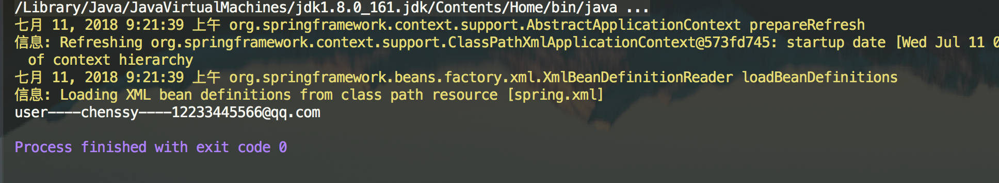

# IoC 之解析自定义标签

## 1. 使用自定义标签

扩展 Spring 自定义标签配置一般需要以下几个步骤：

1. 创建一个需要扩展的组件。
2. 定义一个XSD 文件，用于描述组件内容。
3. 创建一个实现 `org.springframework.beans.factory.xml.AbstractSingleBeanDefinitionParser` 接口的类，用来解析 XSD 文件中的定义和组件定义。
4. 创建一个 Handler，继承 `org.springframework.beans.factory.xml.NamespaceHandlerSupport` 抽象类 ，用于将组件注册到 Spring 容器。
5. 编写 `spring.handlers` 和 `Spring.schemas` 文件。
6. 

下面就按照上面的步骤来实现一个自定义标签组件。

### 1.1 创建组件

该组件就是一个普通的 Java Bean，没有任何特别之处。代码如下：

```java
public class User {

    private String id;
    private String userName;
    private String email;

}
```

### 1.2 定义 XSD 文件

```xml
<?xml version="1.0" encoding="UTF-8"?>
<xsd:schema xmlns:xsd="http://www.w3.org/2001/XMLSchema" xmlns="http://www.cmsblogs.com/schema/user" targetNamespace="http://www.cmsblogs.com/schema/user" elementFormDefault="qualified">

    <xsd:element name="user">
        <xsd:complexType>
            <xsd:attribute name="id" type="xsd:string" />
            <xsd:attribute name="userName" type="xsd:string" />
            <xsd:attribute name="email" type="xsd:string" />
        </xsd:complexType>
    </xsd:element>

</xsd:schema>
```

上面除了对 User 这个 Java Bean 进行了描述外，还定义了 `xmlns="http://www.cmsblogs.com/schema/user"` 和 `targetNamespace="http://www.cmsblogs.com/schema/user"` 这两个值，这两个值在后面是有大作用的。


### 1.3 定义 Parser 类

定义一个 Parser 类，该类继承 AbstractSingleBeanDefinitionParser ，并实现 `#getBeanClass(Element element)` 和 `#doParse(Element element, BeanDefinitionBuilder builder)` 两个方法。主要是用于解析 XSD 文件中的定义和组件定义。

```java
public class UserDefinitionParser extends AbstractSingleBeanDefinitionParser {

    @Override
    protected Class<?> getBeanClass(Element element) {
        return User.class;
    }

    @Override
    protected void doParse(Element element, BeanDefinitionBuilder builder) {
        String id = element.getAttribute("id");
        String userName = element.getAttribute("userName");
        String email = element.getAttribute("email");

        if (StringUtils.hasText(id)) {
            builder.addPropertyValue("id", id);
        }

        if (StringUtils.hasText(userName)) {
            builder.addPropertyValue("userName", userName);
        }

        if (StringUtils.hasText(email)) {
            builder.addPropertyValue("email", email);
        }
    }

}
```

### 1.4 定义 NamespaceHandler 类

定义 NamespaceHandler 类，继承 NamespaceHandlerSupport ,主要目的是将组件注册到 Spring 容器中。

```java
public class UserNamespaceHandler extends NamespaceHandlerSupport {

    @Override
    public void init() {
        registerBeanDefinitionParser("user", new UserDefinitionParser());
    }

}
```

### 1.5 定义 spring.handlers 文件

```java
http\://www.cmsblogs.com/schema/user=org.springframework.core.customelement.UserNamespaceHandler
```

### 1.6 定义 Spring.schemas 文件

```properties
http\://www.cmsblogs.com/schema/user.xsd=user.xsd
```

### 1.7 运行

经过上面几个步骤，就可以使用自定义的标签了。在 xml 配置文件中使用如下：

```xml
<?xml version="1.0" encoding="UTF-8"?>
<beans xmlns="http://www.springframework.org/schema/beans" xmlns:xsi="http://www.w3.org/2001/XMLSchema-instance"
       xmlns:myTag="http://www.cmsblogs.com/schema/user"
       xsi:schemaLocation="http://www.springframework.org/schema/beans
       http://www.springframework.org/schema/beans/spring-beans.xsd
        http://www.cmsblogs.com/schema/user http://www.cmsblogs.com/schema/user.xsd">

    <myTag:user id="user" email="12233445566@qq.com" userName="chenssy" />

</beans>
```

运行测试：

```
`public static void main(String[] args){    ApplicationContext context = new ClassPathXmlApplicationContext("spring.xml");    User user = (User) context.getBean("user");    System.out.println(user.getUserName() + "----" + user.getEmail());}`
```

运行结果如下图：



运行结果


## 2. 解析自定义标签

上面已经演示了 Spring 自定义标签的使用，下面就来分析自定义标签的解析过程。

### 2.1 parseCustomElement

DefaultBeanDefinitionDocumentReader 的`#parseBeanDefinitions(Element root, BeanDefinitionParserDelegate delegate)` 方法，负责标签的解析工作，根据命名空间的不同进行不同标签的解析。其中，**自定义标签**由 BeanDefinitionParserDelegate 的 `#parseCustomElement(Element ele, BeanDefinition containingBd)` 方法来实现。代码如下：

```java
@Nullable
public BeanDefinition parseCustomElement(Element ele) {
    return parseCustomElement(ele, null);
}

@Nullable
public BeanDefinition parseCustomElement(Element ele, @Nullable BeanDefinition containingBd) {
    // <1> 获取 namespaceUri
    String namespaceUri = getNamespaceURI(ele);
    if (namespaceUri == null) {
        return null;
    }
    // <2> 根据 namespaceUri 获取相应的 Handler
    NamespaceHandler handler = this.readerContext.getNamespaceHandlerResolver().resolve(namespaceUri);
    if (handler == null) {
        error("Unable to locate Spring NamespaceHandler for XML schema namespace [" + namespaceUri + "]", ele);
        return null;
    }
    // 调用自定义的 Handler 处理
    return handler.parse(ele, new ParserContext(this.readerContext, this, containingBd));
}
```

处理过程分为三步：

调用 `#getNamespaceURI((Node node)` 方法，获取 `namespaceUri` 。代码如下：

```java
@Nullable
public String getNamespaceURI(Node node) {
	return node.getNamespaceURI();
}

```

1. 调用 `XmlReaderContext#getNamespaceHandlerResolver()` 方法，获得命名空间的解析器。详细解析，见 [「2.2 getNamespaceHandlerResolver」](http://svip.iocoder.cn/Spring/IoC-parse-BeanDefinitions-in-parseCustomElement/#) 。
2. 调用 `NamespaceHandlerResolver#resolve(String namespaceUri)` 方法，根据 `namespaceUri` 获取相应的
3. 调用 `NamespaceHandlerResolver#resolve(String namespaceUri)` 方法，根据 `namespaceUri` 获取相应的 Handler 对象。这个映射关系我们在 `spring.handlers` 中已经定义了，所以只需要找到该类，然后初始化返回。详细解析，见 [「2.3 resolve」](http://svip.iocoder.cn/Spring/IoC-parse-BeanDefinitions-in-parseCustomElement/#) 。
4. 调用 `NamespaceHandler#parse(Element element, ParserContext parserContext)` 方法，调用自定义的 Handler 处理。详细解析，见 [「2.4 parse」](http://svip.iocoder.cn/Spring/IoC-parse-BeanDefinitions-in-parseCustomElement/#) 。

### 2.2 getNamespaceHandlerResolver

调用 XmlReaderContext 的 `#getNamespaceHandlerResolver()` 方法，返回的命名空间的解析器，代码如下：

```java
/**
 * NamespaceHandler 解析器
 */
private final NamespaceHandlerResolver namespaceHandlerResolver;

public final NamespaceHandlerResolver getNamespaceHandlerResolver() {
	return this.namespaceHandlerResolver;
}
```


#### 2.2.1 NamespaceHandlerResolver 的初始化

那么，NamespaceHandlerResolver 是什么时候进行初始化的呢？

这里需要回退到博文 [《【死磕 Spring】—— IoC 之注册 BeanDefinitions》](http://svip.iocoder.cn/Spring/IoC-register-BeanDefinitions) ，在这篇博客中提到在注册 BeanDefinition 时：

- 首先，是通过 XmlBeanDefinitionReader 的 `#createBeanDefinitionDocumentReader()` 方法，获取 Document 解析器 BeanDefinitionDocumentReader 实例。
- 然后，调用 BeanDefinitionDocumentReader 实例的 `#registerBeanDefinitions(Document doc, XmlReaderContext readerContext)` 方法，进行注册。而该方法需要提供两个参数，一个是 Document 实例 `doc`，一个是 XmlReaderContext 实例 `readerContext` 。

`readerContext` 实例对象由 XmlBeanDefinitionReader 的 `#createReaderContext(Resource resource)` 方法创建。`namespaceHandlerResolver` 实例对象就是在这个时候初始化的，代码如下：

```java
// XmlBeanDefinitionReader.java
public XmlReaderContext createReaderContext(Resource resource) {
	return new XmlReaderContext(resource, this.problemReporter, this.eventListener,
			this.sourceExtractor, this, getNamespaceHandlerResolver());
}
```

XmlReaderContext 构造函数中最后一个参数就是 NamespaceHandlerResolver 对象，该对象由 `getNamespaceHandlerResolver()` 提供，如下：

```java
// XmlBeanDefinitionReader.java

public NamespaceHandlerResolver getNamespaceHandlerResolver() {
	if (this.namespaceHandlerResolver == null) {
		this.namespaceHandlerResolver = createDefaultNamespaceHandlerResolver();
	}
	return this.namespaceHandlerResolver;
}

protected NamespaceHandlerResolver createDefaultNamespaceHandlerResolver() {
	ClassLoader cl = (getResourceLoader() != null ? getResourceLoader().getClassLoader() : getBeanClassLoader());
	return new DefaultNamespaceHandlerResolver(cl); // <x>
}
```

- 从 `<x>` 处，我们可以看到，NamespaceHandlerResolver 对象的**最终类型**是 `org.springframework.beans.factory.xml.DefaultNamespaceHandlerResolver` 。

### 2.3 resolve

所以， `getNamespaceHandlerResolver().resolve(namespaceUri)` 调用的就是 DefaultNamespaceHandlerResolver 的 `#resolve(String namespaceUri)` 方法。代码如下：

```java
@Override
@Nullable
public NamespaceHandler resolve(String namespaceUri) {
    // <1> 获取所有已经配置的 Handler 映射
    Map<String, Object> handlerMappings = getHandlerMappings();
    // <2> 根据 namespaceUri 获取 handler 的信息
    Object handlerOrClassName = handlerMappings.get(namespaceUri);
    // <3.1> 不存在
    if (handlerOrClassName == null) {
        return null;
    // <3.2> 已经初始化
    } else if (handlerOrClassName instanceof NamespaceHandler) {
        return (NamespaceHandler) handlerOrClassName;
    // <3.3> 需要进行初始化
    } else {
        String className = (String) handlerOrClassName;
        try {
            // 获得类，并创建 NamespaceHandler 对象
            Class<?> handlerClass = ClassUtils.forName(className, this.classLoader);
            if (!NamespaceHandler.class.isAssignableFrom(handlerClass)) {
                throw new FatalBeanException("Class [" + className + "] for namespace [" + namespaceUri +
                        "] does not implement the [" + NamespaceHandler.class.getName() + "] interface");
            }
            NamespaceHandler namespaceHandler = (NamespaceHandler) BeanUtils.instantiateClass(handlerClass);
            // 初始化 NamespaceHandler 对象
            namespaceHandler.init();
            // 添加到缓存
            handlerMappings.put(namespaceUri, namespaceHandler);
            return namespaceHandler;
        } catch (ClassNotFoundException ex) {
            throw new FatalBeanException("Could not find NamespaceHandler class [" + className +
                    "] for namespace [" + namespaceUri + "]", ex);
        } catch (LinkageError err) {
            throw new FatalBeanException("Unresolvable class definition for NamespaceHandler class [" +
                    className + "] for namespace [" + namespaceUri + "]", err);
        }
    }
}
```

- `<1>` 处，首先，调用 `#getHandlerMappings()` 方法，获取所有配置文件中的映射关系 `handlerMappings` 。详细解析，胖友先跳到 [「2.3.1 getHandlerMappings」](http://svip.iocoder.cn/Spring/IoC-parse-BeanDefinitions-in-parseCustomElement/#) ，看完就回到此处，继续往下走。
- `<2>` 处，然后，根据 `namespaceUri` 获取 handler 的信息。
- `<3.1>` 处，`handlerOrClassName` 不存在，则返回 `null` 空。
- `<3.2>` 处，`handlerOrClassName` 已经初始化成 NamespaceHandler 对象，直接返回它。
- `<3.3>` 处，`handlerOrClassName` 还是类路径，则创建 NamespaceHandler 对象，并调用 `NamespaceHandler#init()` 方法，初始化 NamespaceHandler 对象。详细解析，见 [「2.3.2 init」](http://svip.iocoder.cn/Spring/IoC-parse-BeanDefinitions-in-parseCustomElement/#) 。
- 另外，创建的 NamespaceHandler 对象，会添加到 `handlerMappings` 中，进行缓存。


#### 2.3.1 getHandlerMappings

```java
/** ClassLoader to use for NamespaceHandler classes. */
@Nullable
private final ClassLoader classLoader;

/**
 * NamespaceHandler 映射配置文件地址
 *
 * Resource location to search for.
 */
private final String handlerMappingsLocation;

/**
 * Stores the mappings from namespace URI to NamespaceHandler class name / instance.
 *
 * NamespaceHandler 映射。
 *
 * key：命名空间
 * value：分成两种情况：1）未初始化时，对应的 NamespaceHandler 的类路径；2）已初始化，对应的 NamespaceHandler 对象
 */
@Nullable
private volatile Map<String, Object> handlerMappings;

/**
 * Load the specified NamespaceHandler mappings lazily.
 */
private Map<String, Object> getHandlerMappings() {
	// 双重检查锁，延迟加载
	Map<String, Object> handlerMappings = this.handlerMappings;
	if (handlerMappings == null) {
		synchronized (this) {
			handlerMappings = this.handlerMappings;
			if (handlerMappings == null) {
				if (logger.isTraceEnabled()) {
					logger.trace("Loading NamespaceHandler mappings from [" + this.handlerMappingsLocation + "]");
				}
				try {
					// 读取 handlerMappingsLocation
					Properties mappings = PropertiesLoaderUtils.loadAllProperties(this.handlerMappingsLocation, this.classLoader);
					if (logger.isTraceEnabled()) {
						logger.trace("Loaded NamespaceHandler mappings: " + mappings);
					}
					// 初始化到 handlerMappings 中
					handlerMappings = new ConcurrentHashMap<>(mappings.size());
					CollectionUtils.mergePropertiesIntoMap(mappings, handlerMappings);
					this.handlerMappings = handlerMappings;
				} catch (IOException ex) {
					throw new IllegalStateException(
							"Unable to load NamespaceHandler mappings from location [" + this.handlerMappingsLocation + "]", ex);
				}
			}
		}
	}
	return handlerMappings;
}
```

- 虽然代码比较长，但是逻辑实际很简单。
- 通过延迟加载( lazy-init )的方式，加载 `handlerMappingsLocation` 中配置的 NamespaceHandler 的映射，到 `handlerMappings` 中。
- `handlerMappings` 的**值属性**有 2 种情况，胖友仔细看下注释。

#### 2.3.2 init

实现 NamespaceHandler 的 `#init()` 方法，主要是将自定义标签解析器进行注册。例如，我们自定义 UserNamespaceHandler 的 `#init()` 方法，代码如下：

```java
// UserNamespaceHandler.java

@Override
public void init() {
    registerBeanDefinitionParser("user",new UserDefinitionParser());
}
```

- 直接调用父类 NamespaceHandlerSupport 的 `#registerBeanDefinitionParser(String elementName, BeanDefinitionParser parser)` 方法，注册指定元素的 BeanDefinitionParser 解析器。

##### 2.3.2.1 registerBeanDefinitionParser

NamespaceHandlerSupport 的 `#registerBeanDefinitionParser(String elementName, BeanDefinitionParser parser)` 方法，注册指定元素的 BeanDefinitionParser 解析器。代码如下：

```java
// NamespaceHandlerSupport.java
/**
 * Stores the {@link BeanDefinitionParser} implementations keyed by the
 * local name of the {@link Element Elements} they handle.
 *
 * key：元素名
 * value：对应 BeanDefinitionParser 的解析器
 */
private final Map<String, BeanDefinitionParser> parsers = new HashMap<>();

protected final void registerBeanDefinitionParser(String elementName, BeanDefinitionParser parser) {
	this.parsers.put(elementName, parser);
}
```

- 其实就是将映射关系放在一个 Map 结构的 `parsers` 对象中。

### 2.4 parse

完成后返回 NamespaceHandler 对象，然后调用其 `#parse(Element element, ParserContext parserContext)` 方法开始自定义标签的解析。代码如下：

```java
// NamespaceHandlerSupport.java
@Override
@Nullable
public BeanDefinition parse(Element element, ParserContext parserContext) {
	// <1> 获得元素对应的 BeanDefinitionParser 对象
	BeanDefinitionParser parser = findParserForElement(element, parserContext);
	// <2> 执行解析
	return (parser != null ? parser.parse(element, parserContext) : null);
}
```

- `<1>` 处，调用 `#findParserForElement(Element element, ParserContext parserContext)` 方法，获取对应的 BeanDefinitionParser 实例。实际上，其实就是获取在 NamespaceHandlerSupport 的 `#registerBeanDefinitionParser()` 方法里面注册的实例对象。代码如下：

```java
  /**
   * Locates the {@link BeanDefinitionParser} from the register implementations using
   * the local name of the supplied {@link Element}.
   */
  @Nullable
  private BeanDefinitionParser findParserForElement(Element element, ParserContext parserContext) {
// 获得元素名
  	String localName = parserContext.getDelegate().getLocalName(element);
  	// 获得 BeanDefinitionParser 对象
  	BeanDefinitionParser parser = this.parsers.get(localName);
  	if (parser == null) {
  		parserContext.getReaderContext().fatal(
  				"Cannot locate BeanDefinitionParser for element [" + localName + "]", element);
  	}
  	return parser;
  }
```

- 首先，获取 `localName`，在上面的例子中就是：`"user` 。
- 然后，从 Map 实例 `parsers` 中获取 BeanDefinitionParser 对象。在上面的例子中就是：UserBeanDefinitionParser 对象。

`<2>` 处，返回 BeanDefinitionParser 对象后，调用其 `#parse(Element element, ParserContext parserContext)` 方法。该方法在 AbstractBeanDefinitionParser 中实现，代码如下：

```java
 // AbstractBeanDefinitionParser.java

  @Override
  @Nullable
  public final BeanDefinition parse(Element element, ParserContext parserContext) {
// <1> 内部解析，返回 AbstractBeanDefinition 对象
  	AbstractBeanDefinition definition = parseInternal(element, parserContext);
  	if (definition != null && !parserContext.isNested()) {
  		try {
  		    // 解析 id 属性
  			String id = resolveId(element, definition, parserContext);
  			if (!StringUtils.hasText(id)) {
  				parserContext.getReaderContext().error(
  						"Id is required for element '" + parserContext.getDelegate().getLocalName(element)
  								+ "' when used as a top-level tag", element);
  			}
  			// 解析 aliases 属性
  			String[] aliases = null;
  			if (shouldParseNameAsAliases()) {
  				String name = element.getAttribute(NAME_ATTRIBUTE);
  				if (StringUtils.hasLength(name)) {
  					aliases = StringUtils.trimArrayElements(StringUtils.commaDelimitedListToStringArray(name));
  				}
  			}
  			// 创建 BeanDefinitionHolder 对象
  			BeanDefinitionHolder holder = new BeanDefinitionHolder(definition, id, aliases);
  			// 注册 BeanDefinition
  			registerBeanDefinition(holder, parserContext.getRegistry());
  			// 触发事件
  			if (shouldFireEvents()) {
  				BeanComponentDefinition componentDefinition = new BeanComponentDefinition(holder);
  				postProcessComponentDefinition(componentDefinition);
  				parserContext.registerComponent(componentDefinition);
  			}
  		} catch (BeanDefinitionStoreException ex) {
  			String msg = ex.getMessage();
  			parserContext.getReaderContext().error((msg != null ? msg : ex.toString()), element);
  			return null;
  		}
  	}
  	return definition;
  }
```

- 核心在 `<1>` 处 `#parseInternal(Element element, ParserContext parserContext)` 方法。为什么这么说？因为该方法返回的是 AbstractBeanDefinition 对象。从前面**默认标签**的解析过程来看，我们就可以判断该方法就是将标签解析为 AbstractBeanDefinition ，且后续代码都是将 AbstractBeanDefinition 转换为 BeanDefinitionHolder 对象。所以真正的解析工作都交由 `#parseInternal(Element element, ParserContext parserContext)` 方法来实现。关于该方法，详细解析，见 [「2.4.1 parseInternal」](http://svip.iocoder.cn/Spring/IoC-parse-BeanDefinitions-in-parseCustomElement/#) 。
- 其它逻辑，例如 `#resolveId(Element element, AbstractBeanDefinition definition, ParserContext parserContext)` 方法，都比较简单，感兴趣的胖友，可以自己去看。

#### 2.4.1 parseInternal

`#parseInternal(Element element, ParserContext parserContext)` 方法，解析 XML 元素为 AbstractBeanDefinition 对象。代码如下：

```java
// AbstractSingleBeanDefinitionParser.java

@Override
protected final AbstractBeanDefinition parseInternal(Element element, ParserContext parserContext) {
    // 创建 BeanDefinitionBuilder 对象
    BeanDefinitionBuilder builder = BeanDefinitionBuilder.genericBeanDefinition();
    // 获取父类元素
    String parentName = getParentName(element);
    if (parentName != null) {
        builder.getRawBeanDefinition().setParentName(parentName);
    }
    // 获取自定义标签中的 class，这个时候会去调用自定义解析中的 getBeanClass()
    Class<?> beanClass = getBeanClass(element);
    if (beanClass != null) {
        builder.getRawBeanDefinition().setBeanClass(beanClass);
    } else {
        // beanClass 为 null，意味着子类并没有重写 getBeanClass() 方法，则尝试去判断是否重写了 getBeanClassName()
        String beanClassName = getBeanClassName(element);
        if (beanClassName != null) {
            builder.getRawBeanDefinition().setBeanClassName(beanClassName);
        }
    }
    // 设置 source 属性
    builder.getRawBeanDefinition().setSource(parserContext.extractSource(element));
    // 设置 scope 属性
    BeanDefinition containingBd = parserContext.getContainingBeanDefinition();
    if (containingBd != null) {
        // Inner bean definition must receive same scope as containing bean.
        builder.setScope(containingBd.getScope());
    }
    // 设置 lazy-init 属性
    if (parserContext.isDefaultLazyInit()) {
        // Default-lazy-init applies to custom bean definitions as well.
        builder.setLazyInit(true);
    }
    // 调用子类的 doParse() 进行解析
    doParse(element, parserContext, builder);
    return builder.getBeanDefinition();
}
```

- 在该方法中我们主要关注两个方法：`#getBeanClass((Element element)` 、`#doParse(Element element, BeanDefinitionBuilder builder)`。
- 对于 `getBeanClass()` 方法，AbstractSingleBeanDefinitionParser 类并没有提供具体实现，而是直接返回 `null` ，**意味着它希望子类能够重写该方法**。当然，如果没有重写该方法，这会去调用 `#getBeanClassName()` ，判断子类是否已经重写了该方法。
- 对于 `#doParse(Element element, BeanDefinitionBuilder builder)` 方法，则是直接**空实现**。

😈 所以对于 `#parseInternal(Element element, ParserContext parserContext)` 方法 而言，它总是期待它的子类能够实现 `#getBeanClass((Element element)` 、`#doParse(Element element, BeanDefinitionBuilder builder)` 方法。其中，`#doParse(Element element, BeanDefinitionBuilder builder)` **方法尤为重要**！如果，你不提供该方法的实现，怎么来解析自定义标签呢？此时，胖友可以回过头，再看一眼在 [「1.3 定义 Parser 类」](http://svip.iocoder.cn/Spring/IoC-parse-BeanDefinitions-in-parseCustomElement/#) 的 UserDefinitionParser 实现类，是不是已经能够很好理解咧。


## 3. 小结

至此，自定义标签的解析过程已经分析完成了。其实整个过程还是较为简单：

- 首先，会加载 `spring.handlers` 文件，将其中内容进行一个解析，形成 `<namespaceUri, 类路径>` 这样的一个映射。
- 然后，根据获取的 `namespaceUri` 就可以得到相应的类路径，对其进行初始化等到相应的 NamespaceHandler 对象。
- 之后，调用该 NamespaceHandler 的 `#parse(...)` 方法，在该方法中根据标签的 `localName` 得到相应的 BeanDefinitionParser 实例对象。
- 最后，调用该 BeanDefinitionParser 的 `#parse(...)` 方法。该方法定义在 AbstractBeanDefinitionParser 抽象类中，核心逻辑封装在其 `#parseInternal(...)` 方法中，该方法返回一个 AbstractBeanDefinition 实例对象，其主要是在 AbstractSingleBeanDefinitionParser 中实现。对于自定义的 Parser 类，其需要实现 `#getBeanClass()` 或者 `#getBeanClassName()` 任一方法，和 `#doParse(...)` 方法。

整体流程如[下图](https://gitee.com/chenssy/blog-home/raw/master/image/201811/spring-201807151001.png)：


​																											*spring-201807151001*

