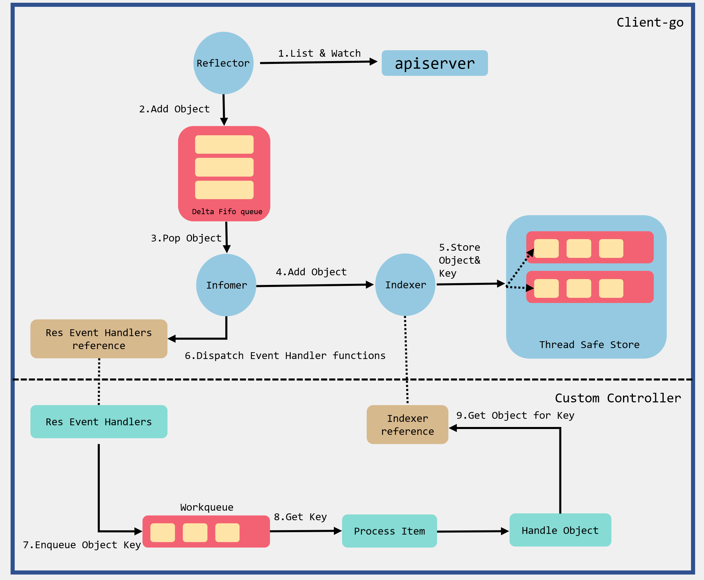
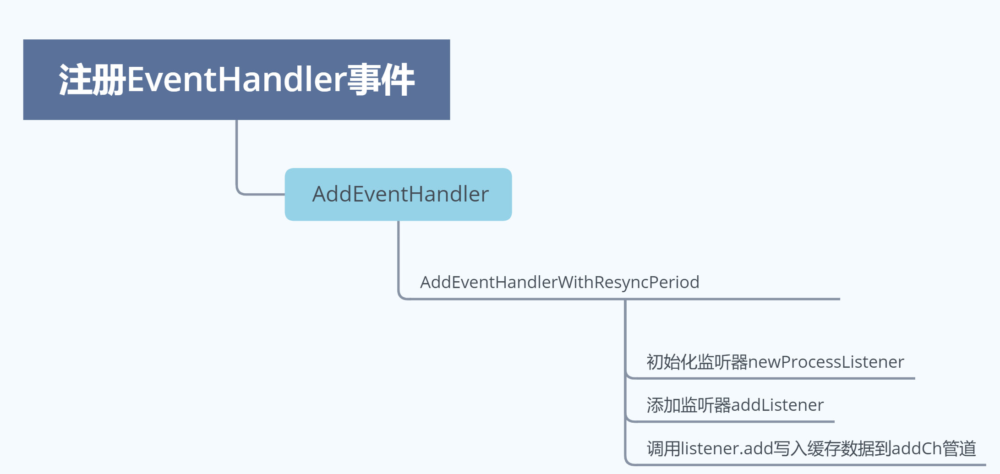
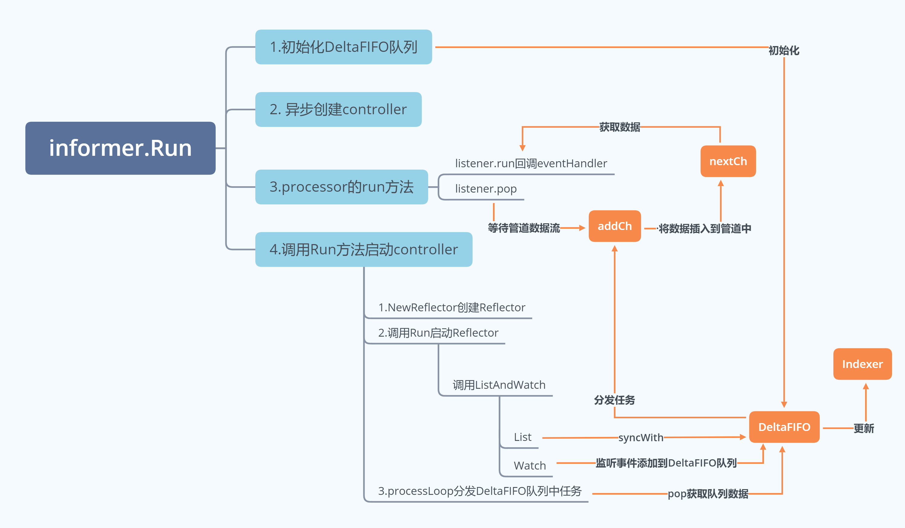

# 16.深入k8s：Informer使用及其源码分析

> 转载请声明出处哦~，本篇文章发布于luozhiyun的博客：[https://www.luozhiyun.com](https://www.luozhiyun.com/)
>
> 由于这部分的代码是在client-go 中，所以使用的源码版本是client-go 1.19


## Informer机制

### 机制设计

Informer主要有两个作用：

1. 通过一种叫作 ListAndWatch 的方法，把 APIServer 中的 API 对象缓存在了本地，并负责更新和维护这个缓存。ListAndWatch通过 APIServer 的 LIST API“获取”所有最新版本的 API 对象；然后，再通过 WATCH API 来“监听”所有这些 API 对象的变化；
2. 注册相应的事件，之后如果监听到的事件变化就会调用事件对应的EventHandler，实现回调。

Informer运行原理如下：



根据流程图来解释一下Informer中几个组件的作用：

- Reflector：用于监控指定的k8s资源，当资源发生变化时，触发相应的变更事件，如Added事件、Updated事件、Deleted事件，并将器资源对象放到本地DeltaFIFO Queue中；
- DeltaFIFO：DeltaFIFO是一个先进先出的队列，可以保存资源对象的操作类型；
- Indexer：用来存储资源对象并自带索引功能的本地存储，Reflector从DeltaFIFO中将消费出来的资源对象存储至Indexer；

Reflector 包会和 apiServer 建立长连接，并使用 ListAndWatch 方法获取并监听某一个资源的变化。List 方法将会获取某个资源的所有实例，Watch 方法则监听资源对象的创建、更新以及删除事件，然后将事件放入到DeltaFIFO Queue中；

然后Informer会不断的从 Delta FIFO Queue 中 pop 增量事件，并根据事件的类型来决定新增、更新或者是删除本地缓存；接着Informer 根据事件类型来触发事先注册好的 Event Handler触发回调函数，然后然后将该事件丢到 Work Queue 这个工作队列中。


### 实例

将到了go-client部分的代码，我们可以直接通过实例来进行上手跑动，Informers Example代码示例如下：

```go
package main

import (
    "flag"
    v1 "k8s.io/apimachinery/pkg/apis/meta/v1"
    "k8s.io/client-go/informers"
    "k8s.io/client-go/kubernetes"
    "k8s.io/client-go/tools/cache"
    "k8s.io/client-go/tools/clientcmd"
    "k8s.io/client-go/util/homedir"
    "log"
    "path/filepath"
    "time"
)

func main() {
    var kubeconfig *string
    //如果是windows，那么会读取C:\Users\xxx\.kube\config 下面的配置文件
    //如果是linux，那么会读取~/.kube/config下面的配置文件
    if home := homedir.HomeDir(); home != "" {
        kubeconfig = flag.String("kubeconfig", filepath.Join(home, ".kube", "config"), "(optional) absolute path to the kubeconfig file")
    } else {
        kubeconfig = flag.String("kubeconfig", "", "absolute path to the kubeconfig file")
    }
    flag.Parse()

    config, err := clientcmd.BuildConfigFromFlags("", *kubeconfig)
    if err != nil {
        panic(err)
    }

    clientset, err := kubernetes.NewForConfig(config)
    if err != nil {
        panic(err)
    }

    stopCh := make(chan struct{})
    defer close(stopCh)
    //表示每分钟进行一次resync，resync会周期性地执行List操作
    sharedInformers := informers.NewSharedInformerFactory(clientset, time.Minute)

    informer := sharedInformers.Core().V1().Pods().Informer()

    informer.AddEventHandler(cache.ResourceEventHandlerFuncs{
        AddFunc: func(obj interface{}) {
            mObj := obj.(v1.Object)
            log.Printf("New Pod Added to Store: %s", mObj.GetName())
        },
        UpdateFunc: func(oldObj, newObj interface{}) {
            oObj := oldObj.(v1.Object)
            nObj := newObj.(v1.Object)
            log.Printf("%s Pod Updated to %s", oObj.GetName(),nObj.GetName())
        },
        DeleteFunc: func(obj interface{}) {
            mObj := obj.(v1.Object)
            log.Printf("Pod Deleted from Store: %s", mObj.GetName())
        },
    })

    informer.Run(stopCh)
}
```

要运行这段代码，需要我们将k8s服务器上的~/.kube代码拷贝到本地，我是win10的机器所以拷贝到`C:\Users\xxx\.kube`中。

informers.NewSharedInformerFactory会传入两个参数，第1个参数clientset是用于与k8s apiserver交互的客户端，第2个参数是代表每分钟会执行一次resync，resync会周期性执行List将所有资源存放再Informer Store中，如果该参数是0，则禁用resync功能。

通过informer.AddEventHandler函数可以为pod资源添加资源事件回调方法，支持3种资源事件回调方法：

- AddFunc
- UpdateFunc
- DeleteFunc

通过名称我们就可以知道是新增、更新、删除时会回调这些方法。

在我们初次执行run方法的时候，可以会将监控的k8s上pod存放到本地，并回调AddFunc方法，如下日志：

```
2020/10/17 15:13:10 New Pod Added to Store: dns-test
2020/10/17 15:13:10 New Pod Added to Store: web-1
2020/10/17 15:13:10 New Pod Added to Store: fluentd-elasticsearch-nwqph
2020/10/17 15:13:10 New Pod Added to Store: kube-flannel-ds-amd64-bjmt2
2020/10/17 15:13:10 New Pod Added to Store: kubernetes-dashboard-65665f84db-jrw6k
2020/10/17 15:13:10 New Pod Added to Store: mongodb
2020/10/17 15:13:10 New Pod Added to Store: web-0
....
```


## 源码解析

### 初始化

#### shared Informer初始化

shared Informer初始化的时候会调用到informers.NewSharedInformerFactory进行初始化。

文件位置：informers/factory.go

```go
func NewSharedInformerFactory(client kubernetes.Interface, defaultResync time.Duration) SharedInformerFactory {
    return NewSharedInformerFactoryWithOptions(client, defaultResync)
}

func NewSharedInformerFactoryWithOptions(client kubernetes.Interface, defaultResync time.Duration, options ...SharedInformerOption) SharedInformerFactory {
    factory := &sharedInformerFactory{
        client:           client,
        namespace:        v1.NamespaceAll,
        defaultResync:    defaultResync,
        informers:        make(map[reflect.Type]cache.SharedIndexInformer),
        startedInformers: make(map[reflect.Type]bool),
        customResync:     make(map[reflect.Type]time.Duration),
    }

    // Apply all options
    for _, opt := range options {
        factory = opt(factory)
    }

    return factory
}
```

NewSharedInformerFactory方法最终会调用到NewSharedInformerFactoryWithOptions初始化一个sharedInformerFactory，在初始化的时候会初始化一个informers，用来缓存不同类型的informer。


#### informer 初始化

informer初始化会调用sharedInformerFactory的方法进行初始化，并且可以调用不同资源的Informer。

```go
    podInformer := sharedInformers.Core().V1().Pods().Informer()
    nodeInformer := sharedInformers.Node().V1beta1().RuntimeClasses().Informer()
```

定义不同资源的Informer可以用来监控node或pod。

通过调用Informer方法会根据类型来创建Informer，同一类资源会共享同一个informer。

文件路径：informers/factory.go

```go
func (f *podInformer) defaultInformer(client kubernetes.Interface, resyncPeriod time.Duration) cache.SharedIndexInformer {
    //创建informer
    return NewFilteredPodInformer(client, f.namespace, resyncPeriod, cache.Indexers{cache.NamespaceIndex: cache.MetaNamespaceIndexFunc}, f.tweakListOptions)
}

func (f *podInformer) Informer() cache.SharedIndexInformer {
    //传入上面定义的defaultInformer方法，用于创建informer
    return f.factory.InformerFor(&corev1.Pod{}, f.defaultInformer)
}

func (f *sharedInformerFactory) InformerFor(obj runtime.Object, newFunc internalinterfaces.NewInformerFunc) cache.SharedIndexInformer {
    f.lock.Lock()
    defer f.lock.Unlock()
    //获取informer类型
    informerType := reflect.TypeOf(obj)
    //查找map缓存,如果存在,那么直接返回
    informer, exists := f.informers[informerType]
    if exists {
        return informer
    }
    //根据类型查找resync的周期
    resyncPeriod, exists := f.customResync[informerType]
    if !exists {
        resyncPeriod = f.defaultResync
    }
    //调用defaultInformer方法创建informer
    informer = newFunc(f.client, resyncPeriod)
    f.informers[informerType] = informer

    return informer
}
```

调用InformerFor方法的时候会传入defaultInformer方法用于创建informer。

InformerFor方法里面首先会去sharedInformerFactory的map缓存中根据类型查找对应的informer，如果存在那么直接返回，如果不存在，那么则会调用newFunc方法创建informer，然后设置到informers缓存中。

下面我们看一下NewFilteredPodInformer是如何创建Informer的：

文件位置：informers/core/v1/pod.go

```go
func NewFilteredPodInformer(client kubernetes.Interface, namespace string, resyncPeriod time.Duration, indexers cache.Indexers, tweakListOptions internalinterfaces.TweakListOptionsFunc) cache.SharedIndexInformer {
    return cache.NewSharedIndexInformer(
        &cache.ListWatch{
            ListFunc: func(options metav1.ListOptions) (runtime.Object, error) {
                if tweakListOptions != nil {
                    tweakListOptions(&options)
                }
                //调用apiserver获取pod列表
                return client.CoreV1().Pods(namespace).List(context.TODO(), options)
            },
            WatchFunc: func(options metav1.ListOptions) (watch.Interface, error) {
                if tweakListOptions != nil {
                    tweakListOptions(&options)
                }
                //调用apiserver监控pod列表
                return client.CoreV1().Pods(namespace).Watch(context.TODO(), options)
            },
        },
        &corev1.Pod{},
        resyncPeriod,
        indexers,
    )
}
```

这里是真正的创建一个informer，并注册了List&Watch的回调函数，list回调函数的api类似下面这样：

```go
    result = &v1.PodList{}
    err = c.client.Get().
        Namespace(c.ns).
        Resource("pods").
        VersionedParams(&opts, scheme.ParameterCodec).
        Timeout(timeout).
        Do(ctx).
        Into(result)
```

构造Informer通过NewSharedIndexInformer完成：

```go
func NewSharedIndexInformer(lw ListerWatcher, exampleObject runtime.Object, defaultEventHandlerResyncPeriod time.Duration, indexers Indexers) SharedIndexInformer {
    realClock := &clock.RealClock{}
    sharedIndexInformer := &sharedIndexInformer{
        processor:                       &sharedProcessor{clock: realClock},
        indexer:                         NewIndexer(DeletionHandlingMetaNamespaceKeyFunc, indexers),
        listerWatcher:                   lw,
        objectType:                      exampleObject,
        resyncCheckPeriod:               defaultEventHandlerResyncPeriod,
        defaultEventHandlerResyncPeriod: defaultEventHandlerResyncPeriod,
        cacheMutationDetector:           NewCacheMutationDetector(fmt.Sprintf("%T", exampleObject)),
        clock:                           realClock,
    }
    return sharedIndexInformer
}
```

sharedIndexInformer里面会创建sharedProcessor，设置List&Watch的回调函数，创建了一个indexer，我们这里看一下NewIndexer是怎么创建indexer的：

```go
func NewIndexer(keyFunc KeyFunc, indexers Indexers) Indexer {
    return &cache{
        cacheStorage: NewThreadSafeStore(indexers, Indices{}),
        keyFunc:      keyFunc,
    }
}
```

NewIndexer方法创建了一个cache，它的keyFunc是DeletionHandlingMetaNamespaceKeyFunc，即接受一个object，生成它的**namepace/name**的字符串。cache里面的数据会存放到cacheStorage中，它是一个threadSafeMap用来存储资源对象并自带索引功能的本地存储。

### 注册EventHandler事件

EventHandler事件的注册是通过informer的AddEventHandler方法进行的。在调用AddEventHandler方法的时候，传入一个cache.ResourceEventHandlerFuncs结构体：

文件位置：tools/cache/shared_informer.go

```go
func (s *sharedIndexInformer) AddEventHandler(handler ResourceEventHandler) {
    s.AddEventHandlerWithResyncPeriod(handler, s.defaultEventHandlerResyncPeriod)
}

func (s *sharedIndexInformer) AddEventHandlerWithResyncPeriod(handler ResourceEventHandler, resyncPeriod time.Duration) {
    s.startedLock.Lock()
    defer s.startedLock.Unlock()

    ...
    //初始化监听器
    listener := newProcessListener(handler, resyncPeriod, determineResyncPeriod(resyncPeriod, s.resyncCheckPeriod), s.clock.Now(), initialBufferSize)
    //如果informer还没启动，那么直接将监听器加入到processor监听器列表中
    if !s.started {
        s.processor.addListener(listener)
        return
    } 
    //如果informer已经启动，那么需要加锁
    s.blockDeltas.Lock()
    defer s.blockDeltas.Unlock()

    s.processor.addListener(listener)
    //然后将indexer中缓存的数据写入到listener中
    for _, item := range s.indexer.List() {
        listener.add(addNotification{newObj: item})
    }
}
```

AddEventHandler方法会调用到AddEventHandlerWithResyncPeriod方法中，然后调用newProcessListener初始化listener。

接着会校验informer是否已经启动，如果没有启动，那么直接将监听器加入到processor监听器列表中并返回；如果informer已经启动，那么需要加锁将监听器加入到processor监听器列表中，然后将indexer中缓存的数据写入到listener中。

需要注意的是listener.add方法会调用processorListener的add方法，这个方法会将数据写入到addCh管道中：

```go
func (p *processorListener) add(notification interface{}) {
    p.addCh <- notification
}
```

addCh管道里面数据是用来处理事件回调的，后面我会说到。

大致的流程如下：



### 启动Informer模块

最后我们在上面的demo中会使用sharedIndexInformer的Run方法来启动Informer模块。

文件位置：tools/cache/shared_informer.go

```go
func (s *sharedIndexInformer) Run(stopCh <-chan struct{}) {
    defer utilruntime.HandleCrash()
    //初始化DeltaFIFO队列
    fifo := NewDeltaFIFOWithOptions(DeltaFIFOOptions{
        KnownObjects:          s.indexer,
        EmitDeltaTypeReplaced: true,
    })

    cfg := &Config{
        //设置Queue为DeltaFIFO队列
        Queue:            fifo,
        //设置List&Watch的回调函数
        ListerWatcher:    s.listerWatcher,
        ObjectType:       s.objectType,
        //设置Resync周期
        FullResyncPeriod: s.resyncCheckPeriod,
        RetryOnError:     false,
        //判断有哪些监听器到期需要被Resync
        ShouldResync:     s.processor.shouldResync,
        Process:           s.HandleDeltas,
        WatchErrorHandler: s.watchErrorHandler,
    }

    func() {
        s.startedLock.Lock()
        defer s.startedLock.Unlock()
        //异步创建controller
        s.controller = New(cfg)
        s.controller.(*controller).clock = s.clock
        s.started = true
    }()

    processorStopCh := make(chan struct{})
    var wg wait.Group
    defer wg.Wait()              // Wait for Processor to stop
    defer close(processorStopCh) // Tell Processor to stop
    wg.StartWithChannel(processorStopCh, s.cacheMutationDetector.Run)
    //调用run方法启动processor
    wg.StartWithChannel(processorStopCh, s.processor.run)

    defer func() {
        s.startedLock.Lock()
        defer s.startedLock.Unlock()
        s.stopped = true  
    }()
    //启动controller
    s.controller.Run(stopCh)
}
```

这段代码主要做了以下几件事：

1. 调用NewDeltaFIFOWithOptions方法初始化DeltaFIFO队列；
2. 初始化Config结果体，作为创建controller的参数；
3. 异步创建controller；
4. 调用run方法启动processor；
5. 调用run方法启动controller；

下面我们看看sharedProcessor的run方法做了什么：

```go
func (p *sharedProcessor) run(stopCh <-chan struct{}) {
    func() {
        ...
        //遍历监听器
        for _, listener := range p.listeners {
            //下面两个方法是核心的事件call back的方法
            p.wg.Start(listener.run)
            p.wg.Start(listener.pop)
        }
        p.listenersStarted = true
    }()
    ...
}
```

run方法会调用processorListener的run方法和pop方法，这两个方法合在一起完成了事件回调。

```go
func (p *processorListener) add(notification interface{}) {
    p.addCh <- notification
}

func (p *processorListener) pop() {
    defer utilruntime.HandleCrash()
    defer close(p.nextCh) // Tell .run() to stop

    var nextCh chan<- interface{}
    var notification interface{}
    for {
        select {
        case nextCh <- notification:
            // Notification dispatched
            var ok bool
            notification, ok = p.pendingNotifications.ReadOne()
            if !ok { // Nothing to pop
                nextCh = nil // Disable this select case
            }
        case notificationToAdd, ok := <-p.addCh:
            if !ok {
                return
            }
            if notification == nil {  
                notification = notificationToAdd
                nextCh = p.nextCh
            } else {  
                p.pendingNotifications.WriteOne(notificationToAdd)
            }
        }
    }
}
```

这段代码，我把add方法也贴到这里了，是因为监听的事件都是从这个方法传入的，然后写入到addCh管道中。

pop方法在select代码块中会获取addCh管道中的数据，第一个循环的时候notification是nil，所以会将nextCh设置为p.nextCh；第二个循环的时候会将数据写入到nextCh中。

当notification不为空的时候是直接将数据存入pendingNotifications缓存中的，取也是从pendingNotifications中读取。

下面我们看看run方法：

```go
func (p *processorListener) run() { 
    stopCh := make(chan struct{})
    wait.Until(func() {
        for next := range p.nextCh {
            switch notification := next.(type) {
            case updateNotification:
                p.handler.OnUpdate(notification.oldObj, notification.newObj)
            case addNotification:
                p.handler.OnAdd(notification.newObj)
            case deleteNotification:
                p.handler.OnDelete(notification.oldObj)
            default:
                utilruntime.HandleError(fmt.Errorf("unrecognized notification: %T", next))
            }
        }
        // the only way to get here is if the p.nextCh is empty and closed
        close(stopCh)
    }, 1*time.Second, stopCh)
}
```

run每秒遍历一次nextCh中的数据，然后根据不同的notification类型执行不同的回调方法，这里会回调到我们在main方法中注册的eventHandler。

下面我们再回到sharedIndexInformer的Run方法中往下走，会运行controller的Run方法。

文件位置：tools/cache/controller.go

```go
func (c *controller) Run(stopCh <-chan struct{}) {
    ...
    //创建Reflector
    r := NewReflector(
        c.config.ListerWatcher,
        c.config.ObjectType,
        c.config.Queue,
        c.config.FullResyncPeriod,
    )
    ...
    //启动Reflector
    wg.StartWithChannel(stopCh, r.Run)
    //每秒中循环调用DeltaFIFO队列的pop方法，
    wait.Until(c.processLoop, time.Second, stopCh)
    wg.Wait()
}
```

这里对应Informer运行原理里面Informer上部分创建Reflector并进行监听，和下部分循环调用DeltaFIFO队列的pop方法进行分发。

### 启动Reflector进行监听

Reflector的Run方法最后会调用到Reflector的ListAndWatch方法进行监听获取资源。ListAndWatch代码会分为两部分，一部分是List，一部分是Watch。

我们先看List部分代码：

代码位置：tools/cache/reflector.go

```go
func (r *Reflector) ListAndWatch(stopCh <-chan struct{}) error {
    ...
    if err := func() error {
        ...
        go func() {
            defer func() {
                if r := recover(); r != nil {
                    panicCh <- r
                }
            }() 
            pager := pager.New(pager.SimplePageFunc(func(opts metav1.ListOptions) (runtime.Object, error) {
                //根据参数获取pod 列表
                return r.listerWatcher.List(opts)
            }))
            ...

            list, paginatedResult, err = pager.List(context.Background(), options)
            ...
            close(listCh)
        }()
        ...
        //获取资源版本号
        resourceVersion = listMetaInterface.GetResourceVersion()
        initTrace.Step("Resource version extracted")
        //将资源数据转换成资源对象列表
        items, err := meta.ExtractList(list)
        ...
        //将资源对象列表中的资源对象和资源版本号存储至DeltaFIFO队列中
        if err := r.syncWith(items, resourceVersion); err != nil {
            return fmt.Errorf("unable to sync list result: %v", err)
        }
        ...
        r.setLastSyncResourceVersion(resourceVersion)
        return nil
    }(); err != nil {
        return err
    }
    ...
}
```

这部分的代码会分为如下几个部分：

1. 调用listerWatcher.List方法，获取资源下的所有对象的数据，这个方法会通过api调用到apiServer获取资源列表，代码我在上面已经贴出来了；
2. 调用listMetaInterface.GetResourceVersion获取资源版本号；
3. 调用meta.ExtractList方法将资源数据转换成资源对象列表；
4. 将资源对象列表中的资源对象和资源版本号存储至DeltaFIFO队列中；
5. 最后调用setLastSyncResourceVersion方法更新资源版本号；

下面看看Watch部分的代码：

```go
func (r *Reflector) ListAndWatch(stopCh <-chan struct{}) error {
    ...
    for {
        ...
        //调用clientset客户端api与apiServer建立长连接，监控指定资源的变更
        w, err := r.listerWatcher.Watch(options)
        ...
        //处理资源的变更事件
        if err := r.watchHandler(start, w, &resourceVersion, resyncerrc, stopCh); err != nil {
            ...
            return nil
        }
    } 
}
```

这里会循环调用clientset客户端api与apiServer建立长连接，监控指定资源的变更，如果监控到有资源变更，那么会调用watchHandler处理资源的变更事件。

```go
func (r *Reflector) watchHandler(start time.Time, w watch.Interface, resourceVersion *string, errc chan error, stopCh <-chan struct{}) error {
    ... 
loop:
    for {
        select {
        case <-stopCh:
            return errorStopRequested
        case err := <-errc:
            return err
        case event, ok := <-w.ResultChan():
            ...
            // 获取资源版本号
            newResourceVersion := meta.GetResourceVersion()
            switch event.Type {
            //将添加资源事件添加到DeltaFIFO队列中
            case watch.Added:
                err := r.store.Add(event.Object)
                if err != nil {
                    utilruntime.HandleError(fmt.Errorf("%s: unable to add watch event object (%#v) to store: %v", r.name, event.Object, err))
                }
            //将更新资源事件添加到DeltaFIFO队列中
            case watch.Modified:
                err := r.store.Update(event.Object)
                if err != nil {
                    utilruntime.HandleError(fmt.Errorf("%s: unable to update watch event object (%#v) to store: %v", r.name, event.Object, err))
                }
            //将删除资源事件添加到DeltaFIFO队列中
            case watch.Deleted: 
                err := r.store.Delete(event.Object)
                if err != nil {
                    utilruntime.HandleError(fmt.Errorf("%s: unable to delete watch event object (%#v) from store: %v", r.name, event.Object, err))
                }
            ...
            *resourceVersion = newResourceVersion
            r.setLastSyncResourceVersion(newResourceVersion)
            eventCount++
        }
    }
    ... 
}
```

watchHandler方法会根据传入的资源类型调用不同的方法转换成不同的Delta然后存入到DeltaFIFO队列中。

### processLoop分发DeltaFIFO队列中任务

processLoop方法，以1s为周期，周期性的执行。

文件位置：tools/cache/controller.go

```go
func (c *controller) processLoop() {
    for {
        obj, err := c.config.Queue.Pop(PopProcessFunc(c.config.Process))
        if err != nil {
            if err == ErrFIFOClosed {
                return
            }
            if c.config.RetryOnError {
                // This is the safe way to re-enqueue.
                c.config.Queue.AddIfNotPresent(obj)
            }
        }
    }
}
```

这里会循环将DeltaFIFO队列中数据pop出队，然后交给Process方法进行处理，Process方法是在上面调用sharedIndexInformer的Run方法的数据设置，设置的方法是sharedIndexInformer的HandleDeltas方法。

```go
func (s *sharedIndexInformer) HandleDeltas(obj interface{}) error {
    s.blockDeltas.Lock()
    defer s.blockDeltas.Unlock()

    // from oldest to newest
    //根据obj的Type类型进行分发
    for _, d := range obj.(Deltas) {
        switch d.Type {
        case Sync, Replaced, Added, Updated:
            s.cacheMutationDetector.AddObject(d.Object)
            //如果缓存中存在该对象
            if old, exists, err := s.indexer.Get(d.Object); err == nil && exists {
                //更新indexr
                if err := s.indexer.Update(d.Object); err != nil {
                    return err
                }

                isSync := false
                switch {
                case d.Type == Sync:
                    // Sync events are only propagated to listeners that requested resync
                    isSync = true
                case d.Type == Replaced:
                    //新老对象获取版本号进行比较
                    if accessor, err := meta.Accessor(d.Object); err == nil {
                        if oldAccessor, err := meta.Accessor(old); err == nil {
                            // Replaced events that didn't change resourceVersion are treated as resync events
                            // and only propagated to listeners that requested resync
                            isSync = accessor.GetResourceVersion() == oldAccessor.GetResourceVersion()
                        }
                    }
                }
                s.processor.distribute(updateNotification{oldObj: old, newObj: d.Object}, isSync)
            //  如果缓存中不存在该对象
            } else {
                if err := s.indexer.Add(d.Object); err != nil {
                    return err
                }
                s.processor.distribute(addNotification{newObj: d.Object}, false)
            }
        case Deleted:
            if err := s.indexer.Delete(d.Object); err != nil {
                return err
            }
            s.processor.distribute(deleteNotification{oldObj: d.Object}, false)
        }
    }
    return nil
}
```

HandleDeltas会与indexer缓存交互更新我们从Delta FIFO中取到的内容，之后通过`s.processor.distribute()`进行消息的分发。

在distribute中，sharedProcesser通过`listener.add(obj)`向每个listener分发该object。而该函数中又执行了`p.addCh <- notification`。

```go
func (p *sharedProcessor) distribute(obj interface{}, sync bool) {
    p.listenersLock.RLock()
    defer p.listenersLock.RUnlock()

    if sync {
        for _, listener := range p.syncingListeners {
            listener.add(obj)
        }
    } else {
        for _, listener := range p.listeners {
            listener.add(obj)
        }
    }
}
```

这里可以结合上面的`p.wg.Start(listener.run)`和`p.wg.Start(listener.pop)`方法来进行理解，这里将notification传入到addCh管道之后会触发EventHandler事件。

这里我用一张图总结一下informer的Run方法流程：



至此，我们分析完了informer的所有机制。

## 总结

通过上面分析，我们全面熟悉了k8s是如何通过Informer机制实现ListAndWatch获取并监视 API 对象变化。

熟悉了Informer与Reflector是如何协同进行数据的传递，但是我这里有点遗憾的是限于篇幅，没有去详细的讲解DeltaFIFO队列里面是如何进行数据的存储与获取，实际上这个队列的实现也是非常的有意思的。

对于Indexer来说，我在文章里面也只说到了获取DeltaFIFO队列的数据后更新到Indexer的ThreadSafeMap中，但是并没有讲ThreadSafeMap这个存储是如何做的，里面的索引又是如何建立的，这些各位同学感兴趣的也可以去研究一下。

## Reference

https://www.kubernetes.org.cn/2693.html

https://github.com/kubernetes/sample-controller/blob/master/docs/controller-client-go.md

https://kubernetes.io/docs/concepts/extend-kubernetes/api-extension/custom-resources/

https://mp.weixin.qq.com/s?__biz=MzU1OTAzNzc5MQ==&mid=2247484052&idx=1&sn=cec9f4a1ee0d21c5b2c51bd147b8af59&chksm=fc1c2ea4cb6ba7b283eef5ac4a45985437c648361831bc3e6dd5f38053be1968b3389386e415&scene=21#wechat_redirect